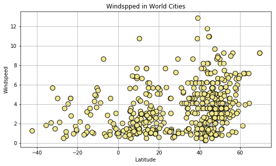

# importing all dependincies


```python
import requests
import csv
import matplotlib.pyplot as plt
import matplotlib.colors as color
#import openweathermapy as ow
import pandas as pd
import random
```

# storing api_key to a variable


```python
from localenv.py import api_key
url= "https://api.openweathermap.org/data/2.5/weather?"

```


```python
with open('Book1.csv') as mycity:
    mycity = csv.reader(mycity)
    next(mycity)
    
    count =0
    row_count=[]
    for row in mycity:
        if row[0] not in row_count:
            count = count+1
    print("Number of row count",count)  
```

    Number of row count 46832
    


```python
weather_json=[]

with open('Book1.csv') as mycity:
    mycity = csv.reader(mycity)
    next(mycity)
    myfile_list =list(mycity)
    
    for row in range(1,46832):
        if(row==500):
            break    
        chosen_row = random.choice(myfile_list)
      
        query_url = url + "&units=" + units + "&lat=" + chosen_row[0] + "&lon=" + chosen_row[1] + "&appid=" + api_key 
        response1 = requests.get(query_url )
        #print(response1)
        reque_data = response1.json()
        weather_json.append(reque_data)
        #else:
            #print("out of ranage")
```


```python
print(weather_json)
```

    [{'coord': {'lon': 120.2, 'lat': 12}, 'weather': [{'id': 800, 'main': 'Clear', 'description': 'clear sky', 'icon': '02n'}], 'base': 'stations', 'main': {'temp': 26.54, 'pressure': 1019.02, 'humidity': 98, 'temp_min': 26.54, 'temp_max': 26.54, 'sea_level': 1022.62, 'grnd_level': 1019.02}, 'wind': {'speed': 6.76, 'deg': 89.5019}, 'clouds': {'all': 8}, 'dt': 1519762948, 'sys': {'message': 0.0043, 'country': 'PH', 'sunrise': 1519683323, 'sunset': 1519726103}, 'id': 1716834, 'name': 'Coron', 'cod': 200}, {'coord': {'lon': 11.57, 'lat': 43.52}, 'weather': [{'id': 800, 'main': 'Clear', 'description': 'clear sky', 'icon': '01n'}], 'base': 'stations', 'main': {'temp': -3, 'pressure': 1012, 'humidity': 53, 'temp_min': -3, 'temp_max': -3}, 'visibility': 10000, 'wind': {'speed': 1.5, 'deg': 280}, 'clouds': {'all': 0}, 'dt': 1519761000, 'sys': {'type': 1, 'id': 5861, 'message': 0.005, 'country': 'IT', 'sunrise': 1519710746, 'sunset': 1519750847}, 'id': 3172718, 'name': 'Montevarchi', 'cod': 200}, {'coord': {'lon': -95.24, 'lat': 29.42}, 'weather': [{'id': 721, 'main': 'Haze', 'description': 'haze', 'icon': '50d'}], 'base': 'stations', 'main': {'temp': 25.25, 'pressure': 1018, 'humidity': 78, 'temp_min': 24, 'temp_max': 26}, 'visibility': 16093, 'wind': {'speed': 7.7, 'deg': 170, 'gust': 13.4}, 'clouds': {'all': 75}, 'dt': 1519761300, 'sys': {'type': 1, 'id': 2639, 'message': 0.0039, 'country': 'US', 'sunrise': 1519735658, 'sunset': 1519777182}, 'id': 4670592, 'name': 'Alvin', 'cod': 200}, {'coord': {'lon': 9.17, 'lat': 51.32}, 'weather': [{'id': 600, 'main': 'Snow', 'description': 'light snow', 'icon': '13n'}], 'base': 'stations', 'main': {'temp': -8.34, 'pressure': 1019, 'humidity': 78, 'temp_min': -10, 'temp_max': -6}, 'visibility': 10000, 'wind': {'speed': 1, 'deg': 110}, 'clouds': {'all': 0}, 'dt': 1519761000, 'sys': {'type': 1, 'id': 4926, 'message': 0.0037, 'country': 'DE', 'sunrise': 1519711862, 'sunset': 1519750895}, 'id': 2806799, 'name': 'Wolfhagen', 'cod': 200}, {'coord': {'lon': -76.88, 'lat': 0.68}, 'weather': [{'id': 501, 'main': 'Rain', 'description': 'moderate rain', 'icon': '10d'}], 'base': 'stations', 'main': {'temp': 23.72, 'pressure': 945.41, 'humidity': 91, 'temp_min': 23.72, 'temp_max': 23.72, 'sea_level': 1019.54, 'grnd_level': 945.41}, 'wind': {'speed': 0.71, 'deg': 318.502}, 'rain': {'3h': 6.475}, 'clouds': {'all': 20}, 'dt': 1519762950, 'sys': {'message': 0.0081, 'country': 'CO', 'sunrise': 1519730225, 'sunset': 1519773778}, 'id': 3829343, 'name': 'Orito', 'cod': 200}, {'coord': {'lon': 31.65, 'lat': 63.93}, 'weather': [{'id': 800, 'main': 'Clear', 'description': 'clear sky', 'icon': '01n'}], 'base': 'stations', 'main': {'temp': -20.06, 'pressure': 1041.55, 'humidity': 67, 'temp_min': -20.06, 'temp_max': -20.06, 'sea_level': 1067.41, 'grnd_level': 1041.55}, 'wind': {'speed': 2.11, 'deg': 8.50186}, 'clouds': {'all': 0}, 'dt': 1519762950, 'sys': {'message': 0.004, 'country': 'RU', 'sunrise': 1519707912, 'sunset': 1519744085}, 'id': 524100, 'name': 'Muyezerskiy', 'cod': 200}, {'coord': {'lon': 39.23, 'lat': 55.97}, 'weather': [{'id': 801, 'main': 'Clouds', 'description': 'few clouds', 'icon': '02n'}], 'base': 'stations', 'main': {'temp': -22.54, 'pressure': 1034.01, 'humidity': 66, 'temp_min': -22.54, 'temp_max': -22.54, 'sea_level': 1053.06, 'grnd_level': 1034.01}, 'wind': {'speed': 4.61, 'deg': 39.0019}, 'clouds': {'all': 12}, 'dt': 1519762951, 'sys': {'message': 0.0044, 'country': 'RU', 'sunrise': 1519705077, 'sunset': 1519743262}, 'id': 511165, 'name': 'Pernovo', 'cod': 200}, {'coord': {'lon': 117.89, 'lat': 4.25}, 'weather': [{'id': 803, 'main': 'Clouds', 'description': 'broken clouds', 'icon': '04n'}], 'base': 'stations', 'main': {'temp': 24, 'pressure': 1009, 'humidity': 100, 'temp_min': 24, 'temp_max': 24}, 'visibility': 10000, 'wind': {'speed': 2.1, 'deg': 340}, 'clouds': {'all': 75}, 'dt': 1519761600, 'sys': {'type': 1, 'id': 8118, 'message': 0.0041, 'country': 'MY', 'sunrise': 1519683609, 'sunset': 1519726919}, 'id': 1734199, 'name': 'Tawau', 'cod': 200}, {'coord': {'lon': -94.13, 'lat': 36.19}, 'weather': [{'id': 500, 'main': 'Rain', 'description': 'light rain', 'icon': '10d'}], 'base': 'stations', 'main': {'temp': 11.2, 'pressure': 1018, 'humidity': 81, 'temp_min': 10, 'temp_max': 12}, 'visibility': 9656, 'wind': {'speed': 2.1}, 'clouds': {'all': 90}, 'dt': 1519761900, 'sys': {'type': 1, 'id': 263, 'message': 0.0047, 'country': 'US', 'sunrise': 1519735695, 'sunset': 1519776619}, 'id': 4132093, 'name': 'Springdale', 'cod': 200}, {'coord': {'lon': 24.87, 'lat': 35.08}, 'weather': [{'id': 801, 'main': 'Clouds', 'description': 'few clouds', 'icon': '02n'}], 'base': 'stations', 'main': {'temp': 14, 'pressure': 1009, 'humidity': 67, 'temp_min': 14, 'temp_max': 14}, 'visibility': 10000, 'wind': {'speed': 9.3, 'deg': 170}, 'clouds': {'all': 20}, 'dt': 1519761000, 'sys': {'type': 1, 'id': 5677, 'message': 0.0043, 'country': 'GR', 'sunrise': 1519707107, 'sunset': 1519748093}, 'id': 256842, 'name': 'Moires', 'cod': 200}, {'coord': {'lon': 24.11, 'lat': 43.03}, 'weather': [{'id': 804, 'main': 'Clouds', 'description': 'overcast clouds', 'icon': '04n'}], 'base': 'stations', 'main': {'temp': -8.69, 'pressure': 983.35, 'humidity': 89, 'temp_min': -8.69, 'temp_max': -8.69, 'sea_level': 1024.04, 'grnd_level': 983.35}, 'wind': {'speed': 1.96, 'deg': 42.5019}, 'clouds': {'all': 92}, 'dt': 1519762953, 'sys': {'message': 0.0036, 'country': 'BG', 'sunrise': 1519707711, 'sunset': 1519747864}, 'id': 725611, 'name': 'Yablanitsa', 'cod': 200}, {'coord': {'lon': 125.46, 'lat': 6.91}, 'weather': [{'id': 803, 'main': 'Clouds', 'description': 'broken clouds', 'icon': '04n'}], 'base': 'stations', 'main': {'temp': 24, 'pressure': 1010, 'humidity': 100, 'temp_min': 24, 'temp_max': 24}, 'visibility': 10000, 'wind': {'speed': 1.5, 'deg': 10}, 'clouds': {'all': 75}, 'dt': 1519761600, 'sys': {'type': 1, 'id': 7707, 'message': 0.0042, 'country': 'PH', 'sunrise': 1519681884, 'sunset': 1519725013}, 'id': 1730039, 'name': 'Astorga', 'cod': 200}, {'coord': {'lon': 49.66, 'lat': 40.3}, 'weather': [{'id': 804, 'main': 'Clouds', 'description': 'overcast clouds', 'icon': '04n'}], 'base': 'stations', 'main': {'temp': 8, 'pressure': 1015, 'humidity': 93, 'temp_min': 8, 'temp_max': 8}, 'visibility': 10000, 'wind': {'speed': 4.1, 'deg': 190}, 'clouds': {'all': 90}, 'dt': 1519759800, 'sys': {'type': 1, 'id': 7212, 'message': 0.0054, 'country': 'AZ', 'sunrise': 1519701430, 'sunset': 1519741879}, 'id': 585236, 'name': 'Puta', 'cod': 200}, {'coord': {'lon': 16.05, 'lat': 48.33}, 'weather': [{'id': 600, 'main': 'Snow', 'description': 'light snow', 'icon': '13n'}], 'base': 'stations', 'main': {'temp': -10.55, 'pressure': 1017, 'humidity': 78, 'temp_min': -11, 'temp_max': -10}, 'visibility': 8000, 'wind': {'speed': 2.6, 'deg': 310}, 'clouds': {'all': 64}, 'dt': 1519761000, 'sys': {'type': 1, 'id': 5940, 'message': 0.0039, 'country': 'AT', 'sunrise': 1519709987, 'sunset': 1519749463}, 'id': 2763266, 'name': 'Tulln', 'cod': 200}, {'coord': {'lon': -107.95, 'lat': 44.02}, 'weather': [{'id': 800, 'main': 'Clear', 'description': 'clear sky', 'icon': '01d'}], 'base': 'stations', 'main': {'temp': -3, 'pressure': 1010, 'humidity': 73, 'temp_min': -3, 'temp_max': -3}, 'visibility': 16093, 'wind': {'speed': 1.5, 'deg': 270}, 'clouds': {'all': 1}, 'dt': 1519761180, 'sys': {'type': 1, 'id': 3096, 'message': 0.0044, 'country': 'US', 'sunrise': 1519739428, 'sunset': 1519779528}, 'id': 5843495, 'name': 'Worland', 'cod': 200}, {'coord': {'lon': 24.1, 'lat': 44.58}, 'weather': [{'id': 600, 'main': 'Snow', 'description': 'light snow', 'icon': '13n'}], 'base': 'stations', 'main': {'temp': -9, 'pressure': 1012, 'humidity': 85, 'temp_min': -9, 'temp_max': -9}, 'visibility': 4100, 'wind': {'speed': 6.2, 'deg': 80}, 'clouds': {'all': 90}, 'dt': 1519761600, 'sys': {'type': 1, 'id': 5991, 'message': 0.003, 'country': 'RO', 'sunrise': 1519707807, 'sunset': 1519747774}, 'id': 665708, 'name': 'Susani', 'cod': 200}, {'coord': {'lon': 135.55, 'lat': 34.57}, 'weather': [{'id': 801, 'main': 'Clouds', 'description': 'few clouds', 'icon': '02n'}], 'base': 'stations', 'main': {'temp': 6, 'pressure': 1023, 'humidity': 75, 'temp_min': 6, 'temp_max': 6}, 'visibility': 10000, 'wind': {'speed': 3.1, 'deg': 130}, 'clouds': {'all': 20}, 'dt': 1519759800, 'sys': {'type': 1, 'id': 7514, 'message': 0.0045, 'country': 'JP', 'sunrise': 1519680543, 'sunset': 1519721537}, 'id': 1857568, 'name': 'Matsubara', 'cod': 200}, {'coord': {'lon': 20.83, 'lat': 48.02}, 'weather': [{'id': 803, 'main': 'Clouds', 'description': 'broken clouds', 'icon': '04n'}], 'base': 'stations', 'main': {'temp': -7.69, 'pressure': 1010.67, 'humidity': 66, 'temp_min': -7.69, 'temp_max': -7.69, 'sea_level': 1029.19, 'grnd_level': 1010.67}, 'wind': {'speed': 6.36, 'deg': 32.5019}, 'clouds': {'all': 68}, 'dt': 1519762956, 'sys': {'message': 0.0031, 'country': 'HU', 'sunrise': 1519708819, 'sunset': 1519748337}, 'id': 717861, 'name': 'Malyi', 'cod': 200}, {'coord': {'lon': 60.47, 'lat': 56.99}, 'weather': [{'id': 620, 'main': 'Snow', 'description': 'light shower snow', 'icon': '13n'}], 'base': 'stations', 'main': {'temp': -17, 'pressure': 1020, 'humidity': 84, 'temp_min': -17, 'temp_max': -17}, 'visibility': 9000, 'wind': {'speed': 2, 'deg': 340}, 'clouds': {'all': 90}, 'dt': 1519759800, 'sys': {'type': 1, 'id': 7318, 'message': 0.0038, 'country': 'RU', 'sunrise': 1519700094, 'sunset': 1519738053}, 'id': 1491159, 'name': 'Sredneuralsk', 'cod': 200}, {'coord': {'lon': 24.27, 'lat': 46.4}, 'weather': [{'id': 701, 'main': 'Mist', 'description': 'mist', 'icon': '50n'}, {'id': 600, 'main': 'Snow', 'description': 'light snow', 'icon': '13n'}], 'base': 'stations', 'main': {'temp': -11.22, 'pressure': 1011, 'humidity': 92, 'temp_min': -14, 'temp_max': -8}, 'visibility': 4700, 'wind': {'speed': 0.5}, 'clouds': {'all': 64}, 'dt': 1519761600, 'sys': {'type': 1, 'id': 5999, 'message': 0.004, 'country': 'RO', 'sunrise': 1519707884, 'sunset': 1519747618}, 'id': 680050, 'name': 'Cucerdea', 'cod': 200}, {'coord': {'lon': -85.18, 'lat': 35.2}, 'weather': [{'id': 800, 'main': 'Clear', 'description': 'clear sky', 'icon': '01d'}], 'base': 'stations', 'main': {'temp': 18, 'pressure': 1026, 'humidity': 34, 'temp_min': 18, 'temp_max': 18}, 'visibility': 16093, 'wind': {'speed': 4.6, 'deg': 170}, 'clouds': {'all': 1}, 'dt': 1519762500, 'sys': {'type': 1, 'id': 2504, 'message': 0.0058, 'country': 'US', 'sunrise': 1519733501, 'sunset': 1519774516}, 'id': 4641495, 'name': 'Middle Valley', 'cod': 200}, {'coord': {'lon': 74.17, 'lat': 18.28}, 'weather': [{'id': 800, 'main': 'Clear', 'description': 'clear sky', 'icon': '01n'}], 'base': 'stations', 'main': {'temp': 17.79, 'pressure': 950.03, 'humidity': 52, 'temp_min': 17.79, 'temp_max': 17.79, 'sea_level': 1024, 'grnd_level': 950.03}, 'wind': {'speed': 1.16, 'deg': 303.502}, 'clouds': {'all': 0}, 'dt': 1519762958, 'sys': {'message': 0.0052, 'country': 'IN', 'sunrise': 1519694591, 'sunset': 1519736932}, 'id': 1269087, 'name': 'Jejuri', 'cod': 200}, {'coord': {'lon': -91.45, 'lat': 15.72}, 'weather': [{'id': 800, 'main': 'Clear', 'description': 'clear sky', 'icon': '01d'}], 'base': 'stations', 'main': {'temp': 22.54, 'pressure': 836.55, 'humidity': 44, 'temp_min': 22.54, 'temp_max': 22.54, 'sea_level': 1026.23, 'grnd_level': 836.55}, 'wind': {'speed': 0.96, 'deg': 54.5019}, 'clouds': {'all': 0}, 'dt': 1519762959, 'sys': {'message': 0.003, 'country': 'GT', 'sunrise': 1519734230, 'sunset': 1519776778}, 'id': 3588694, 'name': 'Soloma', 'cod': 200}, {'coord': {'lon': 38.5, 'lat': -10.9}, 'weather': [{'id': 801, 'main': 'Clouds', 'description': 'few clouds', 'icon': '02n'}], 'base': 'stations', 'main': {'temp': 23.29, 'pressure': 984.08, 'humidity': 94, 'temp_min': 23.29, 'temp_max': 23.29, 'sea_level': 1022.26, 'grnd_level': 984.08}, 'wind': {'speed': 0.91, 'deg': 72.5019}, 'clouds': {'all': 12}, 'dt': 1519762959, 'sys': {'message': 0.0037, 'country': 'TZ', 'sunrise': 1519702136, 'sunset': 1519746483}, 'id': 877597, 'name': 'Nangomba', 'cod': 200}, {'coord': {'lon': 28.57, 'lat': 44.27}, 'weather': [{'id': 802, 'main': 'Clouds', 'description': 'scattered clouds', 'icon': '03n'}], 'base': 'stations', 'main': {'temp': -12, 'pressure': 1014, 'humidity': 92, 'temp_min': -12, 'temp_max': -12}, 'visibility': 10000, 'wind': {'speed': 4.6, 'deg': 10}, 'clouds': {'all': 40}, 'dt': 1519761600, 'sys': {'type': 1, 'id': 5987, 'message': 0.0031, 'country': 'RO', 'sunrise': 1519706717, 'sunset': 1519746719}, 'id': 671584, 'name': 'Ovidiu', 'cod': 200}, {'coord': {'lon': 74.33, 'lat': 25.73}, 'weather': [{'id': 800, 'main': 'Clear', 'description': 'clear sky', 'icon': '01n'}], 'base': 'stations', 'main': {'temp': 18.97, 'pressure': 971.68, 'humidity': 67, 'temp_min': 18.97, 'temp_max': 18.97, 'sea_level': 1025.86, 'grnd_level': 971.68}, 'wind': {'speed': 1.21, 'deg': 188.002}, 'clouds': {'all': 0}, 'dt': 1519762960, 'sys': {'message': 0.0032, 'country': 'IN', 'sunrise': 1519694838, 'sunset': 1519736615}, 'id': 1278278, 'name': 'Asind', 'cod': 200}, {'coord': {'lon': 38.3, 'lat': 44.85}, 'weather': [{'id': 800, 'main': 'Clear', 'description': 'clear sky', 'icon': '01n'}], 'base': 'stations', 'main': {'temp': 0, 'pressure': 1011, 'humidity': 90, 'temp_min': 0, 'temp_max': 0}, 'visibility': 10000, 'wind': {'speed': 5, 'deg': 90}, 'clouds': {'all': 0}, 'dt': 1519759800, 'sys': {'type': 1, 'id': 7295, 'message': 0.0063, 'country': 'RU', 'sunrise': 1519704420, 'sunset': 1519744346}, 'id': 583785, 'name': 'Akhtyrskiy', 'cod': 200}, {'coord': {'lon': 41.09, 'lat': 56.93}, 'weather': [{'id': 801, 'main': 'Clouds', 'description': 'few clouds', 'icon': '02n'}], 'base': 'stations', 'main': {'temp': -21.51, 'pressure': 1034.74, 'humidity': 75, 'temp_min': -21.51, 'temp_max': -21.51, 'sea_level': 1053.99, 'grnd_level': 1034.74}, 'wind': {'speed': 4.86, 'deg': 26.0019}, 'clouds': {'all': 12}, 'dt': 1519762952, 'sys': {'message': 0.0039, 'country': 'RU', 'sunrise': 1519704730, 'sunset': 1519742718}, 'id': 546672, 'name': 'Kokhma', 'cod': 200}, {'coord': {'lon': 25.17, 'lat': 45.4}, 'weather': [{'id': 800, 'main': 'Clear', 'description': 'clear sky', 'icon': '02n'}], 'base': 'stations', 'main': {'temp': -17.06, 'pressure': 898.07, 'humidity': 63, 'temp_min': -17.06, 'temp_max': -17.06, 'sea_level': 1027.89, 'grnd_level': 898.07}, 'wind': {'speed': 1.06, 'deg': 75.5019}, 'clouds': {'all': 8}, 'dt': 1519762962, 'sys': {'message': 0.0032, 'country': 'RO', 'sunrise': 1519707603, 'sunset': 1519747466}, 'id': 668542, 'name': 'Rucar', 'cod': 200}, {'coord': {'lon': 67, 'lat': 30.58}, 'weather': [{'id': 803, 'main': 'Clouds', 'description': 'broken clouds', 'icon': '04n'}], 'base': 'stations', 'main': {'temp': 4.79, 'pressure': 814.99, 'humidity': 94, 'temp_min': 4.79, 'temp_max': 4.79, 'sea_level': 1027.77, 'grnd_level': 814.99}, 'wind': {'speed': 1.21, 'deg': 107.502}, 'clouds': {'all': 56}, 'dt': 1519762962, 'sys': {'message': 0.0032, 'country': 'PK', 'sunrise': 1519696799, 'sunset': 1519738177}, 'id': 1167821, 'name': 'Pishin', 'cod': 200}, {'coord': {'lon': 35.09, 'lat': 53.47}, 'weather': [{'id': 803, 'main': 'Clouds', 'description': 'broken clouds', 'icon': '04n'}], 'base': 'stations', 'main': {'temp': -17.46, 'pressure': 1019.83, 'humidity': 74, 'temp_min': -17.46, 'temp_max': -17.46, 'sea_level': 1046.58, 'grnd_level': 1019.83}, 'wind': {'speed': 8.56, 'deg': 68.5019}, 'clouds': {'all': 76}, 'dt': 1519762963, 'sys': {'message': 0.0035, 'country': 'RU', 'sunrise': 1519705832, 'sunset': 1519744489}, 'id': 548972, 'name': 'Khvastovichi', 'cod': 200}, {'coord': {'lon': 36.91, 'lat': 53.45}, 'weather': [{'id': 803, 'main': 'Clouds', 'description': 'broken clouds', 'icon': '04n'}], 'base': 'stations', 'main': {'temp': -18.29, 'pressure': 1014.64, 'humidity': 78, 'temp_min': -18.29, 'temp_max': -18.29, 'sea_level': 1047.79, 'grnd_level': 1014.64}, 'wind': {'speed': 6.91, 'deg': 67.0019}, 'clouds': {'all': 80}, 'dt': 1519762963, 'sys': {'message': 0.0038, 'country': 'RU', 'sunrise': 1519705394, 'sunset': 1519744053}, 'id': 569116, 'name': 'Chern', 'cod': 200}, {'coord': {'lon': -122.22, 'lat': 47.48}, 'weather': [{'id': 804, 'main': 'Clouds', 'description': 'overcast clouds', 'icon': '04d'}], 'base': 'stations', 'main': {'temp': 7.37, 'pressure': 1018, 'humidity': 65, 'temp_min': 6, 'temp_max': 8}, 'visibility': 16093, 'wind': {'speed': 5.1, 'deg': 180}, 'clouds': {'all': 90}, 'dt': 1519761480, 'sys': {'type': 1, 'id': 2948, 'message': 0.0048, 'country': 'US', 'sunrise': 1519743069, 'sunset': 1519782741}, 'id': 5808189, 'name': 'Renton', 'cod': 200}, {'coord': {'lon': 4.53, 'lat': 51.03}, 'weather': [{'id': 800, 'main': 'Clear', 'description': 'clear sky', 'icon': '01n'}], 'base': 'stations', 'main': {'temp': -5, 'pressure': 1019, 'humidity': 62, 'temp_min': -6, 'temp_max': -4}, 'visibility': 10000, 'wind': {'speed': 2.1, 'deg': 70}, 'clouds': {'all': 0}, 'dt': 1519761300, 'sys': {'type': 1, 'id': 4842, 'message': 0.0048, 'country': 'BE', 'sunrise': 1519712951, 'sunset': 1519752033}, 'id': 2801539, 'name': 'Bonheiden', 'cod': 200}, {'coord': {'lon': 124.38, 'lat': 10.65}, 'weather': [{'id': 803, 'main': 'Clouds', 'description': 'broken clouds', 'icon': '04n'}], 'base': 'stations', 'main': {'temp': 25, 'pressure': 1010, 'humidity': 94, 'temp_min': 25, 'temp_max': 25}, 'visibility': 10000, 'wind': {'speed': 1, 'deg': 10}, 'clouds': {'all': 75}, 'dt': 1519761600, 'sys': {'type': 1, 'id': 7737, 'message': 0.0032, 'country': 'PH', 'sunrise': 1519682273, 'sunset': 1519725146}, 'id': 1690011, 'name': 'San Francisco', 'cod': 200}, {'coord': {'lon': 104.72, 'lat': 31.77}, 'weather': [{'id': 800, 'main': 'Clear', 'description': 'clear sky', 'icon': '01n'}], 'base': 'stations', 'main': {'temp': 2.99, 'pressure': 947.85, 'humidity': 88, 'temp_min': 2.99, 'temp_max': 2.99, 'sea_level': 1030.08, 'grnd_level': 947.85}, 'wind': {'speed': 1.41, 'deg': 314.502}, 'clouds': {'all': 0}, 'dt': 1519762965, 'sys': {'message': 0.0046, 'country': 'CN', 'sunrise': 1519687806, 'sunset': 1519729068}, 'id': 1885823, 'name': 'Jiangyou', 'cod': 200}, {'coord': {'lon': 14.97, 'lat': -20.37}, 'weather': [{'id': 800, 'main': 'Clear', 'description': 'clear sky', 'icon': '02n'}], 'base': 'stations', 'main': {'temp': 19.04, 'pressure': 912.91, 'humidity': 42, 'temp_min': 19.04, 'temp_max': 19.04, 'sea_level': 1024.77, 'grnd_level': 912.91}, 'wind': {'speed': 2.21, 'deg': 229.502}, 'clouds': {'all': 8}, 'dt': 1519762966, 'sys': {'message': 0.0064, 'country': 'NA', 'sunrise': 1519707425, 'sunset': 1519752477}, 'id': 3356213, 'name': 'Khorixas', 'cod': 200}, {'coord': {'lon': -90.67, 'lat': 40.46}, 'weather': [{'id': 800, 'main': 'Clear', 'description': 'clear sky', 'icon': '01d'}], 'base': 'stations', 'main': {'temp': 17.74, 'pressure': 1013, 'humidity': 34, 'temp_min': 17, 'temp_max': 19}, 'visibility': 16093, 'wind': {'speed': 8.2, 'deg': 170, 'gust': 11.3}, 'clouds': {'all': 1}, 'dt': 1519762500, 'sys': {'type': 1, 'id': 878, 'message': 0.0105, 'country': 'US', 'sunrise': 1519735083, 'sunset': 1519775576}, 'id': 4900817, 'name': 'Macomb', 'cod': 200}, {'coord': {'lon': 44.65, 'lat': 40.61}, 'weather': [{'id': 800, 'main': 'Clear', 'description': 'clear sky', 'icon': '02n'}], 'base': 'stations', 'main': {'temp': 3.91, 'pressure': 1013, 'humidity': 75, 'temp_min': 2, 'temp_max': 6}, 'visibility': 10000, 'wind': {'speed': 2.1, 'deg': 40}, 'clouds': {'all': 8}, 'dt': 1519759800, 'sys': {'type': 1, 'id': 7226, 'message': 0.0043, 'country': 'AM', 'sunrise': 1519702648, 'sunset': 1519743065}, 'id': 616424, 'name': 'Meghradzor', 'cod': 200}, {'coord': {'lon': 15.6, 'lat': 48.42}, 'weather': [{'id': 600, 'main': 'Snow', 'description': 'light snow', 'icon': '13n'}], 'base': 'stations', 'main': {'temp': -10, 'pressure': 1017, 'humidity': 78, 'temp_min': -10, 'temp_max': -10}, 'visibility': 8000, 'wind': {'speed': 2.6, 'deg': 310}, 'clouds': {'all': 68}, 'dt': 1519761000, 'sys': {'type': 1, 'id': 5940, 'message': 0.0042, 'country': 'AT', 'sunrise': 1519710101, 'sunset': 1519749565}, 'id': 2773536, 'name': 'Kremsthal', 'cod': 200}, {'coord': {'lon': 84.05, 'lat': 18.42}, 'weather': [{'id': 800, 'main': 'Clear', 'description': 'clear sky', 'icon': '01n'}], 'base': 'stations', 'main': {'temp': 16.94, 'pressure': 1011.15, 'humidity': 95, 'temp_min': 16.94, 'temp_max': 16.94, 'sea_level': 1024.24, 'grnd_level': 1011.15}, 'wind': {'speed': 1.06, 'deg': 359.002}, 'clouds': {'all': 0}, 'dt': 1519762968, 'sys': {'message': 0.0039, 'country': 'IN', 'sunrise': 1519692226, 'sunset': 1519734556}, 'id': 1261853, 'name': 'Narasannapeta', 'cod': 200}, {'coord': {'lon': -44.12, 'lat': -19.58}, 'weather': [{'id': 802, 'main': 'Clouds', 'description': 'scattered clouds', 'icon': '03d'}], 'base': 'stations', 'main': {'temp': 29.04, 'pressure': 1014, 'humidity': 51, 'temp_min': 28, 'temp_max': 30}, 'visibility': 10000, 'wind': {'speed': 3.6, 'deg': 330}, 'clouds': {'all': 40}, 'dt': 1519758000, 'sys': {'type': 1, 'id': 4472, 'message': 0.0046, 'country': 'BR', 'sunrise': 1519721642, 'sunset': 1519766621}, 'id': 3467280, 'name': 'Capim Branco', 'cod': 200}, {'coord': {'lon': -86.78, 'lat': 36.17}, 'weather': [{'id': 800, 'main': 'Clear', 'description': 'clear sky', 'icon': '01d'}], 'base': 'stations', 'main': {'temp': 19.19, 'pressure': 1023, 'humidity': 32, 'temp_min': 18, 'temp_max': 20}, 'visibility': 16093, 'wind': {'speed': 4.1, 'deg': 230}, 'clouds': {'all': 1}, 'dt': 1519761360, 'sys': {'type': 1, 'id': 2533, 'message': 0.0045, 'country': 'US', 'sunrise': 1519733931, 'sunset': 1519774855}, 'id': 4644585, 'name': 'Nashville', 'cod': 200}, {'coord': {'lon': 21.05, 'lat': 42.07}, 'weather': [{'id': 600, 'main': 'Snow', 'description': 'light snow', 'icon': '13n'}], 'base': 'stations', 'main': {'temp': -4.04, 'pressure': 1005, 'humidity': 92, 'temp_min': -6, 'temp_max': -2}, 'visibility': 2600, 'wind': {'speed': 0.91, 'deg': 260.002}, 'clouds': {'all': 90}, 'dt': 1519761600, 'sys': {'type': 1, 'id': 6088, 'message': 0.0043, 'country': 'MK', 'sunrise': 1519708388, 'sunset': 1519748653}, 'id': 785113, 'name': 'Tearce', 'cod': 200}, {'coord': {'lon': -69.32, 'lat': 10.07}, 'weather': [{'id': 804, 'main': 'Clouds', 'description': 'overcast clouds', 'icon': '04d'}], 'base': 'stations', 'main': {'temp': 27.79, 'pressure': 939.09, 'humidity': 46, 'temp_min': 27.79, 'temp_max': 27.79, 'sea_level': 1022.22, 'grnd_level': 939.09}, 'wind': {'speed': 2.26, 'deg': 44.0019}, 'clouds': {'all': 88}, 'dt': 1519762535, 'sys': {'message': 0.0053, 'country': 'VE', 'sunrise': 1519728726, 'sunset': 1519771656}, 'id': 3648522, 'name': 'Barquisimeto', 'cod': 200}, {'coord': {'lon': 123.17, 'lat': 10.98}, 'weather': [{'id': 802, 'main': 'Clouds', 'description': 'scattered clouds', 'icon': '03n'}], 'base': 'stations', 'main': {'temp': 22.69, 'pressure': 1006.13, 'humidity': 89, 'temp_min': 22.69, 'temp_max': 22.69, 'sea_level': 1022.95, 'grnd_level': 1006.13}, 'wind': {'speed': 2.81, 'deg': 56.0019}, 'clouds': {'all': 32}, 'dt': 1519762970, 'sys': {'message': 0.0083, 'country': 'PH', 'sunrise': 1519682575, 'sunset': 1519725425}, 'id': 1717441, 'name': 'Chambrey', 'cod': 200}, {'coord': {'lon': -1.53, 'lat': 53.13}, 'weather': [{'id': 802, 'main': 'Clouds', 'description': 'scattered clouds', 'icon': '03n'}], 'base': 'stations', 'main': {'temp': -3.64, 'pressure': 1022, 'humidity': 92, 'temp_min': -4, 'temp_max': -3}, 'visibility': 10000, 'wind': {'speed': 4.1, 'deg': 40}, 'clouds': {'all': 40}, 'dt': 1519761000, 'sys': {'type': 1, 'id': 5106, 'message': 0.0045, 'country': 'GB', 'sunrise': 1519714577, 'sunset': 1519753318}, 'id': 2642910, 'name': 'Matlock', 'cod': 200}, {'coord': {'lon': 133.23, 'lat': 34.57}, 'weather': [{'id': 802, 'main': 'Clouds', 'description': 'scattered clouds', 'icon': '03n'}], 'base': 'stations', 'main': {'temp': -5.41, 'pressure': 984.48, 'humidity': 77, 'temp_min': -5.41, 'temp_max': -5.41, 'sea_level': 1037.46, 'grnd_level': 984.48}, 'wind': {'speed': 0.91, 'deg': 81.0019}, 'clouds': {'all': 36}, 'dt': 1519762971, 'sys': {'message': 0.0036, 'country': 'JP', 'sunrise': 1519681099, 'sunset': 1519722094}, 'id': 1864155, 'name': 'Fuchu', 'cod': 200}, {'coord': {'lon': -80.61, 'lat': 28.32}, 'weather': [{'id': 800, 'main': 'Clear', 'description': 'clear sky', 'icon': '01d'}], 'base': 'stations', 'main': {'temp': 25.74, 'pressure': 1022, 'humidity': 65, 'temp_min': 24, 'temp_max': 27}, 'visibility': 16093, 'wind': {'speed': 6.7, 'deg': 60}, 'clouds': {'all': 1}, 'dt': 1519761360, 'sys': {'type': 1, 'id': 708, 'message': 0.0044, 'country': 'US', 'sunrise': 1519732104, 'sunset': 1519773713}, 'id': 4151441, 'name': 'Cocoa Beach', 'cod': 200}, {'coord': {'lon': 135.85, 'lat': 34.5}, 'weather': [{'id': 801, 'main': 'Clouds', 'description': 'few clouds', 'icon': '02n'}], 'base': 'stations', 'main': {'temp': 6, 'pressure': 1023, 'humidity': 75, 'temp_min': 6, 'temp_max': 6}, 'visibility': 10000, 'wind': {'speed': 3.1, 'deg': 130}, 'clouds': {'all': 20}, 'dt': 1519759800, 'sys': {'type': 1, 'id': 7514, 'message': 0.0033, 'country': 'JP', 'sunrise': 1519680467, 'sunset': 1519721469}, 'id': 1853066, 'name': 'Sakurai', 'cod': 200}, {'coord': {'lon': 23.22, 'lat': 46.23}, 'weather': [{'id': 701, 'main': 'Mist', 'description': 'mist', 'icon': '50n'}], 'base': 'stations', 'main': {'temp': -12, 'pressure': 1011, 'humidity': 92, 'temp_min': -12, 'temp_max': -12}, 'visibility': 3500, 'wind': {'speed': 3.6, 'deg': 290}, 'clouds': {'all': 75}, 'dt': 1519761600, 'sys': {'type': 1, 'id': 5990, 'message': 0.0037, 'country': 'RO', 'sunrise': 1519708124, 'sunset': 1519747882}, 'id': 683577, 'name': 'Bucium', 'cod': 200}, {'coord': {'lon': 97.15, 'lat': 5.18}, 'weather': [{'id': 800, 'main': 'Clear', 'description': 'clear sky', 'icon': '01n'}], 'base': 'stations', 'main': {'temp': 27.19, 'pressure': 1021.85, 'humidity': 100, 'temp_min': 27.19, 'temp_max': 27.19, 'sea_level': 1021.65, 'grnd_level': 1021.85}, 'wind': {'speed': 0.61, 'deg': 57.0019}, 'clouds': {'all': 0}, 'dt': 1519762973, 'sys': {'message': 0.0031, 'country': 'ID', 'sunrise': 1519688618, 'sunset': 1519731866}, 'id': 1214658, 'name': 'Lhokseumawe', 'cod': 200}, {'coord': {'lon': 18.86, 'lat': 47.12}, 'weather': [{'id': 601, 'main': 'Snow', 'description': 'snow', 'icon': '13n'}, {'id': 701, 'main': 'Mist', 'description': 'mist', 'icon': '50n'}], 'base': 'stations', 'main': {'temp': -8, 'pressure': 1013, 'humidity': 100, 'temp_min': -8, 'temp_max': -8}, 'visibility': 2200, 'wind': {'speed': 2.1, 'deg': 30}, 'clouds': {'all': 90}, 'dt': 1519761600, 'sys': {'type': 1, 'id': 5724, 'message': 0.0078, 'country': 'HU', 'sunrise': 1519709229, 'sunset': 1519748871}, 'id': 3056414, 'name': 'Adony', 'cod': 200}, {'coord': {'lon': 158.7, 'lat': 55.93}, 'weather': [{'id': 800, 'main': 'Clear', 'description': 'clear sky', 'icon': '01n'}], 'base': 'stations', 'main': {'temp': -24.79, 'pressure': 895.16, 'humidity': 52, 'temp_min': -24.79, 'temp_max': -24.79, 'sea_level': 1025.18, 'grnd_level': 895.16}, 'wind': {'speed': 0.96, 'deg': 80.5019}, 'clouds': {'all': 0}, 'dt': 1519762974, 'sys': {'message': 0.0041, 'country': 'RU', 'sunrise': 1519676450, 'sunset': 1519714551}, 'id': 2125711, 'name': 'Esso', 'cod': 200}, {'coord': {'lon': 10.18, 'lat': 48.62}, 'weather': [{'id': 800, 'main': 'Clear', 'description': 'clear sky', 'icon': '01n'}], 'base': 'stations', 'main': {'temp': -12.88, 'pressure': 1014, 'humidity': 77, 'temp_min': -14, 'temp_max': -12}, 'visibility': 10000, 'wind': {'speed': 1.5, 'deg': 30}, 'clouds': {'all': 0}, 'dt': 1519761000, 'sys': {'type': 1, 'id': 4913, 'message': 0.0047, 'country': 'DE', 'sunrise': 1519711414, 'sunset': 1519750854}, 'id': 2906194, 'name': 'Herbrechtingen', 'cod': 200}, {'coord': {'lon': 9.5, 'lat': 47.07}, 'weather': [{'id': 800, 'main': 'Clear', 'description': 'clear sky', 'icon': '02n'}], 'base': 'stations', 'main': {'temp': -13.44, 'pressure': 1013, 'humidity': 61, 'temp_min': -22, 'temp_max': -8}, 'visibility': 10000, 'wind': {'speed': 4.6, 'deg': 30}, 'clouds': {'all': 8}, 'dt': 1519761000, 'sys': {'type': 1, 'id': 6019, 'message': 0.0046, 'country': 'LI', 'sunrise': 1519711469, 'sunset': 1519751123}, 'id': 3042073, 'name': 'Balzers', 'cod': 200}, {'coord': {'lon': 50.35, 'lat': 53.37}, 'weather': [{'id': 800, 'main': 'Clear', 'description': 'clear sky', 'icon': '01n'}], 'base': 'stations', 'main': {'temp': -18, 'pressure': 1029, 'humidity': 70, 'temp_min': -18, 'temp_max': -18}, 'visibility': 10000, 'wind': {'speed': 4, 'deg': 330}, 'clouds': {'all': 0}, 'dt': 1519759800, 'sys': {'type': 1, 'id': 7345, 'message': 0.0094, 'country': 'RU', 'sunrise': 1519702167, 'sunset': 1519740830}, 'id': 517992, 'name': 'Novosemeykino', 'cod': 200}, {'coord': {'lon': 25, 'lat': 44}, 'weather': [{'id': 804, 'main': 'Clouds', 'description': 'overcast clouds', 'icon': '04n'}], 'base': 'stations', 'main': {'temp': -8.64, 'pressure': 1016.66, 'humidity': 92, 'temp_min': -8.64, 'temp_max': -8.64, 'sea_level': 1025.66, 'grnd_level': 1016.66}, 'wind': {'speed': 7.46, 'deg': 75.5019}, 'clouds': {'all': 88}, 'dt': 1519762976, 'sys': {'message': 0.0088, 'country': 'RO', 'sunrise': 1519707556, 'sunset': 1519747593}, 'id': 664591, 'name': 'Troianul', 'cod': 200}, {'coord': {'lon': -89.87, 'lat': 14.5}, 'weather': [{'id': 802, 'main': 'Clouds', 'description': 'scattered clouds', 'icon': '03d'}], 'base': 'stations', 'main': {'temp': 32, 'pressure': 1020, 'humidity': 29, 'temp_min': 32, 'temp_max': 32}, 'visibility': 10000, 'wind': {'speed': 2.1, 'deg': 10}, 'clouds': {'all': 40}, 'dt': 1519761000, 'sys': {'type': 1, 'id': 4206, 'message': 0.0053, 'country': 'GT', 'sunrise': 1519733808, 'sunset': 1519776441}, 'id': 3592477, 'name': 'Monjas', 'cod': 200}, {'coord': {'lon': 102.14, 'lat': 51.68}, 'weather': [{'id': 802, 'main': 'Clouds', 'description': 'scattered clouds', 'icon': '03n'}], 'base': 'stations', 'main': {'temp': -19.81, 'pressure': 851.71, 'humidity': 75, 'temp_min': -19.81, 'temp_max': -19.81, 'sea_level': 1045.72, 'grnd_level': 851.71}, 'wind': {'speed': 1.11, 'deg': 80.0019}, 'clouds': {'all': 44}, 'dt': 1519762977, 'sys': {'message': 0.0062, 'country': 'RU', 'sunrise': 1519689611, 'sunset': 1519728526}, 'id': 2021031, 'name': 'Kyren', 'cod': 200}, {'coord': {'lon': 24.3, 'lat': 48.9}, 'weather': [{'id': 600, 'main': 'Snow', 'description': 'light snow', 'icon': '13n'}], 'base': 'stations', 'main': {'temp': -12, 'pressure': 1018, 'humidity': 85, 'temp_min': -12, 'temp_max': -12}, 'visibility': 2700, 'wind': {'speed': 1, 'deg': 50}, 'clouds': {'all': 75}, 'dt': 1519759800, 'sys': {'type': 1, 'id': 7360, 'message': 0.004, 'country': 'UA', 'sunrise': 1519708050, 'sunset': 1519747441}, 'id': 697473, 'name': 'Petranka', 'cod': 200}, {'coord': {'lon': -48.45, 'lat': -14.45}, 'weather': [{'id': 501, 'main': 'Rain', 'description': 'moderate rain', 'icon': '10d'}], 'base': 'stations', 'main': {'temp': 26.09, 'pressure': 955.22, 'humidity': 86, 'temp_min': 26.09, 'temp_max': 26.09, 'sea_level': 1021.93, 'grnd_level': 955.22}, 'wind': {'speed': 1.61, 'deg': 39.5019}, 'rain': {'3h': 4.975}, 'clouds': {'all': 12}, 'dt': 1519762978, 'sys': {'message': 0.0036, 'country': 'BR', 'sunrise': 1519722877, 'sunset': 1519767469}, 'id': 3456285, 'name': 'Niquelandia', 'cod': 200}, {'coord': {'lon': 121.51, 'lat': 16.59}, 'weather': [{'id': 501, 'main': 'Rain', 'description': 'moderate rain', 'icon': '10n'}], 'base': 'stations', 'main': {'temp': 20.84, 'pressure': 1006.61, 'humidity': 99, 'temp_min': 20.84, 'temp_max': 20.84, 'sea_level': 1026.03, 'grnd_level': 1006.61}, 'wind': {'speed': 1.31, 'deg': 230.502}, 'rain': {'3h': 4.2575}, 'clouds': {'all': 92}, 'dt': 1519762979, 'sys': {'message': 0.0037, 'country': 'PH', 'sunrise': 1519683173, 'sunset': 1519725629}, 'id': 1714974, 'name': 'Diffun', 'cod': 200}, {'coord': {'lon': -99.28, 'lat': 23.92}, 'weather': [{'id': 800, 'main': 'Clear', 'description': 'clear sky', 'icon': '02d'}], 'base': 'stations', 'main': {'temp': 30, 'pressure': 1014, 'humidity': 45, 'temp_min': 30, 'temp_max': 30}, 'visibility': 11265, 'wind': {'speed': 10.3, 'deg': 160}, 'clouds': {'all': 5}, 'dt': 1519760400, 'sys': {'type': 1, 'id': 3976, 'message': 0.0034, 'country': 'MX', 'sunrise': 1519736407, 'sunset': 1519778366}, 'id': 3527413, 'name': 'Graciano Sanchez', 'cod': 200}, {'coord': {'lon': 41.81, 'lat': 54.58}, 'weather': [{'id': 800, 'main': 'Clear', 'description': 'clear sky', 'icon': '02n'}], 'base': 'stations', 'main': {'temp': -22.94, 'pressure': 1032.55, 'humidity': 68, 'temp_min': -22.94, 'temp_max': -22.94, 'sea_level': 1050.06, 'grnd_level': 1032.55}, 'wind': {'speed': 3.66, 'deg': 39.0019}, 'clouds': {'all': 8}, 'dt': 1519762980, 'sys': {'message': 0.0073, 'country': 'RU', 'sunrise': 1519704323, 'sunset': 1519742774}, 'id': 509273, 'name': 'Pitelino', 'cod': 200}, {'coord': {'lon': -80.61, 'lat': 28.41}, 'weather': [{'id': 800, 'main': 'Clear', 'description': 'clear sky', 'icon': '01d'}], 'base': 'stations', 'main': {'temp': 25.75, 'pressure': 1022, 'humidity': 57, 'temp_min': 24, 'temp_max': 27}, 'visibility': 16093, 'wind': {'speed': 7.2, 'deg': 60, 'gust': 9.3}, 'clouds': {'all': 1}, 'dt': 1519761360, 'sys': {'type': 1, 'id': 643, 'message': 0.0037, 'country': 'US', 'sunrise': 1519732107, 'sunset': 1519773710}, 'id': 4149959, 'name': 'Cape Canaveral', 'cod': 200}, {'coord': {'lon': -71.18, 'lat': 42.37}, 'weather': [{'id': 802, 'main': 'Clouds', 'description': 'scattered clouds', 'icon': '03d'}], 'base': 'stations', 'main': {'temp': 11.75, 'pressure': 1023, 'humidity': 25, 'temp_min': 11, 'temp_max': 13}, 'visibility': 16093, 'wind': {'speed': 5.1, 'deg': 280, 'gust': 9.3}, 'clouds': {'all': 40}, 'dt': 1519762500, 'sys': {'type': 1, 'id': 1272, 'message': 0.0043, 'country': 'US', 'sunrise': 1519730516, 'sunset': 1519770790}, 'id': 4954611, 'name': 'Watertown', 'cod': 200}, {'coord': {'lon': 12.87, 'lat': 48.78}, 'weather': [{'id': 802, 'main': 'Clouds', 'description': 'scattered clouds', 'icon': '03n'}], 'base': 'stations', 'main': {'temp': -12.61, 'pressure': 981.16, 'humidity': 61, 'temp_min': -12.61, 'temp_max': -12.61, 'sea_level': 1034.94, 'grnd_level': 981.16}, 'wind': {'speed': 2.56, 'deg': 79.0019}, 'clouds': {'all': 48}, 'dt': 1519762981, 'sys': {'message': 0.004, 'country': 'DE', 'sunrise': 1519710781, 'sunset': 1519750196}, 'id': 2853310, 'name': 'Plattling', 'cod': 200}, {'coord': {'lon': -73.25, 'lat': 40.73}, 'weather': [{'id': 800, 'main': 'Clear', 'description': 'clear sky', 'icon': '01d'}], 'base': 'stations', 'main': {'temp': 11.28, 'pressure': 1026, 'humidity': 34, 'temp_min': 9, 'temp_max': 13}, 'visibility': 16093, 'wind': {'speed': 4.6, 'deg': 190}, 'clouds': {'all': 1}, 'dt': 1519761360, 'sys': {'type': 1, 'id': 2109, 'message': 0.0066, 'country': 'US', 'sunrise': 1519730921, 'sunset': 1519771377}, 'id': 5108169, 'name': 'Bay Shore', 'cod': 200}, {'coord': {'lon': 125.5, 'lat': 11.5}, 'weather': [{'id': 804, 'main': 'Clouds', 'description': 'overcast clouds', 'icon': '04n'}], 'base': 'stations', 'main': {'temp': 24.19, 'pressure': 1009.69, 'humidity': 100, 'temp_min': 24.19, 'temp_max': 24.19, 'sea_level': 1023.51, 'grnd_level': 1009.69}, 'wind': {'speed': 1.61, 'deg': 76.0019}, 'clouds': {'all': 88}, 'dt': 1519762982, 'sys': {'message': 0.0033, 'country': 'PH', 'sunrise': 1519682034, 'sunset': 1519724848}, 'id': 1700013, 'name': 'Maydolong', 'cod': 200}, {'coord': {'lon': 85.1, 'lat': 19.52}, 'weather': [{'id': 800, 'main': 'Clear', 'description': 'clear sky', 'icon': '01n'}], 'base': 'stations', 'main': {'temp': 20.37, 'pressure': 1013.18, 'humidity': 95, 'temp_min': 20.37, 'temp_max': 20.37, 'sea_level': 1023.92, 'grnd_level': 1013.18}, 'wind': {'speed': 1.91, 'deg': 172.502}, 'clouds': {'all': 0}, 'dt': 1519762983, 'sys': {'message': 0.0032, 'country': 'IN', 'sunrise': 1519692015, 'sunset': 1519734264}, 'id': 1258714, 'name': 'Rambha', 'cod': 200}, {'coord': {'lon': 77.8, 'lat': 31.52}, 'weather': [{'id': 802, 'main': 'Clouds', 'description': 'scattered clouds', 'icon': '03n'}], 'base': 'stations', 'main': {'temp': -13.51, 'pressure': 605.53, 'humidity': 90, 'temp_min': -13.51, 'temp_max': -13.51, 'sea_level': 1031.58, 'grnd_level': 605.53}, 'wind': {'speed': 0.96, 'deg': 15.0019}, 'clouds': {'all': 32}, 'dt': 1519762983, 'sys': {'message': 0.0048, 'country': 'IN', 'sunrise': 1519694250, 'sunset': 1519735543}, 'id': 1257277, 'name': 'Sarahan', 'cod': 200}, {'coord': {'lon': -4.28, 'lat': 39.98}, 'weather': [{'id': 500, 'main': 'Rain', 'description': 'light rain', 'icon': '10n'}], 'base': 'stations', 'main': {'temp': 4.34, 'pressure': 1003, 'humidity': 93, 'temp_min': 4, 'temp_max': 5}, 'visibility': 3000, 'wind': {'speed': 0.5}, 'clouds': {'all': 90}, 'dt': 1519761600, 'sys': {'type': 1, 'id': 5505, 'message': 0.0044, 'country': 'ES', 'sunrise': 1519714345, 'sunset': 1519754851}, 'id': 2510249, 'name': 'Torrijos', 'cod': 200}, {'coord': {'lon': 14.45, 'lat': 47.6}, 'weather': [{'id': 802, 'main': 'Clouds', 'description': 'scattered clouds', 'icon': '03n'}], 'base': 'stations', 'main': {'temp': -12, 'pressure': 1010, 'humidity': 51, 'temp_min': -12, 'temp_max': -12}, 'wind': {'speed': 1.5}, 'clouds': {'all': 44}, 'dt': 1519761000, 'sys': {'type': 1, 'id': 5941, 'message': 0.0038, 'country': 'AT', 'sunrise': 1519710319, 'sunset': 1519749898}, 'id': 2776954, 'name': 'Hall', 'cod': 200}, {'coord': {'lon': -16.55, 'lat': 13.48}, 'weather': [{'id': 800, 'main': 'Clear', 'description': 'clear sky', 'icon': '01n'}], 'base': 'stations', 'main': {'temp': 21, 'pressure': 1012, 'humidity': 64, 'temp_min': 21, 'temp_max': 21}, 'visibility': 10000, 'wind': {'speed': 5.7, 'deg': 280}, 'clouds': {'all': 0}, 'dt': 1519761600, 'sys': {'type': 1, 'id': 6111, 'message': 0.0041, 'country': 'GM', 'sunrise': 1519716183, 'sunset': 1519758876}, 'id': 2413827, 'name': 'Barra', 'cod': 200}, {'coord': {'lon': 79.72, 'lat': 28.63}, 'weather': [{'id': 800, 'main': 'Clear', 'description': 'clear sky', 'icon': '01n'}], 'base': 'stations', 'main': {'temp': 14.39, 'pressure': 1000.13, 'humidity': 89, 'temp_min': 14.39, 'temp_max': 14.39, 'sea_level': 1025.62, 'grnd_level': 1000.13}, 'wind': {'speed': 1.61, 'deg': 358.502}, 'clouds': {'all': 0}, 'dt': 1519762985, 'sys': {'message': 0.0031, 'country': 'IN', 'sunrise': 1519693665, 'sunset': 1519735204}, 'id': 1269555, 'name': 'Jahanabad', 'cod': 200}, {'coord': {'lon': 24.77, 'lat': 60.75}, 'weather': [{'id': 800, 'main': 'Clear', 'description': 'clear sky', 'icon': '01n'}], 'base': 'stations', 'main': {'temp': -19, 'pressure': 1046, 'humidity': 70, 'temp_min': -19, 'temp_max': -19}, 'visibility': 10000, 'wind': {'speed': 5.7, 'deg': 40}, 'clouds': {'all': 0}, 'dt': 1519761000, 'sys': {'type': 1, 'id': 5019, 'message': 0.0033, 'country': 'FI', 'sunrise': 1519709091, 'sunset': 1519746199}, 'id': 639411, 'name': 'Riihimäki', 'cod': 200}, {'coord': {'lon': 77.49, 'lat': 13.83}, 'weather': [{'id': 800, 'main': 'Clear', 'description': 'clear sky', 'icon': '01n'}], 'base': 'stations', 'main': {'temp': 14.87, 'pressure': 945.98, 'humidity': 60, 'temp_min': 14.87, 'temp_max': 14.87, 'sea_level': 1024.57, 'grnd_level': 945.98}, 'wind': {'speed': 1.71, 'deg': 113.502}, 'clouds': {'all': 0}, 'dt': 1519762819, 'sys': {'message': 0.003, 'country': 'IN', 'sunrise': 1519693634, 'sunset': 1519736292}, 'id': 1270079, 'name': 'Hindupur', 'cod': 200}, {'coord': {'lon': 4.47, 'lat': 50.77}, 'weather': [{'id': 800, 'main': 'Clear', 'description': 'clear sky', 'icon': '01n'}], 'base': 'stations', 'main': {'temp': -4.86, 'pressure': 1019, 'humidity': 62, 'temp_min': -6, 'temp_max': -4}, 'visibility': 10000, 'wind': {'speed': 2.1, 'deg': 70}, 'clouds': {'all': 0}, 'dt': 1519761000, 'sys': {'type': 1, 'id': 4842, 'message': 0.0046, 'country': 'BE', 'sunrise': 1519712944, 'sunset': 1519752067}, 'id': 2795699, 'name': 'Hoeilaart', 'cod': 200}, {'coord': {'lon': 80.63, 'lat': 17.55}, 'weather': [{'id': 800, 'main': 'Clear', 'description': 'clear sky', 'icon': '01n'}], 'base': 'stations', 'main': {'temp': 19.84, 'pressure': 1006.86, 'humidity': 78, 'temp_min': 19.84, 'temp_max': 19.84, 'sea_level': 1024.2, 'grnd_level': 1006.86}, 'wind': {'speed': 1.21, 'deg': 194.002}, 'clouds': {'all': 0}, 'dt': 1519762988, 'sys': {'message': 0.0029, 'country': 'IN', 'sunrise': 1519693015, 'sunset': 1519735408}, 'id': 1265938, 'name': 'Kottagudem', 'cod': 200}, {'coord': {'lon': 102.07, 'lat': 15.2}, 'weather': [{'id': 801, 'main': 'Clouds', 'description': 'few clouds', 'icon': '02n'}], 'base': 'stations', 'main': {'temp': 22, 'pressure': 1011, 'humidity': 100, 'temp_min': 22, 'temp_max': 22}, 'wind': {'speed': 2.1, 'deg': 200}, 'clouds': {'all': 24}, 'dt': 1519761600, 'sys': {'type': 1, 'id': 7972, 'message': 0.0033, 'country': 'TH', 'sunrise': 1519687786, 'sunset': 1519730344}, 'id': 1608131, 'name': 'Non Thai', 'cod': 200}, {'coord': {'lon': -119.29, 'lat': 36.33}, 'weather': [{'id': 804, 'main': 'Clouds', 'description': 'overcast clouds', 'icon': '04d'}], 'base': 'stations', 'main': {'temp': 7.6, 'pressure': 1018, 'humidity': 81, 'temp_min': 7, 'temp_max': 8}, 'visibility': 16093, 'wind': {'speed': 2.1, 'deg': 260}, 'clouds': {'all': 90}, 'dt': 1519761360, 'sys': {'type': 1, 'id': 511, 'message': 0.0041, 'country': 'US', 'sunrise': 1519741734, 'sunset': 1519782655}, 'id': 5406567, 'name': 'Visalia', 'cod': 200}, {'coord': {'lon': 38.6, 'lat': 48.04}, 'weather': [{'id': 804, 'main': 'Clouds', 'description': 'overcast clouds', 'icon': '04n'}], 'base': 'stations', 'main': {'temp': -6.41, 'pressure': 1001.91, 'humidity': 89, 'temp_min': -6.41, 'temp_max': -6.41, 'sea_level': 1027.69, 'grnd_level': 1001.91}, 'wind': {'speed': 8.86, 'deg': 112.002}, 'clouds': {'all': 92}, 'dt': 1519762989, 'sys': {'message': 0.0029, 'country': 'UA', 'sunrise': 1519704561, 'sunset': 1519744066}, 'id': 691374, 'name': 'Torez', 'cod': 200}, {'coord': {'lon': -47.67, 'lat': -20.98}, 'weather': [{'id': 803, 'main': 'Clouds', 'description': 'broken clouds', 'icon': '04d'}], 'base': 'stations', 'main': {'temp': 25, 'pressure': 1013, 'humidity': 78, 'temp_min': 25, 'temp_max': 25}, 'visibility': 10000, 'wind': {'speed': 4.1, 'deg': 210}, 'clouds': {'all': 75}, 'dt': 1519758000, 'sys': {'type': 1, 'id': 4566, 'message': 0.006, 'country': 'BR', 'sunrise': 1519722439, 'sunset': 1519767526}, 'id': 3468902, 'name': 'Brodosqui', 'cod': 200}, {'coord': {'lon': 61.52, 'lat': 60.91}, 'weather': [{'id': 802, 'main': 'Clouds', 'description': 'scattered clouds', 'icon': '03n'}], 'base': 'stations', 'main': {'temp': -28.66, 'pressure': 1032.07, 'humidity': 57, 'temp_min': -28.66, 'temp_max': -28.66, 'sea_level': 1048.76, 'grnd_level': 1032.07}, 'wind': {'speed': 1.36, 'deg': 350.502}, 'clouds': {'all': 44}, 'dt': 1519762990, 'sys': {'message': 0.0035, 'country': 'RU', 'sunrise': 1519700311, 'sunset': 1519737342}, 'id': 1495812, 'name': 'Ous', 'cod': 200}, {'coord': {'lon': 13.35, 'lat': -3.69}, 'weather': [{'id': 501, 'main': 'Rain', 'description': 'moderate rain', 'icon': '10n'}], 'base': 'stations', 'main': {'temp': 20.47, 'pressure': 982.05, 'humidity': 99, 'temp_min': 20.47, 'temp_max': 20.47, 'sea_level': 1026.72, 'grnd_level': 982.05}, 'wind': {'speed': 2.51, 'deg': 276.502}, 'rain': {'3h': 4.57}, 'clouds': {'all': 92}, 'dt': 1519762991, 'sys': {'message': 0.004, 'country': 'CG', 'sunrise': 1519708424, 'sunset': 1519752271}, 'id': 2255285, 'name': 'Sibiti', 'cod': 200}, {'coord': {'lon': 18.42, 'lat': -33.93}, 'weather': [{'id': 800, 'main': 'Clear', 'description': 'clear sky', 'icon': '01n'}], 'base': 'stations', 'main': {'temp': 18, 'pressure': 1014, 'humidity': 77, 'temp_min': 18, 'temp_max': 18}, 'visibility': 10000, 'wind': {'speed': 6.2, 'deg': 200}, 'clouds': {'all': 0}, 'dt': 1519761600, 'sys': {'type': 1, 'id': 6529, 'message': 0.0059, 'country': 'ZA', 'sunrise': 1519705980, 'sunset': 1519752251}, 'id': 3369157, 'name': 'Cape Town', 'cod': 200}, {'coord': {'lon': -93.03, 'lat': 17.28}, 'weather': [{'id': 800, 'main': 'Clear', 'description': 'clear sky', 'icon': '01d'}], 'base': 'stations', 'main': {'temp': 27.84, 'pressure': 960.49, 'humidity': 49, 'temp_min': 27.84, 'temp_max': 27.84, 'sea_level': 1025.86, 'grnd_level': 960.49}, 'wind': {'speed': 1.26, 'deg': 39.0019}, 'clouds': {'all': 0}, 'dt': 1519762992, 'sys': {'message': 0.0029, 'country': 'MX', 'sunrise': 1519734664, 'sunset': 1519777104}, 'id': 3526769, 'name': 'Ishuatan', 'cod': 200}, {'coord': {'lon': 120.66, 'lat': 17.98}, 'weather': [{'id': 501, 'main': 'Rain', 'description': 'moderate rain', 'icon': '10n'}], 'base': 'stations', 'main': {'temp': 21.57, 'pressure': 998.27, 'humidity': 100, 'temp_min': 21.57, 'temp_max': 21.57, 'sea_level': 1025.05, 'grnd_level': 998.27}, 'wind': {'speed': 2.36, 'deg': 88.5019}, 'rain': {'3h': 3.4625}, 'clouds': {'all': 80}, 'dt': 1519762992, 'sys': {'message': 0.0031, 'country': 'PH', 'sunrise': 1519683428, 'sunset': 1519725783}, 'id': 1713752, 'name': 'Espiritu', 'cod': 200}, {'coord': {'lon': 122.52, 'lat': 9.55}, 'weather': [{'id': 801, 'main': 'Clouds', 'description': 'few clouds', 'icon': '02n'}], 'base': 'stations', 'main': {'temp': 25.89, 'pressure': 1013.42, 'humidity': 100, 'temp_min': 25.89, 'temp_max': 25.89, 'sea_level': 1022.26, 'grnd_level': 1013.42}, 'wind': {'speed': 3.16, 'deg': 66.0019}, 'clouds': {'all': 12}, 'dt': 1519762993, 'sys': {'message': 0.0032, 'country': 'PH', 'sunrise': 1519682681, 'sunset': 1519725630}, 'id': 1730097, 'name': 'Asia', 'cod': 200}, {'coord': {'lon': 47.48, 'lat': 42.97}, 'weather': [{'id': 804, 'main': 'Clouds', 'description': 'overcast clouds', 'icon': '04n'}], 'base': 'stations', 'main': {'temp': 4, 'pressure': 1016, 'humidity': 93, 'temp_min': 4, 'temp_max': 4}, 'visibility': 9000, 'wind': {'speed': 4, 'deg': 140}, 'clouds': {'all': 90}, 'dt': 1519759800, 'sys': {'type': 1, 'id': 7297, 'message': 0.0036, 'country': 'RU', 'sunrise': 1519702105, 'sunset': 1519742253}, 'id': 537508, 'name': 'Kyakhulay', 'cod': 200}, {'coord': {'lon': 118.48, 'lat': 31.56}, 'weather': [{'id': 500, 'main': 'Rain', 'description': 'light rain', 'icon': '10n'}, {'id': 701, 'main': 'Mist', 'description': 'mist', 'icon': '50n'}], 'base': 'stations', 'main': {'temp': 11, 'pressure': 1007, 'humidity': 93, 'temp_min': 11, 'temp_max': 11}, 'visibility': 2000, 'wind': {'speed': 2, 'deg': 360}, 'clouds': {'all': 90}, 'dt': 1519758000, 'sys': {'type': 1, 'id': 7447, 'message': 0.0092, 'country': 'CN', 'sunrise': 1519684496, 'sunset': 1519725773}, 'id': 1813851, 'name': 'Gushu', 'cod': 200}, {'coord': {'lon': 119.98, 'lat': 16.15}, 'weather': [{'id': 802, 'main': 'Clouds', 'description': 'scattered clouds', 'icon': '03n'}], 'base': 'stations', 'main': {'temp': 25.54, 'pressure': 1020.8, 'humidity': 98, 'temp_min': 25.54, 'temp_max': 25.54, 'sea_level': 1023.96, 'grnd_level': 1020.8}, 'wind': {'speed': 2.41, 'deg': 117.002}, 'clouds': {'all': 32}, 'dt': 1519762994, 'sys': {'message': 0.0047, 'country': 'PH', 'sunrise': 1519683524, 'sunset': 1519726012}, 'id': 1731685, 'name': 'Alaminos', 'cod': 200}, {'coord': {'lon': 43.79, 'lat': 52.26}, 'weather': [{'id': 802, 'main': 'Clouds', 'description': 'scattered clouds', 'icon': '03n'}], 'base': 'stations', 'main': {'temp': -19.36, 'pressure': 1018.53, 'humidity': 74, 'temp_min': -19.36, 'temp_max': -19.36, 'sea_level': 1045.68, 'grnd_level': 1018.53}, 'wind': {'speed': 5.56, 'deg': 59.0019}, 'clouds': {'all': 32}, 'dt': 1519762995, 'sys': {'message': 0.0031, 'country': 'RU', 'sunrise': 1519703643, 'sunset': 1519742500}, 'id': 500886, 'name': 'Rtishchevo', 'cod': 200}, {'coord': {'lon': 25.66, 'lat': 48.04}, 'weather': [{'id': 620, 'main': 'Snow', 'description': 'light shower snow', 'icon': '13n'}, {'id': 701, 'main': 'Mist', 'description': 'mist', 'icon': '50n'}], 'base': 'stations', 'main': {'temp': -12.53, 'pressure': 1017, 'humidity': 92, 'temp_min': -13, 'temp_max': -12}, 'visibility': 10000, 'wind': {'speed': 3, 'deg': 330}, 'clouds': {'all': 75}, 'dt': 1519761600, 'sys': {'type': 1, 'id': 7362, 'message': 0.0038, 'country': 'UA', 'sunrise': 1519707663, 'sunset': 1519747175}, 'id': 707313, 'name': 'Yizhivtsi', 'cod': 200}, {'coord': {'lon': -41.25, 'lat': -20.37}, 'weather': [{'id': 500, 'main': 'Rain', 'description': 'light rain', 'icon': '10d'}], 'base': 'stations', 'main': {'temp': 25.39, 'pressure': 930.26, 'humidity': 63, 'temp_min': 25.39, 'temp_max': 25.39, 'sea_level': 1025.01, 'grnd_level': 930.26}, 'wind': {'speed': 1.56, 'deg': 351.002}, 'rain': {'3h': 0.605}, 'clouds': {'all': 48}, 'dt': 1519762996, 'sys': {'message': 0.0028, 'country': 'BR', 'sunrise': 1519720922, 'sunset': 1519765963}, 'id': 3465749, 'name': 'Conceicao do Castelo', 'cod': 200}, {'coord': {'lon': 50.92, 'lat': 61.75}, 'weather': [{'id': 600, 'main': 'Snow', 'description': 'light snow', 'icon': '13n'}], 'base': 'stations', 'main': {'temp': -15, 'pressure': 1035, 'humidity': 84, 'temp_min': -15, 'temp_max': -15}, 'visibility': 10000, 'wind': {'speed': 4, 'deg': 360}, 'clouds': {'all': 68}, 'dt': 1519759800, 'sys': {'type': 1, 'id': 7333, 'message': 0.0036, 'country': 'RU', 'sunrise': 1519702965, 'sunset': 1519739777}, 'id': 497971, 'name': 'Sedkyrkeshch', 'cod': 200}, {'coord': {'lon': 14.26, 'lat': 50.08}, 'weather': [{'id': 803, 'main': 'Clouds', 'description': 'broken clouds', 'icon': '04n'}], 'base': 'stations', 'main': {'temp': -10, 'pressure': 1017, 'humidity': 56, 'temp_min': -10, 'temp_max': -10}, 'visibility': 10000, 'wind': {'speed': 3.6, 'deg': 50}, 'clouds': {'all': 75}, 'dt': 1519761600, 'sys': {'type': 1, 'id': 5898, 'message': 0.0038, 'country': 'CZ', 'sunrise': 1519710545, 'sunset': 1519749767}, 'id': 3075051, 'name': 'Hostivice', 'cod': 200}, {'coord': {'lon': 13.63, 'lat': 48.65}, 'weather': [{'id': 803, 'main': 'Clouds', 'description': 'broken clouds', 'icon': '04n'}], 'base': 'stations', 'main': {'temp': -9, 'pressure': 1016, 'humidity': 61, 'temp_min': -9, 'temp_max': -9}, 'visibility': 10000, 'wind': {'speed': 1.5, 'deg': 340}, 'clouds': {'all': 75}, 'dt': 1519761000, 'sys': {'type': 1, 'id': 5932, 'message': 0.0038, 'country': 'DE', 'sunrise': 1519710590, 'sunset': 1519750023}, 'id': 2908661, 'name': 'Hauzenberg', 'cod': 200}, {'coord': {'lon': -86.3, 'lat': 15.48}, 'weather': [{'id': 802, 'main': 'Clouds', 'description': 'scattered clouds', 'icon': '03d'}], 'base': 'stations', 'main': {'temp': 30, 'pressure': 1015, 'humidity': 66, 'temp_min': 30, 'temp_max': 30}, 'visibility': 10000, 'wind': {'speed': 5.7, 'deg': 20}, 'clouds': {'all': 40}, 'dt': 1519761600, 'sys': {'type': 1, 'id': 4189, 'message': 0.0037, 'country': 'HN', 'sunrise': 1519732986, 'sunset': 1519775550}, 'id': 3611572, 'name': 'Elixir', 'cod': 200}, {'coord': {'lon': -70.88, 'lat': 45.58}, 'weather': [{'id': 800, 'main': 'Clear', 'description': 'clear sky', 'icon': '01d'}], 'base': 'stations', 'main': {'temp': 4.05, 'pressure': 1019, 'humidity': 40, 'temp_min': 3, 'temp_max': 5}, 'visibility': 16093, 'wind': {'speed': 5.1, 'deg': 320, 'gust': 7.2}, 'clouds': {'all': 1}, 'dt': 1519762500, 'sys': {'type': 1, 'id': 1374, 'message': 0.0042, 'country': 'CA', 'sunrise': 1519730638, 'sunset': 1519770529}, 'id': 6032673, 'name': 'Lac-Megantic', 'cod': 200}, {'coord': {'lon': -11.24, 'lat': 7.47}, 'weather': [{'id': 800, 'main': 'Clear', 'description': 'clear sky', 'icon': '01n'}], 'base': 'stations', 'main': {'temp': 25.22, 'pressure': 1015.61, 'humidity': 68, 'temp_min': 25.22, 'temp_max': 25.22, 'sea_level': 1026.31, 'grnd_level': 1015.61}, 'wind': {'speed': 2.26, 'deg': 233.002}, 'clouds': {'all': 0}, 'dt': 1519762999, 'sys': {'message': 0.0037, 'country': 'SL', 'sunrise': 1519714703, 'sunset': 1519757803}, 'id': 2408683, 'name': 'Gorahun', 'cod': 200}, {'coord': {'lon': -95.54, 'lat': 29.62}, 'weather': [{'id': 804, 'main': 'Clouds', 'description': 'overcast clouds', 'icon': '04d'}], 'base': 'stations', 'main': {'temp': 26, 'pressure': 1017, 'humidity': 74, 'temp_min': 25, 'temp_max': 28}, 'visibility': 16093, 'wind': {'speed': 6.2, 'deg': 160, 'gust': 10.3}, 'clouds': {'all': 90}, 'dt': 1519761600, 'sys': {'type': 1, 'id': 2647, 'message': 0.0059, 'country': 'US', 'sunrise': 1519735738, 'sunset': 1519777246}, 'id': 4711801, 'name': 'Missouri City', 'cod': 200}, {'coord': {'lon': 62.2, 'lat': 34.35}, 'weather': [{'id': 803, 'main': 'Clouds', 'description': 'broken clouds', 'icon': '04n'}], 'base': 'stations', 'main': {'temp': 6.57, 'pressure': 873.51, 'humidity': 83, 'temp_min': 6.57, 'temp_max': 6.57, 'sea_level': 1027.45, 'grnd_level': 873.51}, 'wind': {'speed': 1.11, 'deg': 94.0019}, 'clouds': {'all': 64}, 'dt': 1519762745, 'sys': {'message': 0.0033, 'country': 'AF', 'sunrise': 1519698121, 'sunset': 1519739162}, 'id': 1140026, 'name': 'Herat', 'cod': 200}, {'coord': {'lon': 71.8, 'lat': 34.01}, 'weather': [{'id': 721, 'main': 'Haze', 'description': 'haze', 'icon': '50n'}], 'base': 'stations', 'main': {'temp': 19, 'pressure': 1014, 'humidity': 45, 'temp_min': 19, 'temp_max': 19}, 'visibility': 8000, 'wind': {'speed': 2.1, 'deg': 230}, 'clouds': {'all': 75}, 'dt': 1519758000, 'sys': {'type': 1, 'id': 7143, 'message': 0.0035, 'country': 'PK', 'sunrise': 1519695803, 'sunset': 1519736873}, 'id': 1168680, 'name': 'Pabbi', 'cod': 200}, {'coord': {'lon': 1.64, 'lat': 41.57}, 'weather': [{'id': 300, 'main': 'Drizzle', 'description': 'light intensity drizzle', 'icon': '09n'}], 'base': 'stations', 'main': {'temp': 2.66, 'pressure': 1010, 'humidity': 93, 'temp_min': 2, 'temp_max': 4}, 'visibility': 7000, 'wind': {'speed': 3.36, 'deg': 73.0019}, 'clouds': {'all': 92}, 'dt': 1519761600, 'sys': {'type': 1, 'id': 5485, 'message': 0.004, 'country': 'ES', 'sunrise': 1519713013, 'sunset': 1519753344}, 'id': 3105885, 'name': 'Vilanova del Cami', 'cod': 200}, {'coord': {'lon': 91.85, 'lat': 22.84}, 'weather': [{'id': 800, 'main': 'Clear', 'description': 'clear sky', 'icon': '01n'}], 'base': 'stations', 'main': {'temp': 18.29, 'pressure': 1018.53, 'humidity': 90, 'temp_min': 18.29, 'temp_max': 18.29, 'sea_level': 1023.96, 'grnd_level': 1018.53}, 'wind': {'speed': 1.06, 'deg': 17.5019}, 'clouds': {'all': 0}, 'dt': 1519763002, 'sys': {'message': 0.0046, 'country': 'BD', 'sunrise': 1519690522, 'sunset': 1519732520}, 'id': 1462681, 'name': 'Manikchari', 'cod': 200}, {'coord': {'lon': 6.02, 'lat': 59.98}, 'weather': [{'id': 800, 'main': 'Clear', 'description': 'clear sky', 'icon': '01n'}], 'base': 'stations', 'main': {'temp': -11.94, 'pressure': 998.43, 'humidity': 100, 'temp_min': -11.94, 'temp_max': -11.94, 'sea_level': 1057.44, 'grnd_level': 998.43}, 'wind': {'speed': 2.86, 'deg': 91.0019}, 'clouds': {'all': 0}, 'dt': 1519763002, 'sys': {'message': 0.0035, 'country': 'NO', 'sunrise': 1519713483, 'sunset': 1519750804}, 'id': 3141292, 'name': 'Rosendal', 'cod': 200}, {'coord': {'lon': 126.8, 'lat': 44.32}, 'weather': [{'id': 804, 'main': 'Clouds', 'description': 'overcast clouds', 'icon': '04n'}], 'base': 'stations', 'main': {'temp': -14.54, 'pressure': 1007.1, 'humidity': 81, 'temp_min': -14.54, 'temp_max': -14.54, 'sea_level': 1035.43, 'grnd_level': 1007.1}, 'wind': {'speed': 2.96, 'deg': 87.0019}, 'clouds': {'all': 88}, 'dt': 1519763003, 'sys': {'message': 0.0075, 'country': 'CN', 'sunrise': 1519683172, 'sunset': 1519723119}, 'id': 2036418, 'name': 'Jishu', 'cod': 200}, {'coord': {'lon': 17, 'lat': 43.72}, 'weather': [{'id': 800, 'main': 'Clear', 'description': 'clear sky', 'icon': '01n'}], 'base': 'stations', 'main': {'temp': -5, 'pressure': 1009, 'humidity': 53, 'temp_min': -5, 'temp_max': -5}, 'visibility': 10000, 'wind': {'speed': 4.1, 'deg': 330}, 'clouds': {'all': 0}, 'dt': 1519761600, 'sys': {'type': 1, 'id': 5459, 'message': 0.0043, 'country': 'BA', 'sunrise': 1519709456, 'sunset': 1519749531}, 'id': 3193008, 'name': 'Podhum', 'cod': 200}, {'coord': {'lon': 18.17, 'lat': 47.98}, 'weather': [{'id': 600, 'main': 'Snow', 'description': 'light snow', 'icon': '13n'}], 'base': 'stations', 'main': {'temp': -8, 'pressure': 1014, 'humidity': 85, 'temp_min': -8, 'temp_max': -8}, 'visibility': 5000, 'wind': {'speed': 6.7, 'deg': 320}, 'clouds': {'all': 90}, 'dt': 1519760700, 'sys': {'type': 1, 'id': 5729, 'message': 0.0045, 'country': 'SK', 'sunrise': 1519709454, 'sunset': 1519748978}, 'id': 3058472, 'name': 'Nove Zamky', 'cod': 200}, {'coord': {'lon': 41.88, 'lat': 52.66}, 'weather': [{'id': 802, 'main': 'Clouds', 'description': 'scattered clouds', 'icon': '03n'}], 'base': 'stations', 'main': {'temp': -19.81, 'pressure': 1023.72, 'humidity': 77, 'temp_min': -19.81, 'temp_max': -19.81, 'sea_level': 1046.9, 'grnd_level': 1023.72}, 'wind': {'speed': 5.56, 'deg': 62.0019}, 'clouds': {'all': 44}, 'dt': 1519763004, 'sys': {'message': 0.0028, 'country': 'RU', 'sunrise': 1519704134, 'sunset': 1519742926}, 'id': 502793, 'name': 'Rasskazovo', 'cod': 200}, {'coord': {'lon': 2.5, 'lat': 39.57}, 'weather': [{'id': 500, 'main': 'Rain', 'description': 'light rain', 'icon': '10n'}], 'base': 'stations', 'main': {'temp': 4, 'pressure': 1009, 'humidity': 86, 'temp_min': 4, 'temp_max': 4}, 'visibility': 10000, 'wind': {'speed': 4.1, 'deg': 70}, 'clouds': {'all': 90}, 'dt': 1519761600, 'sys': {'type': 1, 'id': 5492, 'message': 0.0033, 'country': 'ES', 'sunrise': 1519712697, 'sunset': 1519753244}, 'id': 2520493, 'name': 'Calvia', 'cod': 200}, {'coord': {'lon': 20.63, 'lat': 47.37}, 'weather': [{'id': 600, 'main': 'Snow', 'description': 'light snow', 'icon': '13n'}], 'base': 'stations', 'main': {'temp': -9, 'pressure': 1013, 'humidity': 92, 'temp_min': -9, 'temp_max': -9}, 'visibility': 3000, 'wind': {'speed': 6.2, 'deg': 50}, 'clouds': {'all': 90}, 'dt': 1519760700, 'sys': {'type': 1, 'id': 5731, 'message': 0.0031, 'country': 'HU', 'sunrise': 1519708822, 'sunset': 1519748429}, 'id': 718321, 'name': 'Kunhegyes', 'cod': 200}, {'coord': {'lon': 120.61, 'lat': 15.85}, 'weather': [{'id': 800, 'main': 'Clear', 'description': 'clear sky', 'icon': '02n'}], 'base': 'stations', 'main': {'temp': 22.79, 'pressure': 1014.88, 'humidity': 91, 'temp_min': 22.79, 'temp_max': 22.79, 'sea_level': 1024.41, 'grnd_level': 1014.88}, 'wind': {'speed': 1.46, 'deg': 155.002}, 'clouds': {'all': 8}, 'dt': 1519763006, 'sys': {'message': 0.0208, 'country': 'PH', 'sunrise': 1519683362, 'sunset': 1519725871}, 'id': 1712508, 'name': 'Guiling', 'cod': 200}, {'coord': {'lon': -121.93, 'lat': 37.7}, 'weather': [{'id': 800, 'main': 'Clear', 'description': 'clear sky', 'icon': '01d'}], 'base': 'stations', 'main': {'temp': 11.86, 'pressure': 1017, 'humidity': 27, 'temp_min': 10, 'temp_max': 14}, 'visibility': 16093, 'wind': {'speed': 4.1, 'deg': 360}, 'clouds': {'all': 1}, 'dt': 1519762320, 'sys': {'type': 1, 'id': 409, 'message': 0.0041, 'country': 'US', 'sunrise': 1519742434, 'sunset': 1519783223}, 'id': 5344157, 'name': 'Dublin', 'cod': 200}, {'coord': {'lon': 19.09, 'lat': 50.09}, 'weather': [{'id': 600, 'main': 'Snow', 'description': 'light snow', 'icon': '13n'}], 'base': 'stations', 'main': {'temp': -12.49, 'pressure': 1018, 'humidity': 71, 'temp_min': -13, 'temp_max': -12}, 'visibility': 10000, 'wind': {'speed': 5.7, 'deg': 50}, 'clouds': {'all': 75}, 'dt': 1519761600, 'sys': {'type': 1, 'id': 5356, 'message': 0.0039, 'country': 'PL', 'sunrise': 1519709388, 'sunset': 1519748606}, 'id': 3103365, 'name': 'Bierun', 'cod': 200}, {'coord': {'lon': 122.52, 'lat': -4.92}, 'weather': [{'id': 803, 'main': 'Clouds', 'description': 'broken clouds', 'icon': '04n'}], 'base': 'stations', 'main': {'temp': 27.84, 'pressure': 1018.04, 'humidity': 94, 'temp_min': 27.84, 'temp_max': 27.84, 'sea_level': 1021.45, 'grnd_level': 1018.04}, 'wind': {'speed': 1.01, 'deg': 280.002}, 'clouds': {'all': 68}, 'dt': 1519763007, 'sys': {'message': 0.0034, 'country': 'ID', 'sunrise': 1519682182, 'sunset': 1519726117}, 'id': 1640972, 'name': 'Katabu', 'cod': 200}, {'coord': {'lon': 76.62, 'lat': 17.83}, 'weather': [{'id': 800, 'main': 'Clear', 'description': 'clear sky', 'icon': '01n'}], 'base': 'stations', 'main': {'temp': 19.24, 'pressure': 956.36, 'humidity': 54, 'temp_min': 19.24, 'temp_max': 19.24, 'sea_level': 1024.61, 'grnd_level': 956.36}, 'wind': {'speed': 2.51, 'deg': 119.002}, 'clouds': {'all': 0}, 'dt': 1519763008, 'sys': {'message': 0.0039, 'country': 'IN', 'sunrise': 1519693987, 'sunset': 1519736360}, 'id': 1253870, 'name': 'Umarga', 'cod': 200}, {'coord': {'lon': -54.38, 'lat': 4.25}, 'weather': [{'id': 802, 'main': 'Clouds', 'description': 'scattered clouds', 'icon': '03d'}], 'base': 'stations', 'main': {'temp': 28.14, 'pressure': 1006.37, 'humidity': 75, 'temp_min': 28.14, 'temp_max': 28.14, 'sea_level': 1022.3, 'grnd_level': 1006.37}, 'wind': {'speed': 1.11, 'deg': 341.502}, 'clouds': {'all': 32}, 'dt': 1519763009, 'sys': {'message': 0.0175, 'country': 'GF', 'sunrise': 1519724946, 'sunset': 1519768262}, 'id': 3381538, 'name': 'Grand-Santi', 'cod': 200}, {'coord': {'lon': 39.37, 'lat': 52.46}, 'weather': [{'id': 804, 'main': 'Clouds', 'description': 'overcast clouds', 'icon': '04n'}], 'base': 'stations', 'main': {'temp': -16.71, 'pressure': 1025.09, 'humidity': 79, 'temp_min': -16.71, 'temp_max': -16.71, 'sea_level': 1045.08, 'grnd_level': 1025.09}, 'wind': {'speed': 6.56, 'deg': 65.0019}, 'clouds': {'all': 88}, 'dt': 1519763009, 'sys': {'message': 0.0037, 'country': 'RU', 'sunrise': 1519704719, 'sunset': 1519743546}, 'id': 572559, 'name': 'Borinskoye', 'cod': 200}, {'coord': {'lon': 7.17, 'lat': 51.4}, 'weather': [{'id': 600, 'main': 'Snow', 'description': 'light snow', 'icon': '13n'}], 'base': 'stations', 'main': {'temp': -4.74, 'pressure': 1020, 'humidity': 53, 'temp_min': -6, 'temp_max': -4}, 'visibility': 10000, 'wind': {'speed': 2.1, 'deg': 50}, 'clouds': {'all': 0}, 'dt': 1519761000, 'sys': {'type': 1, 'id': 4886, 'message': 0.0047, 'country': 'DE', 'sunrise': 1519712347, 'sunset': 1519751370}, 'id': 2909230, 'name': 'Hattingen', 'cod': 200}, {'coord': {'lon': -97.07, 'lat': 15.85}, 'weather': [{'id': 800, 'main': 'Clear', 'description': 'clear sky', 'icon': '02d'}], 'base': 'stations', 'main': {'temp': 28, 'pressure': 1017, 'humidity': 69, 'temp_min': 28, 'temp_max': 28}, 'visibility': 24140, 'wind': {'speed': 4.1, 'deg': 230}, 'clouds': {'all': 5}, 'dt': 1519760700, 'sys': {'type': 1, 'id': 4010, 'message': 0.0031, 'country': 'MX', 'sunrise': 1519735583, 'sunset': 1519778123}, 'id': 3520994, 'name': 'Puerto Escondido', 'cod': 200}, {'coord': {'lon': 9.79, 'lat': 37.15}, 'weather': [{'id': 802, 'main': 'Clouds', 'description': 'scattered clouds', 'icon': '03n'}], 'base': 'stations', 'main': {'temp': 8, 'pressure': 1008, 'humidity': 87, 'temp_min': 8, 'temp_max': 8}, 'visibility': 10000, 'wind': {'speed': 1.56, 'deg': 303.502}, 'clouds': {'all': 40}, 'dt': 1519761600, 'sys': {'type': 1, 'id': 6319, 'message': 0.0033, 'country': 'TN', 'sunrise': 1519710824, 'sunset': 1519751616}, 'id': 2469264, 'name': 'Menzel Bourguiba', 'cod': 200}, {'coord': {'lon': 114.63, 'lat': 33.63}, 'weather': [{'id': 500, 'main': 'Rain', 'description': 'light rain', 'icon': '10n'}], 'base': 'stations', 'main': {'temp': 8.04, 'pressure': 1021.29, 'humidity': 97, 'temp_min': 8.04, 'temp_max': 8.04, 'sea_level': 1027.2, 'grnd_level': 1021.29}, 'wind': {'speed': 5.76, 'deg': 3.50186}, 'rain': {'3h': 0.4475}, 'clouds': {'all': 76}, 'dt': 1519763011, 'sys': {'message': 0.0105, 'country': 'CN', 'sunrise': 1519685515, 'sunset': 1519726605}, 'id': 1784130, 'name': 'Zhoukou', 'cod': 200}, {'coord': {'lon': -96.67, 'lat': 18.03}, 'weather': [{'id': 800, 'main': 'Clear', 'description': 'clear sky', 'icon': '01d'}], 'base': 'stations', 'main': {'temp': 25.39, 'pressure': 924.01, 'humidity': 42, 'temp_min': 25.39, 'temp_max': 25.39, 'sea_level': 1027.2, 'grnd_level': 924.01}, 'wind': {'speed': 1.06, 'deg': 48.5019}, 'clouds': {'all': 0}, 'dt': 1519763012, 'sys': {'message': 0.0112, 'country': 'MX', 'sunrise': 1519735564, 'sunset': 1519777952}, 'id': 3519640, 'name': 'San Bartolome Ayautla', 'cod': 200}, {'coord': {'lon': 3.17, 'lat': 50.69}, 'weather': [{'id': 800, 'main': 'Clear', 'description': 'clear sky', 'icon': '01n'}], 'base': 'stations', 'main': {'temp': -4, 'pressure': 1019, 'humidity': 58, 'temp_min': -4, 'temp_max': -4}, 'visibility': 10000, 'wind': {'speed': 3.1, 'deg': 40}, 'clouds': {'all': 0}, 'dt': 1519761600, 'sys': {'type': 1, 'id': 5625, 'message': 0.004, 'country': 'FR', 'sunrise': 1519713250, 'sunset': 1519752386}, 'id': 2982681, 'name': 'Roubaix', 'cod': 200}, {'coord': {'lon': 68.51, 'lat': 27.91}, 'weather': [{'id': 721, 'main': 'Haze', 'description': 'haze', 'icon': '50n'}], 'base': 'stations', 'main': {'temp': 22, 'pressure': 1011, 'humidity': 73, 'temp_min': 22, 'temp_max': 22}, 'visibility': 3000, 'wind': {'speed': 1.06, 'deg': 300.502}, 'clouds': {'all': 40}, 'dt': 1519758000, 'sys': {'type': 1, 'id': 7150, 'message': 0.0118, 'country': 'PK', 'sunrise': 1519696323, 'sunset': 1519737925}, 'id': 1178843, 'name': 'Garhi Yasin', 'cod': 200}, {'coord': {'lon': 129.7, 'lat': 44.77}, 'weather': [{'id': 800, 'main': 'Clear', 'description': 'clear sky', 'icon': '01n'}], 'base': 'stations', 'main': {'temp': -23.66, 'pressure': 975.81, 'humidity': 69, 'temp_min': -23.66, 'temp_max': -23.66, 'sea_level': 1040.17, 'grnd_level': 975.81}, 'wind': {'speed': 1.01, 'deg': 57.5019}, 'clouds': {'all': 0}, 'dt': 1519763014, 'sys': {'message': 0.0036, 'country': 'CN', 'sunrise': 1519682505, 'sunset': 1519722394}, 'id': 2038198, 'name': 'Chaihe', 'cod': 200}, {'coord': {'lon': 16.93, 'lat': 40.63}, 'weather': [{'id': 800, 'main': 'Clear', 'description': 'clear sky', 'icon': '01n'}], 'base': 'stations', 'main': {'temp': 0.05, 'pressure': 1005, 'humidity': 86, 'temp_min': -2, 'temp_max': 2}, 'visibility': 8000, 'wind': {'speed': 4.6, 'deg': 310}, 'clouds': {'all': 0}, 'dt': 1519761300, 'sys': {'type': 1, 'id': 5753, 'message': 0.0042, 'country': 'IT', 'sunrise': 1519709295, 'sunset': 1519749722}, 'id': 3179655, 'name': 'Castellaneta', 'cod': 200}, {'coord': {'lon': 8.68, 'lat': 52.13}, 'weather': [{'id': 620, 'main': 'Snow', 'description': 'light shower snow', 'icon': '13n'}], 'base': 'stations', 'main': {'temp': -5.75, 'pressure': 1021, 'humidity': 85, 'temp_min': -7, 'temp_max': -5}, 'visibility': 10000, 'wind': {'speed': 2.1, 'deg': 90}, 'clouds': {'all': 75}, 'dt': 1519761300, 'sys': {'type': 1, 'id': 4951, 'message': 0.0074, 'country': 'DE', 'sunrise': 1519712045, 'sunset': 1519750948}, 'id': 2906121, 'name': 'Herford', 'cod': 200}, {'coord': {'lon': -77.52, 'lat': 1.27}, 'weather': [{'id': 802, 'main': 'Clouds', 'description': 'scattered clouds', 'icon': '03d'}], 'base': 'stations', 'main': {'temp': 16.42, 'pressure': 1020, 'humidity': 60, 'temp_min': 13, 'temp_max': 22}, 'visibility': 10000, 'wind': {'speed': 3.6, 'deg': 330}, 'clouds': {'all': 40}, 'dt': 1519761600, 'sys': {'type': 1, 'id': 4271, 'message': 0.0043, 'country': 'CO', 'sunrise': 1519730399, 'sunset': 1519773912}, 'id': 3689915, 'name': 'Ancuya', 'cod': 200}, {'coord': {'lon': 70.03, 'lat': 38.11}, 'weather': [{'id': 804, 'main': 'Clouds', 'description': 'overcast clouds', 'icon': '04n'}], 'base': 'stations', 'main': {'temp': 0.84, 'pressure': 793.35, 'humidity': 88, 'temp_min': 0.84, 'temp_max': 0.84, 'sea_level': 1034.58, 'grnd_level': 793.35}, 'wind': {'speed': 1.41, 'deg': 82.0019}, 'clouds': {'all': 88}, 'dt': 1519763016, 'sys': {'message': 0.0033, 'country': 'TJ', 'sunrise': 1519696429, 'sunset': 1519737100}, 'id': 1221091, 'name': 'Muminobod', 'cod': 200}, {'coord': {'lon': 21.27, 'lat': 37.87}, 'weather': [{'id': 803, 'main': 'Clouds', 'description': 'broken clouds', 'icon': '04n'}], 'base': 'stations', 'main': {'temp': 13, 'pressure': 1003, 'humidity': 76, 'temp_min': 13, 'temp_max': 13}, 'visibility': 10000, 'wind': {'speed': 4.6, 'deg': 160}, 'clouds': {'all': 75}, 'dt': 1519761000, 'sys': {'type': 1, 'id': 5671, 'message': 0.0034, 'country': 'GR', 'sunrise': 1519708108, 'sunset': 1519748823}, 'id': 260379, 'name': 'Kavasilas', 'cod': 200}, {'coord': {'lon': -7.73, 'lat': 40.74}, 'weather': [{'id': 501, 'main': 'Rain', 'description': 'moderate rain', 'icon': '10n'}], 'base': 'stations', 'main': {'temp': 0.47, 'pressure': 941.52, 'humidity': 100, 'temp_min': 0.47, 'temp_max': 0.47, 'sea_level': 1013.91, 'grnd_level': 941.52}, 'wind': {'speed': 1.56, 'deg': 71.5019}, 'rain': {'3h': 5.2475}, 'clouds': {'all': 92}, 'dt': 1519763017, 'sys': {'message': 0.0035, 'country': 'PT', 'sunrise': 1519715213, 'sunset': 1519755639}, 'id': 2734246, 'name': 'Satao', 'cod': 200}, {'coord': {'lon': 24.72, 'lat': 43.13}, 'weather': [{'id': 804, 'main': 'Clouds', 'description': 'overcast clouds', 'icon': '04n'}], 'base': 'stations', 'main': {'temp': -8.14, 'pressure': 984.97, 'humidity': 90, 'temp_min': -8.14, 'temp_max': -8.14, 'sea_level': 1023.55, 'grnd_level': 984.97}, 'wind': {'speed': 3.86, 'deg': 69.0019}, 'clouds': {'all': 88}, 'dt': 1519763017, 'sys': {'message': 0.0035, 'country': 'BG', 'sunrise': 1519707570, 'sunset': 1519747711}, 'id': 729559, 'name': 'Lovech', 'cod': 200}, {'coord': {'lon': 123.28, 'lat': 13.43}, 'weather': [{'id': 801, 'main': 'Clouds', 'description': 'few clouds', 'icon': '02n'}], 'base': 'stations', 'main': {'temp': 25.99, 'pressure': 1022.34, 'humidity': 100, 'temp_min': 25.99, 'temp_max': 25.99, 'sea_level': 1023.88, 'grnd_level': 1022.34}, 'wind': {'speed': 3.01, 'deg': 38.5019}, 'clouds': {'all': 12}, 'dt': 1519763018, 'sys': {'message': 0.0045, 'country': 'PH', 'sunrise': 1519682635, 'sunset': 1519725315}, 'id': 1728433, 'name': 'Balaogan', 'cod': 200}, {'coord': {'lon': 40.01, 'lat': 55.55}, 'weather': [{'id': 801, 'main': 'Clouds', 'description': 'few clouds', 'icon': '02n'}], 'base': 'stations', 'main': {'temp': -22.16, 'pressure': 1034.25, 'humidity': 64, 'temp_min': -22.16, 'temp_max': -22.16, 'sea_level': 1052.37, 'grnd_level': 1034.25}, 'wind': {'speed': 4.31, 'deg': 33.0019}, 'clouds': {'all': 12}, 'dt': 1519763018, 'sys': {'message': 0.0035, 'country': 'RU', 'sunrise': 1519704848, 'sunset': 1519743116}, 'id': 568400, 'name': 'Cherusti', 'cod': 200}, {'coord': {'lon': 8.67, 'lat': 49.55}, 'weather': [{'id': 800, 'main': 'Clear', 'description': 'clear sky', 'icon': '01n'}], 'base': 'stations', 'main': {'temp': -5.34, 'pressure': 1018, 'humidity': 38, 'temp_min': -6, 'temp_max': -5}, 'visibility': 10000, 'wind': {'speed': 5.7, 'deg': 60, 'gust': 9.3}, 'clouds': {'all': 1}, 'dt': 1519761360, 'sys': {'type': 1, 'id': 4984, 'message': 0.0044, 'country': 'DE', 'sunrise': 1519711844, 'sunset': 1519751150}, 'id': 2812174, 'name': 'Weinheim', 'cod': 200}, {'coord': {'lon': 37.98, 'lat': 2.33}, 'weather': [{'id': 801, 'main': 'Clouds', 'description': 'few clouds', 'icon': '02n'}], 'base': 'stations', 'main': {'temp': 25.04, 'pressure': 944.52, 'humidity': 61, 'temp_min': 25.04, 'temp_max': 25.04, 'sea_level': 1020.92, 'grnd_level': 944.52}, 'wind': {'speed': 2.21, 'deg': 89.5019}, 'clouds': {'all': 20}, 'dt': 1519763019, 'sys': {'message': 0.0367, 'country': 'KE', 'sunrise': 1519702719, 'sunset': 1519746160}, 'id': 187585, 'name': 'Marsabit', 'cod': 200}, {'coord': {'lon': 4.5, 'lat': 51.25}, 'weather': [{'id': 800, 'main': 'Clear', 'description': 'clear sky', 'icon': '01n'}], 'base': 'stations', 'main': {'temp': -4.88, 'pressure': 1020, 'humidity': 58, 'temp_min': -6, 'temp_max': -4}, 'visibility': 10000, 'wind': {'speed': 2.6, 'deg': 60}, 'clouds': {'all': 0}, 'dt': 1519761300, 'sys': {'type': 1, 'id': 4839, 'message': 0.0203, 'country': 'BE', 'sunrise': 1519712975, 'sunset': 1519752023}, 'id': 2786963, 'name': 'Schoten', 'cod': 200}, {'coord': {'lon': 15.37, 'lat': -8.19}, 'weather': [{'id': 500, 'main': 'Rain', 'description': 'light rain', 'icon': '10n'}], 'base': 'stations', 'main': {'temp': 19.34, 'pressure': 900.34, 'humidity': 95, 'temp_min': 19.34, 'temp_max': 19.34, 'sea_level': 1024.97, 'grnd_level': 900.34}, 'wind': {'speed': 2.76, 'deg': 270.002}, 'rain': {'3h': 0.14}, 'clouds': {'all': 68}, 'dt': 1519763020, 'sys': {'message': 0.0037, 'country': 'AO', 'sunrise': 1519707783, 'sunset': 1519751938}, 'id': 2242885, 'name': 'Camabatela', 'cod': 200}, {'coord': {'lon': 3.02, 'lat': 50.48}, 'weather': [{'id': 800, 'main': 'Clear', 'description': 'clear sky', 'icon': '01n'}], 'base': 'stations', 'main': {'temp': -5, 'pressure': 1019, 'humidity': 58, 'temp_min': -7, 'temp_max': -4}, 'visibility': 10000, 'wind': {'speed': 3.1, 'deg': 40}, 'clouds': {'all': 0}, 'dt': 1519761600, 'sys': {'type': 1, 'id': 5625, 'message': 0.0033, 'country': 'FR', 'sunrise': 1519713269, 'sunset': 1519752438}, 'id': 2998520, 'name': 'Libercourt', 'cod': 200}, {'coord': {'lon': 26.48, 'lat': 45.33}, 'weather': [{'id': 800, 'main': 'Clear', 'description': 'clear sky', 'icon': '01n'}], 'base': 'stations', 'main': {'temp': -16.39, 'pressure': 916.8, 'humidity': 78, 'temp_min': -16.39, 'temp_max': -16.39, 'sea_level': 1029.43, 'grnd_level': 916.8}, 'wind': {'speed': 0.91, 'deg': 12.0019}, 'clouds': {'all': 0}, 'dt': 1519763021, 'sys': {'message': 0.0035, 'country': 'RO', 'sunrise': 1519707284, 'sunset': 1519747156}, 'id': 680404, 'name': 'Cozieni', 'cod': 200}, {'coord': {'lon': 84.75, 'lat': 19.48}, 'weather': [{'id': 800, 'main': 'Clear', 'description': 'clear sky', 'icon': '01n'}], 'base': 'stations', 'main': {'temp': 18.37, 'pressure': 1002.56, 'humidity': 85, 'temp_min': 18.37, 'temp_max': 18.37, 'sea_level': 1023.96, 'grnd_level': 1002.56}, 'wind': {'speed': 1.21, 'deg': 252.002}, 'clouds': {'all': 0}, 'dt': 1519763022, 'sys': {'message': 0.0035, 'country': 'IN', 'sunrise': 1519692097, 'sunset': 1519734349}, 'id': 1270066, 'name': 'Hinjilikatu', 'cod': 200}, {'coord': {'lon': 120.45, 'lat': 23.61}, 'weather': [{'id': 804, 'main': 'Clouds', 'description': 'overcast clouds', 'icon': '04n'}], 'base': 'stations', 'main': {'temp': 12.12, 'pressure': 939.33, 'humidity': 88, 'temp_min': 12.12, 'temp_max': 12.12, 'sea_level': 1027.65, 'grnd_level': 939.33}, 'wind': {'speed': 1.21, 'deg': 109.002}, 'clouds': {'all': 92}, 'dt': 1519763022, 'sys': {'message': 0.0036, 'country': 'TW', 'sunrise': 1519683692, 'sunset': 1519725625}, 'id': 1665194, 'name': 'Yunlin', 'cod': 200}, {'coord': {'lon': 10.92, 'lat': 5.72}, 'weather': [{'id': 501, 'main': 'Rain', 'description': 'moderate rain', 'icon': '10n'}], 'base': 'stations', 'main': {'temp': 16.54, 'pressure': 892.89, 'humidity': 99, 'temp_min': 16.54, 'temp_max': 16.54, 'sea_level': 1025.74, 'grnd_level': 892.89}, 'wind': {'speed': 0.96, 'deg': 188.002}, 'rain': {'3h': 6.24}, 'clouds': {'all': 80}, 'dt': 1519763023, 'sys': {'message': 0.0034, 'country': 'CM', 'sunrise': 1519709327, 'sunset': 1519752542}, 'id': 2231565, 'name': 'Fontain', 'cod': 200}, {'coord': {'lon': 23.05, 'lat': 47.2}, 'weather': [{'id': 600, 'main': 'Snow', 'description': 'light snow', 'icon': '13n'}, {'id': 701, 'main': 'Mist', 'description': 'mist', 'icon': '50n'}], 'base': 'stations', 'main': {'temp': -6.54, 'pressure': 1013, 'humidity': 85, 'temp_min': -8, 'temp_max': -5}, 'visibility': 10000, 'wind': {'speed': 2.1, 'deg': 70}, 'clouds': {'all': 12}, 'dt': 1519761600, 'sys': {'type': 1, 'id': 5996, 'message': 0.004, 'country': 'RO', 'sunrise': 1519708230, 'sunset': 1519747859}, 'id': 662334, 'name': 'Zalau', 'cod': 200}, {'coord': {'lon': -73.34, 'lat': 40.8}, 'weather': [{'id': 800, 'main': 'Clear', 'description': 'clear sky', 'icon': '01d'}], 'base': 'stations', 'main': {'temp': 11.33, 'pressure': 1026, 'humidity': 34, 'temp_min': 9, 'temp_max': 13}, 'visibility': 16093, 'wind': {'speed': 6.7, 'deg': 220}, 'clouds': {'all': 1}, 'dt': 1519761360, 'sys': {'type': 1, 'id': 2100, 'message': 0.0041, 'country': 'US', 'sunrise': 1519730946, 'sunset': 1519771395}, 'id': 5115107, 'name': 'Dix Hills', 'cod': 200}, {'coord': {'lon': -75.73, 'lat': 2.49}, 'weather': [{'id': 801, 'main': 'Clouds', 'description': 'few clouds', 'icon': '02d'}], 'base': 'stations', 'main': {'temp': 22.62, 'pressure': 879.84, 'humidity': 86, 'temp_min': 22.62, 'temp_max': 22.62, 'sea_level': 1020.19, 'grnd_level': 879.84}, 'wind': {'speed': 1.31, 'deg': 36.5019}, 'clouds': {'all': 24}, 'dt': 1519763025, 'sys': {'message': 0.0032, 'country': 'CO', 'sunrise': 1519730010, 'sunset': 1519773443}, 'id': 3667244, 'name': 'Tesalia', 'cod': 200}, {'coord': {'lon': 120.97, 'lat': 14.95}, 'weather': [{'id': 802, 'main': 'Clouds', 'description': 'scattered clouds', 'icon': '03n'}], 'base': 'stations', 'main': {'temp': 25, 'pressure': 1012, 'humidity': 78, 'temp_min': 24, 'temp_max': 26}, 'visibility': 10000, 'wind': {'speed': 2.6, 'deg': 290}, 'clouds': {'all': 40}, 'dt': 1519761600, 'sys': {'type': 1, 'id': 7704, 'message': 0.0052, 'country': 'PH', 'sunrise': 1519683243, 'sunset': 1519725816}, 'id': 1697622, 'name': 'Niugan', 'cod': 200}, {'coord': {'lon': 124.93, 'lat': 11.57}, 'weather': [{'id': 802, 'main': 'Clouds', 'description': 'scattered clouds', 'icon': '03n'}], 'base': 'stations', 'main': {'temp': 25.09, 'pressure': 1014.64, 'humidity': 100, 'temp_min': 25.09, 'temp_max': 25.09, 'sea_level': 1023.31, 'grnd_level': 1014.64}, 'wind': {'speed': 2.51, 'deg': 101.502}, 'clouds': {'all': 48}, 'dt': 1519763026, 'sys': {'message': 0.0038, 'country': 'PH', 'sunrise': 1519682173, 'sunset': 1519724983}, 'id': 1679856, 'name': 'Villareal', 'cod': 200}, {'coord': {'lon': -80.07, 'lat': 36.12}, 'weather': [{'id': 801, 'main': 'Clouds', 'description': 'few clouds', 'icon': '02d'}], 'base': 'stations', 'main': {'temp': 14.67, 'pressure': 1028, 'humidity': 30, 'temp_min': 14, 'temp_max': 16}, 'visibility': 16093, 'wind': {'speed': 2.31, 'deg': 133.502}, 'clouds': {'all': 20}, 'dt': 1519761300, 'sys': {'type': 1, 'id': 1787, 'message': 0.0093, 'country': 'US', 'sunrise': 1519732320, 'sunset': 1519773246}, 'id': 4474221, 'name': 'Kernersville', 'cod': 200}, {'coord': {'lon': 73.24, 'lat': 29.75}, 'weather': [{'id': 803, 'main': 'Clouds', 'description': 'broken clouds', 'icon': '04n'}], 'base': 'stations', 'main': {'temp': 18.19, 'pressure': 1008.4, 'humidity': 84, 'temp_min': 18.19, 'temp_max': 18.19, 'sea_level': 1026.43, 'grnd_level': 1008.4}, 'wind': {'speed': 1.26, 'deg': 27.5019}, 'clouds': {'all': 68}, 'dt': 1519763027, 'sys': {'message': 0.0039, 'country': 'PK', 'sunrise': 1519695266, 'sunset': 1519736714}, 'id': 1179463, 'name': 'Dunga Bunga', 'cod': 200}, {'coord': {'lon': -85.7, 'lat': 14.93}, 'weather': [{'id': 800, 'main': 'Clear', 'description': 'clear sky', 'icon': '02d'}], 'base': 'stations', 'main': {'temp': 24.49, 'pressure': 943.95, 'humidity': 64, 'temp_min': 24.49, 'temp_max': 24.49, 'sea_level': 1028.18, 'grnd_level': 943.95}, 'wind': {'speed': 1.61, 'deg': 50.0019}, 'clouds': {'all': 8}, 'dt': 1519763027, 'sys': {'message': 0.0034, 'country': 'HN', 'sunrise': 1519732823, 'sunset': 1519775425}, 'id': 3602066, 'name': 'San Jose de Rio Tinto', 'cod': 200}, {'coord': {'lon': 5.33, 'lat': 50.2}, 'weather': [{'id': 800, 'main': 'Clear', 'description': 'clear sky', 'icon': '01n'}], 'base': 'stations', 'main': {'temp': -7.08, 'pressure': 1018, 'humidity': 62, 'temp_min': -11, 'temp_max': -5}, 'visibility': 10000, 'wind': {'speed': 4.1, 'deg': 40}, 'clouds': {'all': 0}, 'dt': 1519761000, 'sys': {'type': 1, 'id': 4854, 'message': 0.005, 'country': 'BE', 'sunrise': 1519712694, 'sunset': 1519751904}, 'id': 2791745, 'name': 'Marche-en-Famenne', 'cod': 200}, {'coord': {'lon': 120.97, 'lat': 14.95}, 'weather': [{'id': 802, 'main': 'Clouds', 'description': 'scattered clouds', 'icon': '03n'}], 'base': 'stations', 'main': {'temp': 25, 'pressure': 1012, 'humidity': 78, 'temp_min': 24, 'temp_max': 26}, 'visibility': 10000, 'wind': {'speed': 2.6, 'deg': 290}, 'clouds': {'all': 40}, 'dt': 1519761600, 'sys': {'type': 1, 'id': 7704, 'message': 0.0052, 'country': 'PH', 'sunrise': 1519683243, 'sunset': 1519725816}, 'id': 1697622, 'name': 'Niugan', 'cod': 200}, {'coord': {'lon': 120.07, 'lat': 15.06}, 'weather': [{'id': 801, 'main': 'Clouds', 'description': 'few clouds', 'icon': '02n'}], 'base': 'stations', 'main': {'temp': 24.47, 'pressure': 1010, 'humidity': 73, 'temp_min': 24, 'temp_max': 25}, 'visibility': 10000, 'wind': {'speed': 0.5}, 'clouds': {'all': 20}, 'dt': 1519761600, 'sys': {'type': 1, 'id': 7703, 'message': 0.0157, 'country': 'PH', 'sunrise': 1519683463, 'sunset': 1519726028}, 'id': 1690086, 'name': 'Poblacion, San Felipe', 'cod': 200}, {'coord': {'lon': -3.95, 'lat': 6.32}, 'weather': [{'id': 502, 'main': 'Rain', 'description': 'heavy intensity rain', 'icon': '10n'}], 'base': 'stations', 'main': {'temp': 22.64, 'pressure': 1008.24, 'humidity': 95, 'temp_min': 22.64, 'temp_max': 22.64, 'sea_level': 1025.86, 'grnd_level': 1008.24}, 'wind': {'speed': 1.51, 'deg': 64.5019}, 'rain': {'3h': 13.6125}, 'clouds': {'all': 76}, 'dt': 1519763029, 'sys': {'message': 0.004, 'country': 'CI', 'sunrise': 1519712915, 'sunset': 1519756091}, 'id': 2288118, 'name': 'Affery', 'cod': 200}, {'coord': {'lon': 22.8, 'lat': 37.95}, 'weather': [{'id': 803, 'main': 'Clouds', 'description': 'broken clouds', 'icon': '04n'}], 'base': 'stations', 'main': {'temp': 14, 'pressure': 1005, 'humidity': 67, 'temp_min': 14, 'temp_max': 14}, 'visibility': 10000, 'wind': {'speed': 4.6, 'deg': 160}, 'clouds': {'all': 75}, 'dt': 1519761000, 'sys': {'type': 1, 'id': 5675, 'message': 0.003, 'country': 'GR', 'sunrise': 1519707745, 'sunset': 1519748452}, 'id': 251685, 'name': 'Vrakhation', 'cod': 200}, {'coord': {'lon': 7.07, 'lat': 49.48}, 'weather': [{'id': 800, 'main': 'Clear', 'description': 'clear sky', 'icon': '01n'}], 'base': 'stations', 'main': {'temp': -9.77, 'pressure': 1016, 'humidity': 84, 'temp_min': -13, 'temp_max': -8}, 'visibility': 10000, 'wind': {'speed': 3.96, 'deg': 80.5019}, 'clouds': {'all': 1}, 'dt': 1519761360, 'sys': {'type': 1, 'id': 4932, 'message': 0.0038, 'country': 'DE', 'sunrise': 1519712223, 'sunset': 1519751539}, 'id': 2958098, 'name': 'Alsweiler', 'cod': 200}, {'coord': {'lon': 1.43, 'lat': 43.6}, 'weather': [{'id': 800, 'main': 'Clear', 'description': 'clear sky', 'icon': '01n'}], 'base': 'stations', 'main': {'temp': -2, 'pressure': 1010, 'humidity': 39, 'temp_min': -2, 'temp_max': -2}, 'visibility': 10000, 'wind': {'speed': 2.1, 'deg': 290}, 'clouds': {'all': 0}, 'dt': 1519761600, 'sys': {'type': 1, 'id': 5535, 'message': 0.0045, 'country': 'FR', 'sunrise': 1519713182, 'sunset': 1519753278}, 'id': 2972315, 'name': 'Toulouse', 'cod': 200}, {'coord': {'lon': 27.69, 'lat': 50.26}, 'weather': [{'id': 803, 'main': 'Clouds', 'description': 'broken clouds', 'icon': '04n'}], 'base': 'stations', 'main': {'temp': -12.39, 'pressure': 1006.61, 'humidity': 82, 'temp_min': -12.39, 'temp_max': -12.39, 'sea_level': 1035.71, 'grnd_level': 1006.61}, 'wind': {'speed': 6.91, 'deg': 65.0019}, 'clouds': {'all': 76}, 'dt': 1519763031, 'sys': {'message': 0.0031, 'country': 'UA', 'sunrise': 1519707340, 'sunset': 1519746527}, 'id': 696602, 'name': 'Polyanka', 'cod': 200}, {'coord': {'lon': 125.02, 'lat': 11.11}, 'weather': [{'id': 802, 'main': 'Clouds', 'description': 'scattered clouds', 'icon': '03n'}], 'base': 'stations', 'main': {'temp': 25.09, 'pressure': 1014.64, 'humidity': 100, 'temp_min': 25.09, 'temp_max': 25.09, 'sea_level': 1023.31, 'grnd_level': 1014.64}, 'wind': {'speed': 2.51, 'deg': 101.502}, 'clouds': {'all': 48}, 'dt': 1519763032, 'sys': {'message': 0.0037, 'country': 'PH', 'sunrise': 1519682136, 'sunset': 1519724977}, 'id': 1683342, 'name': 'Tanauan', 'cod': 200}, {'coord': {'lon': 46.94, 'lat': 34.8}, 'weather': [{'id': 502, 'main': 'Rain', 'description': 'heavy intensity rain', 'icon': '10n'}], 'base': 'stations', 'main': {'temp': 5.2, 'pressure': 1017, 'humidity': 82, 'temp_min': 4, 'temp_max': 7}, 'visibility': 10000, 'wind': {'speed': 4.1, 'deg': 300}, 'clouds': {'all': 75}, 'dt': 1519759800, 'sys': {'type': 1, 'id': 7022, 'message': 0.0047, 'country': 'IR', 'sunrise': 1519701801, 'sunset': 1519742806}, 'id': 128905, 'name': 'Kamyaran', 'cod': 200}, {'coord': {'lon': 116.6, 'lat': 39.91}, 'weather': [{'id': 803, 'main': 'Clouds', 'description': 'broken clouds', 'icon': '04n'}], 'base': 'stations', 'main': {'temp': 1, 'pressure': 1016, 'humidity': 55, 'temp_min': 1, 'temp_max': 1}, 'visibility': 6000, 'wind': {'speed': 2, 'deg': 160}, 'clouds': {'all': 76}, 'dt': 1519759800, 'sys': {'type': 1, 'id': 7405, 'message': 0.0041, 'country': 'CN', 'sunrise': 1519685359, 'sunset': 1519725821}, 'id': 1792520, 'name': 'Tongzhou', 'cod': 200}, {'coord': {'lon': 4.75, 'lat': 44.28}, 'weather': [{'id': 800, 'main': 'Clear', 'description': 'clear sky', 'icon': '01n'}], 'base': 'stations', 'main': {'temp': -3, 'pressure': 1011, 'humidity': 38, 'temp_min': -3, 'temp_max': -3}, 'visibility': 10000, 'wind': {'speed': 7.2, 'deg': 350}, 'clouds': {'all': 0}, 'dt': 1519761600, 'sys': {'type': 1, 'id': 5586, 'message': 0.0044, 'country': 'FR', 'sunrise': 1519712427, 'sunset': 1519752440}, 'id': 3031868, 'name': 'Bollene', 'cod': 200}, {'coord': {'lon': 10.1, 'lat': 48.22}, 'weather': [{'id': 803, 'main': 'Clouds', 'description': 'broken clouds', 'icon': '04n'}], 'base': 'stations', 'main': {'temp': -12.6, 'pressure': 1012, 'humidity': 72, 'temp_min': -14, 'temp_max': -12}, 'visibility': 10000, 'wind': {'speed': 3.6, 'deg': 30}, 'clouds': {'all': 75}, 'dt': 1519761000, 'sys': {'type': 1, 'id': 4908, 'message': 0.0047, 'country': 'DE', 'sunrise': 1519711405, 'sunset': 1519750901}, 'id': 6558414, 'name': 'Illertissen, Stadt', 'cod': 200}, {'coord': {'lon': 24.25, 'lat': 46.45}, 'weather': [{'id': 701, 'main': 'Mist', 'description': 'mist', 'icon': '50n'}, {'id': 600, 'main': 'Snow', 'description': 'light snow', 'icon': '13n'}], 'base': 'stations', 'main': {'temp': -11.23, 'pressure': 1011, 'humidity': 92, 'temp_min': -14, 'temp_max': -8}, 'visibility': 4700, 'wind': {'speed': 0.5}, 'clouds': {'all': 64}, 'dt': 1519761600, 'sys': {'type': 1, 'id': 5999, 'message': 0.0042, 'country': 'RO', 'sunrise': 1519707892, 'sunset': 1519747620}, 'id': 675727, 'name': 'Iernut', 'cod': 200}, {'coord': {'lon': -8.53, 'lat': 41.17}, 'weather': [{'id': 310, 'main': 'Drizzle', 'description': 'light intensity drizzle rain', 'icon': '09n'}], 'base': 'stations', 'main': {'temp': 9.56, 'pressure': 998, 'humidity': 100, 'temp_min': 8, 'temp_max': 11}, 'visibility': 6000, 'wind': {'speed': 2.6, 'deg': 40, 'gust': 7.7}, 'clouds': {'all': 75}, 'dt': 1519761600, 'sys': {'type': 1, 'id': 5959, 'message': 0.003, 'country': 'PT', 'sunrise': 1519715429, 'sunset': 1519755808}, 'id': 8012710, 'name': 'Fânzeres', 'cod': 200}, {'coord': {'lon': -75.06, 'lat': 42.45}, 'weather': [{'id': 800, 'main': 'Clear', 'description': 'clear sky', 'icon': '01d'}], 'base': 'stations', 'main': {'temp': 8.87, 'pressure': 978.49, 'humidity': 44, 'temp_min': 8.87, 'temp_max': 8.87, 'sea_level': 1036.85, 'grnd_level': 978.49}, 'wind': {'speed': 3.06, 'deg': 263.502}, 'clouds': {'all': 0}, 'dt': 1519762930, 'sys': {'message': 0.0033, 'country': 'US', 'sunrise': 1519731451, 'sunset': 1519771718}, 'id': 5129852, 'name': 'Oneonta', 'cod': 200}, {'coord': {'lon': -87.76, 'lat': 41.71}, 'weather': [{'id': 802, 'main': 'Clouds', 'description': 'scattered clouds', 'icon': '03d'}], 'base': 'stations', 'main': {'temp': 16.3, 'pressure': 1019, 'humidity': 51, 'temp_min': 16, 'temp_max': 17}, 'visibility': 16093, 'wind': {'speed': 7.7, 'deg': 210, 'gust': 12.3}, 'clouds': {'all': 40}, 'dt': 1519762500, 'sys': {'type': 1, 'id': 966, 'message': 0.0039, 'country': 'US', 'sunrise': 1519734454, 'sunset': 1519774810}, 'id': 4904365, 'name': 'Oak Lawn', 'cod': 200}, {'coord': {'lon': 72.97, 'lat': 54.21}, 'weather': [{'id': 803, 'main': 'Clouds', 'description': 'broken clouds', 'icon': '04n'}], 'base': 'stations', 'main': {'temp': -14.46, 'pressure': 1021.93, 'humidity': 82, 'temp_min': -14.46, 'temp_max': -14.46, 'sea_level': 1036.56, 'grnd_level': 1021.93}, 'wind': {'speed': 5.81, 'deg': 93.0019}, 'clouds': {'all': 76}, 'dt': 1519763036, 'sys': {'message': 0.0035, 'country': 'RU', 'sunrise': 1519696823, 'sunset': 1519735319}, 'id': 1496380, 'name': 'Odesskoye', 'cod': 200}, {'coord': {'lon': 140.72, 'lat': 36.72}, 'weather': [{'id': 801, 'main': 'Clouds', 'description': 'few clouds', 'icon': '02n'}], 'base': 'stations', 'main': {'temp': 2, 'pressure': 1019, 'humidity': 100, 'temp_min': 2, 'temp_max': 2}, 'visibility': 10000, 'wind': {'speed': 3.1}, 'clouds': {'all': 20}, 'dt': 1519758000, 'sys': {'type': 1, 'id': 7507, 'message': 0.0035, 'country': 'JP', 'sunrise': 1519679409, 'sunset': 1519720192}, 'id': 2110893, 'name': 'Takahagi', 'cod': 200}, {'coord': {'lon': -3.6, 'lat': 56.07}, 'weather': [{'id': 621, 'main': 'Snow', 'description': 'shower snow', 'icon': '13n'}, {'id': 511, 'main': 'Rain', 'description': 'freezing rain', 'icon': '13n'}], 'base': 'stations', 'main': {'temp': -1, 'pressure': 1029, 'humidity': 80, 'temp_min': -1, 'temp_max': -1}, 'visibility': 8000, 'wind': {'speed': 7.7, 'deg': 40}, 'clouds': {'all': 75}, 'dt': 1519761000, 'sys': {'type': 1, 'id': 5122, 'message': 0.0038, 'country': 'GB', 'sunrise': 1519715348, 'sunset': 1519753547}, 'id': 2646921, 'name': 'High Valleyfield', 'cod': 200}, {'coord': {'lon': -100.33, 'lat': 17.08}, 'weather': [{'id': 800, 'main': 'Clear', 'description': 'clear sky', 'icon': '01d'}], 'base': 'stations', 'main': {'temp': 27.47, 'pressure': 1022.34, 'humidity': 100, 'temp_min': 27.47, 'temp_max': 27.47, 'sea_level': 1026.31, 'grnd_level': 1022.34}, 'wind': {'speed': 4.36, 'deg': 248.002}, 'clouds': {'all': 0}, 'dt': 1519763037, 'sys': {'message': 0.003, 'country': 'MX', 'sunrise': 1519736408, 'sunset': 1519778863}, 'id': 3979821, 'name': 'Zacualpan', 'cod': 200}, {'coord': {'lon': 57.63, 'lat': -20.09}, 'weather': [{'id': 521, 'main': 'Rain', 'description': 'shower rain', 'icon': '09n'}], 'base': 'stations', 'main': {'temp': 27, 'pressure': 1013, 'humidity': 78, 'temp_min': 27, 'temp_max': 27}, 'visibility': 10000, 'wind': {'speed': 4.1, 'deg': 80}, 'clouds': {'all': 40}, 'dt': 1519761600, 'sys': {'type': 1, 'id': 6729, 'message': 0.0033, 'country': 'MU', 'sunrise': 1519697196, 'sunset': 1519742233}, 'id': 934255, 'name': 'Piton', 'cod': 200}, {'coord': {'lon': 89.02, 'lat': 25.1}, 'weather': [{'id': 800, 'main': 'Clear', 'description': 'clear sky', 'icon': '01n'}], 'base': 'stations', 'main': {'temp': 17.64, 'pressure': 1021.69, 'humidity': 91, 'temp_min': 17.64, 'temp_max': 17.64, 'sea_level': 1024.73, 'grnd_level': 1021.69}, 'wind': {'speed': 1.26, 'deg': 16.0019}, 'clouds': {'all': 0}, 'dt': 1519763038, 'sys': {'message': 0.0037, 'country': 'BD', 'sunrise': 1519691289, 'sunset': 1519733113}, 'id': 1185206, 'name': 'Joypurhat', 'cod': 200}, {'coord': {'lon': 132.75, 'lat': -5.67}, 'weather': [{'id': 803, 'main': 'Clouds', 'description': 'broken clouds', 'icon': '04n'}], 'base': 'stations', 'main': {'temp': 27.89, 'pressure': 1021.04, 'humidity': 100, 'temp_min': 27.89, 'temp_max': 27.89, 'sea_level': 1021.53, 'grnd_level': 1021.04}, 'wind': {'speed': 1.96, 'deg': 308.502}, 'clouds': {'all': 68}, 'dt': 1519763039, 'sys': {'message': 0.0049, 'country': 'ID', 'sunrise': 1519679701, 'sunset': 1519723688}, 'id': 1623197, 'name': 'Tual', 'cod': 200}, {'coord': {'lon': 121.78, 'lat': 18.31}, 'weather': [{'id': 501, 'main': 'Rain', 'description': 'moderate rain', 'icon': '10n'}], 'base': 'stations', 'main': {'temp': 23.29, 'pressure': 1024.61, 'humidity': 100, 'temp_min': 23.29, 'temp_max': 23.29, 'sea_level': 1025.46, 'grnd_level': 1024.61}, 'wind': {'speed': 5.91, 'deg': 82.0019}, 'rain': {'3h': 9.8}, 'clouds': {'all': 92}, 'dt': 1519763039, 'sys': {'message': 0.004, 'country': 'PH', 'sunrise': 1519683171, 'sunset': 1519725502}, 'id': 1696761, 'name': 'Padaya', 'cod': 200}, {'coord': {'lon': -118.34, 'lat': 46.06}, 'weather': [{'id': 802, 'main': 'Clouds', 'description': 'scattered clouds', 'icon': '03d'}], 'base': 'stations', 'main': {'temp': 3.48, 'pressure': 1019, 'humidity': 52, 'temp_min': -2, 'temp_max': 6}, 'visibility': 16093, 'wind': {'speed': 8.2, 'deg': 210}, 'clouds': {'all': 40}, 'dt': 1519761360, 'sys': {'type': 1, 'id': 2964, 'message': 0.0046, 'country': 'US', 'sunrise': 1519742045, 'sunset': 1519781901}, 'id': 5814916, 'name': 'Walla Walla', 'cod': 200}, {'coord': {'lon': 0.63, 'lat': 51.78}, 'weather': [{'id': 800, 'main': 'Clear', 'description': 'clear sky', 'icon': '01n'}], 'base': 'stations', 'main': {'temp': -3.86, 'pressure': 1020, 'humidity': 73, 'temp_min': -6, 'temp_max': -2}, 'visibility': 10000, 'wind': {'speed': 3.1, 'deg': 20}, 'clouds': {'all': 0}, 'dt': 1519761360, 'sys': {'type': 1, 'id': 5094, 'message': 0.0052, 'country': 'GB', 'sunrise': 1519713946, 'sunset': 1519752911}, 'id': 2633749, 'name': 'Witham', 'cod': 200}, {'coord': {'lon': -151.75, 'lat': -16.48}, 'weather': [{'id': 803, 'main': 'Clouds', 'description': 'broken clouds', 'icon': '04d'}], 'base': 'stations', 'main': {'temp': 28.24, 'pressure': 1026.15, 'humidity': 97, 'temp_min': 28.24, 'temp_max': 28.24, 'sea_level': 1026.19, 'grnd_level': 1026.15}, 'wind': {'speed': 5.51, 'deg': 85.5019}, 'clouds': {'all': 80}, 'dt': 1519763041, 'sys': {'message': 0.0076, 'country': 'PF', 'sunrise': 1519747598, 'sunset': 1519792324}, 'id': 4034551, 'name': 'Faanui', 'cod': 200}, {'coord': {'lon': 26.92, 'lat': 46.92}, 'weather': [{'id': 600, 'main': 'Snow', 'description': 'light snow', 'icon': '13n'}], 'base': 'stations', 'main': {'temp': -11.52, 'pressure': 1017, 'humidity': 85, 'temp_min': -12, 'temp_max': -11}, 'visibility': 10000, 'wind': {'speed': 5.7, 'deg': 320}, 'clouds': {'all': 75}, 'dt': 1519761600, 'sys': {'type': 1, 'id': 5984, 'message': 0.0041, 'country': 'RO', 'sunrise': 1519707283, 'sunset': 1519746948}, 'id': 668732, 'name': 'Roman', 'cod': 200}, {'coord': {'lon': 72.97, 'lat': 19.2}, 'weather': [{'id': 711, 'main': 'Smoke', 'description': 'smoke', 'icon': '50n'}], 'base': 'stations', 'main': {'temp': 29, 'pressure': 1010, 'humidity': 37, 'temp_min': 29, 'temp_max': 29}, 'visibility': 2300, 'wind': {'speed': 0.61, 'deg': 269.502}, 'clouds': {'all': 36}, 'dt': 1519761600, 'sys': {'type': 1, 'id': 7761, 'message': 0.004, 'country': 'IN', 'sunrise': 1519694913, 'sunset': 1519737187}, 'id': 1254661, 'name': 'Thane', 'cod': 200}, {'coord': {'lon': 48.07, 'lat': 46.11}, 'weather': [{'id': 804, 'main': 'Clouds', 'description': 'overcast clouds', 'icon': '04n'}], 'base': 'stations', 'main': {'temp': -2, 'pressure': 1021, 'humidity': 86, 'temp_min': -2, 'temp_max': -2}, 'visibility': 10000, 'wind': {'speed': 5, 'deg': 60}, 'clouds': {'all': 90}, 'dt': 1519759800, 'sys': {'type': 1, 'id': 7303, 'message': 0.0032, 'country': 'RU', 'sunrise': 1519702160, 'sunset': 1519741920}, 'id': 553248, 'name': 'Kamyzyak', 'cod': 200}, {'coord': {'lon': 44.65, 'lat': 43.74}, 'weather': [{'id': 804, 'main': 'Clouds', 'description': 'overcast clouds', 'icon': '04n'}], 'base': 'stations', 'main': {'temp': -1.29, 'pressure': 1007.34, 'humidity': 93, 'temp_min': -1.29, 'temp_max': -1.29, 'sea_level': 1031.26, 'grnd_level': 1007.34}, 'wind': {'speed': 1.81, 'deg': 62.5019}, 'clouds': {'all': 88}, 'dt': 1519763043, 'sys': {'message': 0.0064, 'country': 'RU', 'sunrise': 1519702829, 'sunset': 1519742888}, 'id': 533406, 'name': 'Lukovskaya', 'cod': 200}, {'coord': {'lon': -40.83, 'lat': -21.03}, 'weather': [{'id': 500, 'main': 'Rain', 'description': 'light rain', 'icon': '10d'}], 'base': 'stations', 'main': {'temp': 27.97, 'pressure': 1018.04, 'humidity': 86, 'temp_min': 27.97, 'temp_max': 27.97, 'sea_level': 1024.49, 'grnd_level': 1018.04}, 'wind': {'speed': 8.16, 'deg': 59.0019}, 'rain': {'3h': 0.3925}, 'clouds': {'all': 24}, 'dt': 1519763044, 'sys': {'message': 0.0048, 'country': 'BR', 'sunrise': 1519720795, 'sunset': 1519765888}, 'id': 3457819, 'name': 'Marataizes', 'cod': 200}, {'coord': {'lon': -70.13, 'lat': -15.5}, 'weather': [{'id': 802, 'main': 'Clouds', 'description': 'scattered clouds', 'icon': '03d'}], 'base': 'stations', 'main': {'temp': 17, 'pressure': 1030, 'humidity': 48, 'temp_min': 17, 'temp_max': 17}, 'visibility': 10000, 'wind': {'speed': 2.6, 'deg': 120}, 'clouds': {'all': 40}, 'dt': 1519761600, 'sys': {'type': 1, 'id': 4392, 'message': 0.0038, 'country': 'PE', 'sunrise': 1519728042, 'sunset': 1519772708}, 'id': 3937513, 'name': 'Juliaca', 'cod': 200}, {'coord': {'lon': -5.58, 'lat': 34.8}, 'weather': [{'id': 800, 'main': 'Clear', 'description': 'clear sky', 'icon': '02n'}], 'base': 'stations', 'main': {'temp': 8.99, 'pressure': 980.03, 'humidity': 95, 'temp_min': 8.99, 'temp_max': 8.99, 'sea_level': 1022.34, 'grnd_level': 980.03}, 'wind': {'speed': 0.76, 'deg': 39.5019}, 'clouds': {'all': 8}, 'dt': 1519763045, 'sys': {'message': 0.0033, 'country': 'MA', 'sunrise': 1519714395, 'sunset': 1519755419}, 'id': 2540810, 'name': 'Ouazzane', 'cod': 200}, {'coord': {'lon': -122.43, 'lat': 45.54}, 'weather': [{'id': 701, 'main': 'Mist', 'description': 'mist', 'icon': '50d'}], 'base': 'stations', 'main': {'temp': 5.58, 'pressure': 1024, 'humidity': 86, 'temp_min': 4, 'temp_max': 7}, 'visibility': 9656, 'wind': {'speed': 1.5, 'deg': 70}, 'clouds': {'all': 90}, 'dt': 1519761180, 'sys': {'type': 1, 'id': 2321, 'message': 0.0045, 'country': 'US', 'sunrise': 1519742992, 'sunset': 1519782916}, 'id': 5726018, 'name': 'Fairview', 'cod': 200}, {'coord': {'lon': 27.88, 'lat': 46.8}, 'weather': [{'id': 600, 'main': 'Snow', 'description': 'light snow', 'icon': '13n'}], 'base': 'stations', 'main': {'temp': -12, 'pressure': 1016, 'humidity': 92, 'temp_min': -12, 'temp_max': -12}, 'visibility': 6000, 'wind': {'speed': 3.1, 'deg': 330}, 'clouds': {'all': 75}, 'dt': 1519761600, 'sys': {'type': 1, 'id': 5992, 'message': 0.0038, 'country': 'RO', 'sunrise': 1519707045, 'sunset': 1519746725}, 'id': 684070, 'name': 'Botesti', 'cod': 200}, {'coord': {'lon': 22.59, 'lat': 43.15}, 'weather': [{'id': 601, 'main': 'Snow', 'description': 'snow', 'icon': '13n'}], 'base': 'stations', 'main': {'temp': -7, 'pressure': 1008, 'humidity': 67, 'temp_min': -7, 'temp_max': -7}, 'visibility': 2200, 'wind': {'speed': 2.1, 'deg': 310}, 'clouds': {'all': 90}, 'dt': 1519761600, 'sys': {'type': 1, 'id': 5973, 'message': 0.0043, 'country': 'RS', 'sunrise': 1519708082, 'sunset': 1519748222}, 'id': 787050, 'name': 'Pirot', 'cod': 200}, {'coord': {'lon': 2.35, 'lat': 48.66}, 'weather': [{'id': 800, 'main': 'Clear', 'description': 'clear sky', 'icon': '01n'}], 'base': 'stations', 'main': {'temp': -5, 'pressure': 1016, 'humidity': 49, 'temp_min': -6, 'temp_max': -4}, 'visibility': 10000, 'wind': {'speed': 2.6, 'deg': 50}, 'clouds': {'all': 0}, 'dt': 1519761600, 'sys': {'type': 1, 'id': 5615, 'message': 0.0044, 'country': 'FR', 'sunrise': 1519713294, 'sunset': 1519752732}, 'id': 2991719, 'name': 'Morsang-sur-Orge', 'cod': 200}, {'coord': {'lon': -91.97, 'lat': 15.22}, 'weather': [{'id': 800, 'main': 'Clear', 'description': 'clear sky', 'icon': '02d'}], 'base': 'stations', 'main': {'temp': 33, 'pressure': 1012, 'humidity': 49, 'temp_min': 33, 'temp_max': 33}, 'visibility': 16093, 'wind': {'speed': 4.1, 'deg': 240}, 'clouds': {'all': 5}, 'dt': 1519760580, 'sys': {'type': 1, 'id': 4019, 'message': 0.0388, 'country': 'GT', 'sunrise': 1519734337, 'sunset': 1519776920}, 'id': 3589983, 'name': 'San Jose Ojetenan', 'cod': 200}, {'coord': {'lon': 33.96, 'lat': 44.84}, 'weather': [{'id': 803, 'main': 'Clouds', 'description': 'broken clouds', 'icon': '04n'}], 'base': 'stations', 'main': {'temp': -1.64, 'pressure': 987.97, 'humidity': 96, 'temp_min': -1.64, 'temp_max': -1.64, 'sea_level': 1025.34, 'grnd_level': 987.97}, 'wind': {'speed': 3.76, 'deg': 263.502}, 'clouds': {'all': 64}, 'dt': 1519763049, 'sys': {'message': 0.0059, 'country': 'UA', 'sunrise': 1519705460, 'sunset': 1519745389}, 'id': 696999, 'name': 'Poshtove', 'cod': 200}, {'coord': {'lon': -155.09, 'lat': 19.73}, 'weather': [{'id': 804, 'main': 'Clouds', 'description': 'overcast clouds', 'icon': '04d'}], 'base': 'stations', 'main': {'temp': 18.54, 'pressure': 1022, 'humidity': 69, 'temp_min': 14, 'temp_max': 24}, 'visibility': 16093, 'wind': {'speed': 7.7, 'deg': 110, 'gust': 10.3}, 'clouds': {'all': 90}, 'dt': 1519761360, 'sys': {'type': 1, 'id': 818, 'message': 0.0047, 'country': 'US', 'sunrise': 1519749639, 'sunset': 1519791916}, 'id': 5855927, 'name': 'Hilo', 'cod': 200}, {'coord': {'lon': 133.47, 'lat': 34.98}, 'weather': [{'id': 803, 'main': 'Clouds', 'description': 'broken clouds', 'icon': '04n'}], 'base': 'stations', 'main': {'temp': 2, 'pressure': 1023, 'humidity': 69, 'temp_min': 2, 'temp_max': 2}, 'visibility': 10000, 'wind': {'speed': 2.1, 'deg': 190}, 'clouds': {'all': 75}, 'dt': 1519758000, 'sys': {'type': 1, 'id': 7579, 'message': 0.0035, 'country': 'JP', 'sunrise': 1519681061, 'sunset': 1519722018}, 'id': 1855416, 'name': 'Niimi', 'cod': 200}, {'coord': {'lon': 64.67, 'lat': 65.37}, 'weather': [{'id': 800, 'main': 'Clear', 'description': 'clear sky', 'icon': '02n'}], 'base': 'stations', 'main': {'temp': -31.79, 'pressure': 1042.93, 'humidity': 39, 'temp_min': -31.79, 'temp_max': -31.79, 'sea_level': 1048.89, 'grnd_level': 1042.93}, 'wind': {'speed': 2.96, 'deg': 199.002}, 'clouds': {'all': 8}, 'dt': 1519763051, 'sys': {'message': 0.0044, 'country': 'RU', 'sunrise': 1519700257, 'sunset': 1519735897}, 'id': 1498161, 'name': 'Muzhi', 'cod': 200}, {'coord': {'lon': -8.65, 'lat': 39.62}, 'weather': [{'id': 310, 'main': 'Drizzle', 'description': 'light intensity drizzle rain', 'icon': '09n'}, {'id': 701, 'main': 'Mist', 'description': 'mist', 'icon': '50n'}], 'base': 'stations', 'main': {'temp': 12, 'pressure': 998, 'humidity': 100, 'temp_min': 12, 'temp_max': 12}, 'visibility': 4000, 'wind': {'speed': 3.1, 'deg': 150}, 'clouds': {'all': 75}, 'dt': 1519761600, 'sys': {'type': 1, 'id': 5953, 'message': 0.0045, 'country': 'PT', 'sunrise': 1519715373, 'sunset': 1519755920}, 'id': 2268326, 'name': 'Fatima', 'cod': 200}, {'coord': {'lon': 125.29, 'lat': 6.1}, 'weather': [{'id': 803, 'main': 'Clouds', 'description': 'broken clouds', 'icon': '04n'}], 'base': 'stations', 'main': {'temp': 22.99, 'pressure': 979.3, 'humidity': 98, 'temp_min': 22.99, 'temp_max': 22.99, 'sea_level': 1022.1, 'grnd_level': 979.3}, 'wind': {'speed': 1.46, 'deg': 21.0019}, 'clouds': {'all': 68}, 'dt': 1519763052, 'sys': {'message': 0.0046, 'country': 'PH', 'sunrise': 1519681897, 'sunset': 1519725081}, 'id': 1731744, 'name': 'Alabel', 'cod': 200}, {'coord': {'lon': 14.45, 'lat': 42.07}, 'weather': [{'id': 803, 'main': 'Clouds', 'description': 'broken clouds', 'icon': '04n'}], 'base': 'stations', 'main': {'temp': -1, 'pressure': 1011, 'humidity': 58, 'temp_min': -1, 'temp_max': -1}, 'visibility': 10000, 'wind': {'speed': 2.1, 'deg': 280}, 'clouds': {'all': 75}, 'dt': 1519761000, 'sys': {'type': 1, 'id': 5747, 'message': 0.0038, 'country': 'IT', 'sunrise': 1519709970, 'sunset': 1519750239}, 'id': 3182700, 'name': 'Atessa', 'cod': 200}, {'coord': {'lon': 26.46, 'lat': -28.7}, 'weather': [{'id': 800, 'main': 'Clear', 'description': 'clear sky', 'icon': '01n'}], 'base': 'stations', 'main': {'temp': 19, 'pressure': 1020, 'humidity': 68, 'temp_min': 19, 'temp_max': 19}, 'visibility': 10000, 'wind': {'speed': 1, 'deg': 140}, 'clouds': {'all': 0}, 'dt': 1519761600, 'sys': {'type': 1, 'id': 6522, 'message': 0.0061, 'country': 'ZA', 'sunrise': 1519704308, 'sunset': 1519750071}, 'id': 1015969, 'name': 'Brandfort', 'cod': 200}, {'coord': {'lon': 19.1, 'lat': 44.39}, 'weather': [{'id': 803, 'main': 'Clouds', 'description': 'broken clouds', 'icon': '04n'}], 'base': 'stations', 'main': {'temp': -7, 'pressure': 1011, 'humidity': 92, 'temp_min': -7, 'temp_max': -7}, 'visibility': 7000, 'wind': {'speed': 0.5}, 'clouds': {'all': 75}, 'dt': 1519761600, 'sys': {'type': 1, 'id': 5968, 'message': 0.0149, 'country': 'BA', 'sunrise': 1519708994, 'sunset': 1519748987}, 'id': 3186246, 'name': 'Zvornik', 'cod': 200}, {'coord': {'lon': 23.07, 'lat': 47.03}, 'weather': [{'id': 600, 'main': 'Snow', 'description': 'light snow', 'icon': '13n'}, {'id': 701, 'main': 'Mist', 'description': 'mist', 'icon': '50n'}], 'base': 'stations', 'main': {'temp': -8, 'pressure': 1011, 'humidity': 85, 'temp_min': -8, 'temp_max': -8}, 'visibility': 5000, 'wind': {'speed': 1.21, 'deg': 86.5019}, 'clouds': {'all': 90}, 'dt': 1519761600, 'sys': {'type': 1, 'id': 5988, 'message': 0.0088, 'country': 'RO', 'sunrise': 1519708214, 'sunset': 1519747865}, 'id': 683559, 'name': 'Buciumi', 'cod': 200}, {'coord': {'lon': -86.58, 'lat': 13.48}, 'weather': [{'id': 800, 'main': 'Clear', 'description': 'clear sky', 'icon': '01d'}], 'base': 'stations', 'main': {'temp': 26.84, 'pressure': 936.34, 'humidity': 42, 'temp_min': 26.84, 'temp_max': 26.84, 'sea_level': 1025.58, 'grnd_level': 936.34}, 'wind': {'speed': 4.21, 'deg': 51.0019}, 'clouds': {'all': 0}, 'dt': 1519763055, 'sys': {'message': 0.004, 'country': 'NI', 'sunrise': 1519732984, 'sunset': 1519775685}, 'id': 3616232, 'name': 'Somoto', 'cod': 200}, {'coord': {'lon': 44.61, 'lat': 53.44}, 'weather': [{'id': 801, 'main': 'Clouds', 'description': 'few clouds', 'icon': '02n'}], 'base': 'stations', 'main': {'temp': -21.44, 'pressure': 1017.48, 'humidity': 74, 'temp_min': -21.44, 'temp_max': -21.44, 'sea_level': 1047.87, 'grnd_level': 1017.48}, 'wind': {'speed': 4.56, 'deg': 46.5019}, 'clouds': {'all': 24}, 'dt': 1519763056, 'sys': {'message': 0.0034, 'country': 'RU', 'sunrise': 1519703548, 'sunset': 1519742203}, 'id': 525659, 'name': 'Mokshan', 'cod': 200}, {'coord': {'lon': -72.1, 'lat': 41.36}, 'weather': [{'id': 800, 'main': 'Clear', 'description': 'clear sky', 'icon': '01d'}], 'base': 'stations', 'main': {'temp': 10.42, 'pressure': 1025, 'humidity': 45, 'temp_min': 8, 'temp_max': 13}, 'visibility': 16093, 'wind': {'speed': 6.7, 'deg': 240}, 'clouds': {'all': 1}, 'dt': 1519761360, 'sys': {'type': 1, 'id': 623, 'message': 0.0054, 'country': 'US', 'sunrise': 1519730680, 'sunset': 1519771067}, 'id': 4839416, 'name': 'New London', 'cod': 200}, {'coord': {'lon': 2.1, 'lat': 48.89}, 'weather': [{'id': 800, 'main': 'Clear', 'description': 'clear sky', 'icon': '01n'}], 'base': 'stations', 'main': {'temp': -5.23, 'pressure': 1016, 'humidity': 41, 'temp_min': -6, 'temp_max': -4}, 'visibility': 10000, 'wind': {'speed': 2.6, 'deg': 70}, 'clouds': {'all': 0}, 'dt': 1519761600, 'sys': {'type': 1, 'id': 5617, 'message': 0.006, 'country': 'FR', 'sunrise': 1519713370, 'sunset': 1519752776}, 'id': 3002984, 'name': 'Le Pecq', 'cod': 200}, {'coord': {'lon': 122.54, 'lat': 11.21}, 'weather': [{'id': 500, 'main': 'Rain', 'description': 'light rain', 'icon': '10n'}], 'base': 'stations', 'main': {'temp': 22.59, 'pressure': 996.24, 'humidity': 98, 'temp_min': 22.59, 'temp_max': 22.59, 'sea_level': 1023.43, 'grnd_level': 996.24}, 'wind': {'speed': 0.41, 'deg': 6.50186}, 'rain': {'3h': 0.2025}, 'clouds': {'all': 100}, 'dt': 1519763057, 'sys': {'message': 0.0058, 'country': 'PH', 'sunrise': 1519682734, 'sunset': 1519725569}, 'id': 1688993, 'name': 'San Miguel', 'cod': 200}, {'coord': {'lon': 123.91, 'lat': 9.93}, 'weather': [{'id': 803, 'main': 'Clouds', 'description': 'broken clouds', 'icon': '04n'}], 'base': 'stations', 'main': {'temp': 25, 'pressure': 1010, 'humidity': 94, 'temp_min': 25, 'temp_max': 25}, 'visibility': 10000, 'wind': {'speed': 1, 'deg': 10}, 'clouds': {'all': 75}, 'dt': 1519761600, 'sys': {'type': 1, 'id': 7737, 'message': 0.0143, 'country': 'PH', 'sunrise': 1519682361, 'sunset': 1519725283}, 'id': 1732351, 'name': 'Abucayan', 'cod': 200}, {'coord': {'lon': 22.65, 'lat': 46.22}, 'weather': [{'id': 800, 'main': 'Clear', 'description': 'clear sky', 'icon': '01n'}], 'base': 'stations', 'main': {'temp': -15.01, 'pressure': 948.49, 'humidity': 80, 'temp_min': -15.01, 'temp_max': -15.01, 'sea_level': 1026.15, 'grnd_level': 948.49}, 'wind': {'speed': 1.16, 'deg': 60.0019}, 'clouds': {'all': 0}, 'dt': 1519763059, 'sys': {'message': 0.0036, 'country': 'RO', 'sunrise': 1519708260, 'sunset': 1519748019}, 'id': 664824, 'name': 'Tomesti', 'cod': 200}, {'coord': {'lon': 4.35, 'lat': 51.15}, 'weather': [{'id': 800, 'main': 'Clear', 'description': 'clear sky', 'icon': '01n'}], 'base': 'stations', 'main': {'temp': -5, 'pressure': 1020, 'humidity': 58, 'temp_min': -6, 'temp_max': -4}, 'visibility': 10000, 'wind': {'speed': 2.6, 'deg': 60}, 'clouds': {'all': 0}, 'dt': 1519761300, 'sys': {'type': 1, 'id': 4839, 'message': 0.0064, 'country': 'BE', 'sunrise': 1519713003, 'sunset': 1519752067}, 'id': 2796086, 'name': 'Hemiksem', 'cod': 200}, {'coord': {'lon': 44.49, 'lat': 40.01}, 'weather': [{'id': 803, 'main': 'Clouds', 'description': 'broken clouds', 'icon': '04n'}], 'base': 'stations', 'main': {'temp': 6, 'pressure': 1013, 'humidity': 75, 'temp_min': 6, 'temp_max': 6}, 'visibility': 10000, 'wind': {'speed': 2.1, 'deg': 40}, 'clouds': {'all': 56}, 'dt': 1519759800, 'sys': {'type': 1, 'id': 7226, 'message': 0.0056, 'country': 'AM', 'sunrise': 1519702653, 'sunset': 1519743136}, 'id': 866135, 'name': 'Dimitrov', 'cod': 200}, {'coord': {'lon': 21.68, 'lat': 50.57}, 'weather': [{'id': 801, 'main': 'Clouds', 'description': 'few clouds', 'icon': '02n'}], 'base': 'stations', 'main': {'temp': -12, 'pressure': 1019, 'humidity': 78, 'temp_min': -12, 'temp_max': -12}, 'visibility': 10000, 'wind': {'speed': 6.7, 'deg': 60}, 'clouds': {'all': 20}, 'dt': 1519761600, 'sys': {'type': 1, 'id': 5368, 'message': 0.0048, 'country': 'PL', 'sunrise': 1519708804, 'sunset': 1519747947}, 'id': 757033, 'name': 'Tarnobrzeg', 'cod': 200}, {'coord': {'lon': -103.4, 'lat': 20.42}, 'weather': [{'id': 802, 'main': 'Clouds', 'description': 'scattered clouds', 'icon': '03d'}], 'base': 'stations', 'main': {'temp': 26, 'pressure': 1023, 'humidity': 19, 'temp_min': 26, 'temp_max': 26}, 'visibility': 12874, 'wind': {'speed': 5.1, 'deg': 300}, 'clouds': {'all': 40}, 'dt': 1519760820, 'sys': {'type': 1, 'id': 3982, 'message': 0.0127, 'country': 'MX', 'sunrise': 1519737265, 'sunset': 1519779483}, 'id': 4012080, 'name': 'San Miguel Cuyutlan', 'cod': 200}, {'coord': {'lon': -55.15, 'lat': 5.82}, 'weather': [{'id': 521, 'main': 'Rain', 'description': 'shower rain', 'icon': '09d'}], 'base': 'stations', 'main': {'temp': 28.43, 'pressure': 1010, 'humidity': 62, 'temp_min': 28, 'temp_max': 29}, 'visibility': 10000, 'wind': {'speed': 4.1, 'deg': 20}, 'clouds': {'all': 40}, 'dt': 1519758000, 'sys': {'type': 1, 'id': 4785, 'message': 0.004, 'country': 'SR', 'sunrise': 1519725183, 'sunset': 1519768395}, 'id': 3383330, 'name': 'Paramaribo', 'cod': 200}, {'coord': {'lon': -81.69, 'lat': 35.75}, 'weather': [{'id': 800, 'main': 'Clear', 'description': 'clear sky', 'icon': '01d'}], 'base': 'stations', 'main': {'temp': 15.17, 'pressure': 1028, 'humidity': 33, 'temp_min': 14, 'temp_max': 16}, 'visibility': 16093, 'wind': {'speed': 1.61, 'deg': 166.002}, 'clouds': {'all': 1}, 'dt': 1519761180, 'sys': {'type': 1, 'id': 1790, 'message': 0.0047, 'country': 'US', 'sunrise': 1519732691, 'sunset': 1519773652}, 'id': 4480219, 'name': 'Morganton', 'cod': 200}, {'coord': {'lon': 2.31, 'lat': 48.82}, 'weather': [{'id': 800, 'main': 'Clear', 'description': 'clear sky', 'icon': '01n'}], 'base': 'stations', 'main': {'temp': -5, 'pressure': 1016, 'humidity': 41, 'temp_min': -6, 'temp_max': -4}, 'visibility': 10000, 'wind': {'speed': 2.6, 'deg': 70}, 'clouds': {'all': 0}, 'dt': 1519761600, 'sys': {'type': 1, 'id': 5617, 'message': 0.004, 'country': 'FR', 'sunrise': 1519713315, 'sunset': 1519752730}, 'id': 2992017, 'name': 'Montrouge', 'cod': 200}, {'coord': {'lon': -83.83, 'lat': 9.76}, 'weather': [{'id': 802, 'main': 'Clouds', 'description': 'scattered clouds', 'icon': '03d'}], 'base': 'stations', 'main': {'temp': 26.02, 'pressure': 1017, 'humidity': 44, 'temp_min': 25, 'temp_max': 27}, 'visibility': 10000, 'wind': {'speed': 8.2, 'deg': 80}, 'clouds': {'all': 40}, 'dt': 1519761600, 'sys': {'type': 1, 'id': 4223, 'message': 0.004, 'country': 'CR', 'sunrise': 1519732197, 'sunset': 1519775149}, 'id': 3622663, 'name': 'Orosi', 'cod': 200}, {'coord': {'lon': 27.93, 'lat': 44.68}, 'weather': [{'id': 802, 'main': 'Clouds', 'description': 'scattered clouds', 'icon': '03n'}], 'base': 'stations', 'main': {'temp': -12, 'pressure': 1014, 'humidity': 92, 'temp_min': -12, 'temp_max': -12}, 'visibility': 10000, 'wind': {'speed': 4.6, 'deg': 10}, 'clouds': {'all': 40}, 'dt': 1519761600, 'sys': {'type': 1, 'id': 5987, 'message': 0.0039, 'country': 'RO', 'sunrise': 1519706895, 'sunset': 1519746848}, 'id': 676163, 'name': 'Harsova', 'cod': 200}, {'coord': {'lon': 140.18, 'lat': 36.52}, 'weather': [{'id': 801, 'main': 'Clouds', 'description': 'few clouds', 'icon': '02n'}], 'base': 'stations', 'main': {'temp': 2, 'pressure': 1019, 'humidity': 83, 'temp_min': 2, 'temp_max': 2}, 'visibility': 10000, 'wind': {'speed': 3.1}, 'clouds': {'all': 20}, 'dt': 1519758000, 'sys': {'type': 1, 'id': 7507, 'message': 0.0051, 'country': 'JP', 'sunrise': 1519679528, 'sunset': 1519720332}, 'id': 2111827, 'name': 'Motegi', 'cod': 200}, {'coord': {'lon': 9.27, 'lat': 59.28}, 'weather': [{'id': 803, 'main': 'Clouds', 'description': 'broken clouds', 'icon': '04n'}], 'base': 'stations', 'main': {'temp': -11, 'pressure': 1043, 'humidity': 56, 'temp_min': -11, 'temp_max': -11}, 'visibility': 10000, 'wind': {'speed': 7.7, 'deg': 50, 'gust': 13.9}, 'clouds': {'all': 75}, 'dt': 1519761000, 'sys': {'type': 1, 'id': 5340, 'message': 0.0079, 'country': 'NO', 'sunrise': 1519712618, 'sunset': 1519750107}, 'id': 3133402, 'name': 'Ulefoss', 'cod': 200}, {'coord': {'lon': -76.29, 'lat': 39.42}, 'weather': [{'id': 800, 'main': 'Clear', 'description': 'clear sky', 'icon': '01d'}], 'base': 'stations', 'main': {'temp': 13.11, 'pressure': 1028, 'humidity': 28, 'temp_min': 12, 'temp_max': 14}, 'visibility': 16093, 'wind': {'speed': 4.1, 'deg': 190}, 'clouds': {'all': 1}, 'dt': 1519762500, 'sys': {'type': 1, 'id': 1310, 'message': 0.0046, 'country': 'US', 'sunrise': 1519731580, 'sunset': 1519772176}, 'id': 4354087, 'name': 'Edgewood', 'cod': 200}, {'coord': {'lon': 35.31, 'lat': 54.99}, 'weather': [{'id': 802, 'main': 'Clouds', 'description': 'scattered clouds', 'icon': '03n'}], 'base': 'stations', 'main': {'temp': -20.44, 'pressure': 1021.45, 'humidity': 81, 'temp_min': -20.44, 'temp_max': -20.44, 'sea_level': 1052.41, 'grnd_level': 1021.45}, 'wind': {'speed': 6.16, 'deg': 58.0019}, 'clouds': {'all': 36}, 'dt': 1519763066, 'sys': {'message': 0.0032, 'country': 'RU', 'sunrise': 1519705920, 'sunset': 1519744299}, 'id': 554776, 'name': 'Iznoski', 'cod': 200}, {'coord': {'lon': -9.05, 'lat': 53.27}, 'weather': [{'id': 801, 'main': 'Clouds', 'description': 'few clouds', 'icon': '02n'}], 'base': 'stations', 'main': {'temp': 0, 'pressure': 1024, 'humidity': 89, 'temp_min': 0, 'temp_max': 0}, 'visibility': 10000, 'wind': {'speed': 3.6, 'deg': 40}, 'clouds': {'all': 20}, 'dt': 1519761600, 'sys': {'type': 1, 'id': 5240, 'message': 0.004, 'country': 'IE', 'sunrise': 1519716391, 'sunset': 1519755114}, 'id': 2964180, 'name': 'Gaillimh', 'cod': 200}, {'coord': {'lon': 24.38, 'lat': 48.66}, 'weather': [{'id': 600, 'main': 'Snow', 'description': 'light snow', 'icon': '13n'}], 'base': 'stations', 'main': {'temp': -12, 'pressure': 1018, 'humidity': 85, 'temp_min': -12, 'temp_max': -12}, 'visibility': 2700, 'wind': {'speed': 1, 'deg': 50}, 'clouds': {'all': 75}, 'dt': 1519759800, 'sys': {'type': 1, 'id': 7360, 'message': 0.0037, 'country': 'UA', 'sunrise': 1519708014, 'sunset': 1519747439}, 'id': 701877, 'name': 'Manyava', 'cod': 200}, {'coord': {'lon': 21.33, 'lat': 40.43}, 'weather': [{'id': 500, 'main': 'Rain', 'description': 'light rain', 'icon': '10n'}], 'base': 'stations', 'main': {'temp': -0.16, 'pressure': 923.93, 'humidity': 100, 'temp_min': -0.16, 'temp_max': -0.16, 'sea_level': 1017.48, 'grnd_level': 923.93}, 'wind': {'speed': 1.06, 'deg': 155.502}, 'rain': {'3h': 0.1275}, 'clouds': {'all': 92}, 'dt': 1519763067, 'sys': {'message': 0.0038, 'country': 'GR', 'sunrise': 1519708229, 'sunset': 1519748676}, 'id': 8133860, 'name': 'Dimos Orestida', 'cod': 200}, {'coord': {'lon': 120.88, 'lat': 13.92}, 'weather': [{'id': 802, 'main': 'Clouds', 'description': 'scattered clouds', 'icon': '03n'}], 'base': 'stations', 'main': {'temp': 26, 'pressure': 1011, 'humidity': 100, 'temp_min': 26, 'temp_max': 26}, 'visibility': 10000, 'wind': {'speed': 2.1, 'deg': 70}, 'clouds': {'all': 40}, 'dt': 1519761600, 'sys': {'type': 1, 'id': 7706, 'message': 0.0031, 'country': 'PH', 'sunrise': 1519683228, 'sunset': 1519725874}, 'id': 1700295, 'name': 'Matingain', 'cod': 200}, {'coord': {'lon': 24.2, 'lat': 38.18}, 'weather': [{'id': 802, 'main': 'Clouds', 'description': 'scattered clouds', 'icon': '03n'}], 'base': 'stations', 'main': {'temp': 13.53, 'pressure': 1006, 'humidity': 71, 'temp_min': 13, 'temp_max': 14}, 'visibility': 10000, 'wind': {'speed': 6.7, 'deg': 190}, 'clouds': {'all': 40}, 'dt': 1519761000, 'sys': {'type': 1, 'id': 5673, 'message': 0.0035, 'country': 'GR', 'sunrise': 1519707421, 'sunset': 1519748104}, 'id': 256572, 'name': 'Nea Stira', 'cod': 200}, {'coord': {'lon': -36.65, 'lat': -5.96}, 'weather': [{'id': 803, 'main': 'Clouds', 'description': 'broken clouds', 'icon': '04d'}], 'base': 'stations', 'main': {'temp': 31.04, 'pressure': 984.81, 'humidity': 40, 'temp_min': 31.04, 'temp_max': 31.04, 'sea_level': 1022.99, 'grnd_level': 984.81}, 'wind': {'speed': 4.46, 'deg': 106.002}, 'clouds': {'all': 64}, 'dt': 1519763069, 'sys': {'message': 0.0035, 'country': 'BR', 'sunrise': 1519720346, 'sunset': 1519764344}, 'id': 3389381, 'name': 'Santana do Matos', 'cod': 200}, {'coord': {'lon': 80.77, 'lat': 6.97}, 'weather': [{'id': 804, 'main': 'Clouds', 'description': 'overcast clouds', 'icon': '04n'}], 'base': 'stations', 'main': {'temp': 20.09, 'pressure': 949.22, 'humidity': 95, 'temp_min': 20.09, 'temp_max': 20.09, 'sea_level': 1021.97, 'grnd_level': 949.22}, 'wind': {'speed': 0.16, 'deg': 155.502}, 'clouds': {'all': 88}, 'dt': 1519763069, 'sys': {'message': 0.0033, 'country': 'LK', 'sunrise': 1519692609, 'sunset': 1519735737}, 'id': 1232783, 'name': 'Nuwara Eliya', 'cod': 200}, {'coord': {'lon': 34.06, 'lat': 45.02}, 'weather': [{'id': 803, 'main': 'Clouds', 'description': 'broken clouds', 'icon': '04n'}], 'base': 'stations', 'main': {'temp': -1.64, 'pressure': 987.97, 'humidity': 96, 'temp_min': -1.64, 'temp_max': -1.64, 'sea_level': 1025.34, 'grnd_level': 987.97}, 'wind': {'speed': 3.76, 'deg': 263.502}, 'clouds': {'all': 64}, 'dt': 1519763070, 'sys': {'message': 0.0037, 'country': 'UA', 'sunrise': 1519705447, 'sunset': 1519745354}, 'id': 700835, 'name': 'Molodizhne', 'cod': 200}, {'coord': {'lon': 47.48, 'lat': 40.65}, 'weather': [{'id': 802, 'main': 'Clouds', 'description': 'scattered clouds', 'icon': '03n'}], 'base': 'stations', 'main': {'temp': 2.47, 'pressure': 995.1, 'humidity': 85, 'temp_min': 2.47, 'temp_max': 2.47, 'sea_level': 1030.4, 'grnd_level': 995.1}, 'wind': {'speed': 1.36, 'deg': 276.502}, 'clouds': {'all': 36}, 'dt': 1519763070, 'sys': {'message': 0.0044, 'country': 'AZ', 'sunrise': 1519701972, 'sunset': 1519742383}, 'id': 587378, 'name': 'Agdas', 'cod': 200}, {'coord': {'lon': -35.8, 'lat': -5.53}, 'weather': [{'id': 500, 'main': 'Rain', 'description': 'light rain', 'icon': '10d'}], 'base': 'stations', 'main': {'temp': 29.22, 'pressure': 1009.37, 'humidity': 54, 'temp_min': 29.22, 'temp_max': 29.22, 'sea_level': 1024.12, 'grnd_level': 1009.37}, 'wind': {'speed': 5.46, 'deg': 107.002}, 'rain': {'3h': 0.3175}, 'clouds': {'all': 32}, 'dt': 1519763071, 'sys': {'message': 0.0045, 'country': 'BR', 'sunrise': 1519720157, 'sunset': 1519764126}, 'id': 3407005, 'name': 'Assunção', 'cod': 200}, {'coord': {'lon': 43.78, 'lat': 45}, 'weather': [{'id': 803, 'main': 'Clouds', 'description': 'broken clouds', 'icon': '04n'}], 'base': 'stations', 'main': {'temp': -2.06, 'pressure': 1007.34, 'humidity': 89, 'temp_min': -2.06, 'temp_max': -2.06, 'sea_level': 1032.39, 'grnd_level': 1007.34}, 'wind': {'speed': 2.26, 'deg': 122.002}, 'clouds': {'all': 80}, 'dt': 1519763071, 'sys': {'message': 0.0043, 'country': 'RU', 'sunrise': 1519703116, 'sunset': 1519743020}, 'id': 490108, 'name': 'Sotnikovskoye', 'cod': 200}, {'coord': {'lon': 2.19, 'lat': 41.51}, 'weather': [{'id': 300, 'main': 'Drizzle', 'description': 'light intensity drizzle', 'icon': '09n'}], 'base': 'stations', 'main': {'temp': 2.66, 'pressure': 1010, 'humidity': 93, 'temp_min': 2, 'temp_max': 4}, 'visibility': 7000, 'wind': {'speed': 5.81, 'deg': 63.5019}, 'clouds': {'all': 92}, 'dt': 1519761600, 'sys': {'type': 1, 'id': 5485, 'message': 0.0042, 'country': 'ES', 'sunrise': 1519712878, 'sunset': 1519753215}, 'id': 3119531, 'name': 'La Llagosta', 'cod': 200}, {'coord': {'lon': 18.21, 'lat': 49.54}, 'weather': [{'id': 600, 'main': 'Snow', 'description': 'light snow', 'icon': '13n'}], 'base': 'stations', 'main': {'temp': -11.47, 'pressure': 1017, 'humidity': 78, 'temp_min': -12, 'temp_max': -11}, 'visibility': 4000, 'wind': {'speed': 10.3, 'deg': 40}, 'clouds': {'all': 90}, 'dt': 1519761600, 'sys': {'type': 1, 'id': 5894, 'message': 0.0047, 'country': 'CZ', 'sunrise': 1519709557, 'sunset': 1519748858}, 'id': 3076132, 'name': 'Frenstat pod Radhostem', 'cod': 200}, {'coord': {'lon': -6.74, 'lat': 52.8}, 'weather': [{'id': 803, 'main': 'Clouds', 'description': 'broken clouds', 'icon': '04n'}], 'base': 'stations', 'main': {'temp': -1, 'pressure': 1024, 'humidity': 100, 'temp_min': -1, 'temp_max': -1}, 'visibility': 10000, 'wind': {'speed': 4.6, 'deg': 30, 'gust': 12.3}, 'clouds': {'all': 75}, 'dt': 1519758000, 'sys': {'type': 1, 'id': 5239, 'message': 0.0042, 'country': 'IE', 'sunrise': 1519715797, 'sunset': 1519754598}, 'id': 2961079, 'name': 'Tullow', 'cod': 200}, {'coord': {'lon': 23.51, 'lat': 49.04}, 'weather': [{'id': 803, 'main': 'Clouds', 'description': 'broken clouds', 'icon': '04n'}], 'base': 'stations', 'main': {'temp': -14.14, 'pressure': 962.92, 'humidity': 90, 'temp_min': -14.14, 'temp_max': -14.14, 'sea_level': 1033.77, 'grnd_level': 962.92}, 'wind': {'speed': 5.01, 'deg': 76.5019}, 'clouds': {'all': 80}, 'dt': 1519763073, 'sys': {'message': 0.0046, 'country': 'UA', 'sunrise': 1519708250, 'sunset': 1519747621}, 'id': 693658, 'name': 'Skole', 'cod': 200}, {'coord': {'lon': 60.21, 'lat': 59.77}, 'weather': [{'id': 803, 'main': 'Clouds', 'description': 'broken clouds', 'icon': '04n'}], 'base': 'stations', 'main': {'temp': -23.26, 'pressure': 1016.34, 'humidity': 69, 'temp_min': -23.26, 'temp_max': -23.26, 'sea_level': 1047.75, 'grnd_level': 1016.34}, 'wind': {'speed': 2.61, 'deg': 20.0019}, 'clouds': {'all': 64}, 'dt': 1519763074, 'sys': {'message': 0.0038, 'country': 'RU', 'sunrise': 1519700477, 'sunset': 1519737802}, 'id': 1502061, 'name': 'Krasnoturinsk', 'cod': 200}, {'coord': {'lon': 6.33, 'lat': 49.55}, 'weather': [{'id': 800, 'main': 'Clear', 'description': 'clear sky', 'icon': '01n'}], 'base': 'stations', 'main': {'temp': -9.05, 'pressure': 1015, 'humidity': 48, 'temp_min': -10, 'temp_max': -8}, 'visibility': 10000, 'wind': {'speed': 3.6, 'deg': 50}, 'clouds': {'all': 0}, 'dt': 1519761360, 'sys': {'type': 1, 'id': 5270, 'message': 0.005, 'country': 'LU', 'sunrise': 1519712405, 'sunset': 1519751712}, 'id': 2960732, 'name': 'Bous', 'cod': 200}, {'coord': {'lon': 8.93, 'lat': 53.22}, 'weather': [{'id': 803, 'main': 'Clouds', 'description': 'broken clouds', 'icon': '04n'}], 'base': 'stations', 'main': {'temp': -5.7, 'pressure': 1023, 'humidity': 62, 'temp_min': -7, 'temp_max': -5}, 'visibility': 10000, 'wind': {'speed': 6.7, 'deg': 70}, 'clouds': {'all': 75}, 'dt': 1519761180, 'sys': {'type': 1, 'id': 4894, 'message': 0.0047, 'country': 'DE', 'sunrise': 1519712079, 'sunset': 1519750797}, 'id': 6552711, 'name': 'Worpswede', 'cod': 200}, {'coord': {'lon': -8.25, 'lat': 39.45}, 'weather': [{'id': 310, 'main': 'Drizzle', 'description': 'light intensity drizzle rain', 'icon': '09n'}, {'id': 701, 'main': 'Mist', 'description': 'mist', 'icon': '50n'}], 'base': 'stations', 'main': {'temp': 12, 'pressure': 998, 'humidity': 100, 'temp_min': 12, 'temp_max': 12}, 'visibility': 4000, 'wind': {'speed': 3.1, 'deg': 150}, 'clouds': {'all': 75}, 'dt': 1519761600, 'sys': {'type': 1, 'id': 5953, 'message': 0.0033, 'country': 'PT', 'sunrise': 1519715268, 'sunset': 1519755833}, 'id': 2262540, 'name': 'Tramagal', 'cod': 200}, {'coord': {'lon': -151.33, 'lat': -22.43}, 'weather': [{'id': 801, 'main': 'Clouds', 'description': 'few clouds', 'icon': '02d'}], 'base': 'stations', 'main': {'temp': 25.97, 'pressure': 1028.18, 'humidity': 100, 'temp_min': 25.97, 'temp_max': 25.97, 'sea_level': 1028.22, 'grnd_level': 1028.18}, 'wind': {'speed': 1.51, 'deg': 105.002}, 'clouds': {'all': 12}, 'dt': 1519763076, 'sys': {'message': 0.0095, 'country': 'PF', 'sunrise': 1519747266, 'sunset': 1519792448}, 'id': 4034188, 'name': 'Moerai', 'cod': 200}, {'coord': {'lon': -57.33, 'lat': -25.38}, 'weather': [{'id': 803, 'main': 'Clouds', 'description': 'broken clouds', 'icon': '04d'}], 'base': 'stations', 'main': {'temp': 32, 'pressure': 1006, 'humidity': 55, 'temp_min': 32, 'temp_max': 32}, 'visibility': 10000, 'wind': {'speed': 2.1, 'deg': 40}, 'clouds': {'all': 75}, 'dt': 1519761600, 'sys': {'type': 1, 'id': 4608, 'message': 0.0049, 'country': 'PY', 'sunrise': 1519724575, 'sunset': 1519770022}, 'id': 3437918, 'name': 'Itaugua', 'cod': 200}, {'coord': {'lon': 29.63, 'lat': 59.46}, 'weather': [{'id': 800, 'main': 'Clear', 'description': 'clear sky', 'icon': '01n'}], 'base': 'stations', 'main': {'temp': -17, 'pressure': 1046, 'humidity': 64, 'temp_min': -17, 'temp_max': -17}, 'visibility': 10000, 'wind': {'speed': 4, 'deg': 60, 'gust': 9}, 'clouds': {'all': 0}, 'dt': 1519759800, 'sys': {'type': 1, 'id': 7267, 'message': 0.0039, 'country': 'RU', 'sunrise': 1519707763, 'sunset': 1519745191}, 'id': 548763, 'name': 'Kikerino', 'cod': 200}, {'coord': {'lon': 8.61, 'lat': 49.46}, 'weather': [{'id': 800, 'main': 'Clear', 'description': 'clear sky', 'icon': '01n'}], 'base': 'stations', 'main': {'temp': -5.33, 'pressure': 1018, 'humidity': 44, 'temp_min': -6, 'temp_max': -5}, 'visibility': 10000, 'wind': {'speed': 1.5, 'deg': 90}, 'clouds': {'all': 0}, 'dt': 1519761360, 'sys': {'type': 1, 'id': 4899, 'message': 0.0037, 'country': 'DE', 'sunrise': 1519711852, 'sunset': 1519751171}, 'id': 2933345, 'name': 'Edingen-Neckarhausen', 'cod': 200}, {'coord': {'lon': 84.27, 'lat': 25.32}, 'weather': [{'id': 800, 'main': 'Clear', 'description': 'clear sky', 'icon': '01n'}], 'base': 'stations', 'main': {'temp': 18.39, 'pressure': 1015.77, 'humidity': 70, 'temp_min': 18.39, 'temp_max': 18.39, 'sea_level': 1025.05, 'grnd_level': 1015.77}, 'wind': {'speed': 1.31, 'deg': 213.002}, 'clouds': {'all': 0}, 'dt': 1519763078, 'sys': {'message': 0.0047, 'country': 'IN', 'sunrise': 1519692437, 'sunset': 1519734245}, 'id': 1266448, 'name': 'Koath', 'cod': 200}, {'coord': {'lon': -65.45, 'lat': -19.55}, 'weather': [{'id': 500, 'main': 'Rain', 'description': 'light rain', 'icon': '10d'}], 'base': 'stations', 'main': {'temp': 13.72, 'pressure': 681, 'humidity': 82, 'temp_min': 13.72, 'temp_max': 13.72, 'sea_level': 1016.06, 'grnd_level': 681}, 'wind': {'speed': 1.61, 'deg': 45.5019}, 'rain': {'3h': 0.7775}, 'clouds': {'all': 76}, 'dt': 1519763078, 'sys': {'message': 0.0034, 'country': 'BO', 'sunrise': 1519726764, 'sunset': 1519771736}, 'id': 3923145, 'name': 'Betanzos', 'cod': 200}, {'coord': {'lon': 11.73, 'lat': 48.4}, 'weather': [{'id': 803, 'main': 'Clouds', 'description': 'broken clouds', 'icon': '04n'}], 'base': 'stations', 'main': {'temp': -11.68, 'pressure': 1014, 'humidity': 66, 'temp_min': -14, 'temp_max': -10}, 'visibility': 10000, 'wind': {'speed': 2.1, 'deg': 30}, 'clouds': {'all': 75}, 'dt': 1519761000, 'sys': {'type': 1, 'id': 4887, 'message': 0.0051, 'country': 'DE', 'sunrise': 1519711027, 'sunset': 1519750497}, 'id': 2812833, 'name': 'Weihenstephan', 'cod': 200}, {'coord': {'lon': 41.15, 'lat': 45.01}, 'weather': [{'id': 800, 'main': 'Clear', 'description': 'clear sky', 'icon': '01n'}], 'base': 'stations', 'main': {'temp': -2.64, 'pressure': 991.94, 'humidity': 82, 'temp_min': -2.64, 'temp_max': -2.64, 'sea_level': 1028.5, 'grnd_level': 991.94}, 'wind': {'speed': 3.91, 'deg': 122.002}, 'clouds': {'all': 0}, 'dt': 1519763079, 'sys': {'message': 0.0038, 'country': 'RU', 'sunrise': 1519703747, 'sunset': 1519743652}, 'id': 489063, 'name': 'Staraya Stanitsa', 'cod': 200}, {'coord': {'lon': -15.43, 'lat': 12.04}, 'weather': [{'id': 800, 'main': 'Clear', 'description': 'clear sky', 'icon': '01n'}], 'base': 'stations', 'main': {'temp': 26, 'pressure': 1010, 'humidity': 57, 'temp_min': 26, 'temp_max': 26}, 'visibility': 10000, 'wind': {'speed': 4.1, 'deg': 280}, 'clouds': {'all': 0}, 'dt': 1519761600, 'sys': {'type': 1, 'id': 6118, 'message': 0.0042, 'country': 'GW', 'sunrise': 1519715864, 'sunset': 1519758656}, 'id': 2371467, 'name': 'Mansoa', 'cod': 200}, {'coord': {'lon': 89.45, 'lat': 25.9}, 'weather': [{'id': 802, 'main': 'Clouds', 'description': 'scattered clouds', 'icon': '03n'}], 'base': 'stations', 'main': {'temp': 19.39, 'pressure': 1021.45, 'humidity': 80, 'temp_min': 19.39, 'temp_max': 19.39, 'sea_level': 1025.01, 'grnd_level': 1021.45}, 'wind': {'speed': 2.71, 'deg': 45.5019}, 'clouds': {'all': 32}, 'dt': 1519763081, 'sys': {'message': 0.0036, 'country': 'BD', 'sunrise': 1519691218, 'sunset': 1519732978}, 'id': 1185181, 'name': 'Lalmanirhat', 'cod': 200}, {'coord': {'lon': -82.49, 'lat': 42.91}, 'weather': [{'id': 800, 'main': 'Clear', 'description': 'clear sky', 'icon': '01d'}], 'base': 'stations', 'main': {'temp': 14.04, 'pressure': 1020, 'humidity': 35, 'temp_min': 13, 'temp_max': 15}, 'visibility': 16093, 'wind': {'speed': 7.2, 'deg': 190, 'gust': 10.8}, 'clouds': {'all': 1}, 'dt': 1519762500, 'sys': {'type': 1, 'id': 1448, 'message': 0.0037, 'country': 'US', 'sunrise': 1519733259, 'sunset': 1519773477}, 'id': 5001084, 'name': 'Marysville', 'cod': 200}, {'coord': {'lon': -172.62, 'lat': -13.47}, 'weather': [{'id': 803, 'main': 'Clouds', 'description': 'broken clouds', 'icon': '04d'}], 'base': 'stations', 'main': {'temp': 29.57, 'pressure': 1023.72, 'humidity': 97, 'temp_min': 29.57, 'temp_max': 29.57, 'sea_level': 1023.84, 'grnd_level': 1023.72}, 'wind': {'speed': 7.06, 'deg': 88.5019}, 'clouds': {'all': 80}, 'dt': 1519763082, 'sys': {'message': 0.0521, 'country': 'WS', 'sunrise': 1519752717, 'sunset': 1519797223}, 'id': 4034948, 'name': 'Utuloa', 'cod': 200}, {'coord': {'lon': -73.54, 'lat': 5.58}, 'weather': [{'id': 500, 'main': 'Rain', 'description': 'light rain', 'icon': '10d'}], 'base': 'stations', 'main': {'temp': 18.74, 'pressure': 757.6, 'humidity': 51, 'temp_min': 18.74, 'temp_max': 18.74, 'sea_level': 1020.07, 'grnd_level': 757.6}, 'wind': {'speed': 1.16, 'deg': 317.002}, 'rain': {'3h': 0.3475}, 'clouds': {'all': 8}, 'dt': 1519763082, 'sys': {'message': 0.0042, 'country': 'CO', 'sunrise': 1519729588, 'sunset': 1519772817}, 'id': 3670431, 'name': 'Sachica', 'cod': 200}, {'coord': {'lon': 27.57, 'lat': 47.05}, 'weather': [{'id': 600, 'main': 'Snow', 'description': 'light snow', 'icon': '13n'}], 'base': 'stations', 'main': {'temp': -12, 'pressure': 1016, 'humidity': 92, 'temp_min': -12, 'temp_max': -12}, 'visibility': 6000, 'wind': {'speed': 3.1, 'deg': 330}, 'clouds': {'all': 75}, 'dt': 1519761600, 'sys': {'type': 1, 'id': 5992, 'message': 0.0034, 'country': 'RO', 'sunrise': 1519707136, 'sunset': 1519746783}, 'id': 681384, 'name': 'Ciurea', 'cod': 200}, {'coord': {'lon': 78.45, 'lat': 30.73}, 'weather': [{'id': 800, 'main': 'Clear', 'description': 'clear sky', 'icon': '01n'}], 'base': 'stations', 'main': {'temp': 5.09, 'pressure': 785.97, 'humidity': 70, 'temp_min': 5.09, 'temp_max': 5.09, 'sea_level': 1028.26, 'grnd_level': 785.97}, 'wind': {'speed': 1.21, 'deg': 38.5019}, 'clouds': {'all': 0}, 'dt': 1519763083, 'sys': {'message': 0.0041, 'country': 'IN', 'sunrise': 1519694059, 'sunset': 1519735421}, 'id': 1253628, 'name': 'Uttarkashi', 'cod': 200}, {'coord': {'lon': 125.71, 'lat': 7.33}, 'weather': [{'id': 803, 'main': 'Clouds', 'description': 'broken clouds', 'icon': '04n'}], 'base': 'stations', 'main': {'temp': 24, 'pressure': 1010, 'humidity': 100, 'temp_min': 24, 'temp_max': 24}, 'visibility': 10000, 'wind': {'speed': 1.5, 'deg': 10}, 'clouds': {'all': 75}, 'dt': 1519761600, 'sys': {'type': 1, 'id': 7707, 'message': 0.0055, 'country': 'PH', 'sunrise': 1519681839, 'sunset': 1519724939}, 'id': 1687671, 'name': 'Santo Nino', 'cod': 200}, {'coord': {'lon': 57.9, 'lat': 56.8}, 'weather': [{'id': 803, 'main': 'Clouds', 'description': 'broken clouds', 'icon': '04n'}], 'base': 'stations', 'main': {'temp': -13.16, 'pressure': 1003.62, 'humidity': 87, 'temp_min': -13.16, 'temp_max': -13.16, 'sea_level': 1037.5, 'grnd_level': 1003.62}, 'wind': {'speed': 2.66, 'deg': 80.5019}, 'clouds': {'all': 68}, 'dt': 1519763084, 'sys': {'message': 0.0039, 'country': 'RU', 'sunrise': 1519700689, 'sunset': 1519738691}, 'id': 584308, 'name': 'Achit', 'cod': 200}, {'coord': {'lon': 11.03, 'lat': 59.03}, 'weather': [{'id': 802, 'main': 'Clouds', 'description': 'scattered clouds', 'icon': '03n'}], 'base': 'stations', 'main': {'temp': -11, 'pressure': 1044, 'humidity': 56, 'temp_min': -11, 'temp_max': -11}, 'visibility': 10000, 'wind': {'speed': 6.2, 'deg': 40}, 'clouds': {'all': 40}, 'dt': 1519761000, 'sys': {'type': 1, 'id': 5325, 'message': 0.0034, 'country': 'NO', 'sunrise': 1519712166, 'sunset': 1519749713}, 'id': 3138976, 'name': 'Skjaerhalden', 'cod': 200}, {'coord': {'lon': 121.47, 'lat': 17.27}, 'weather': [{'id': 501, 'main': 'Rain', 'description': 'moderate rain', 'icon': '10n'}], 'base': 'stations', 'main': {'temp': 18.29, 'pressure': 933.17, 'humidity': 97, 'temp_min': 18.29, 'temp_max': 18.29, 'sea_level': 1025.78, 'grnd_level': 933.17}, 'wind': {'speed': 0.61, 'deg': 200.002}, 'rain': {'3h': 6.6825}, 'clouds': {'all': 92}, 'dt': 1519763085, 'sys': {'message': 0.0036, 'country': 'PH', 'sunrise': 1519683207, 'sunset': 1519725614}, 'id': 1694807, 'name': 'Paracelis', 'cod': 200}, {'coord': {'lon': 6.03, 'lat': 62.37}, 'weather': [{'id': 800, 'main': 'Clear', 'description': 'clear sky', 'icon': '01n'}], 'base': 'stations', 'main': {'temp': -5.65, 'pressure': 1042, 'humidity': 35, 'temp_min': -9, 'temp_max': -3}, 'visibility': 10000, 'wind': {'speed': 10.8, 'deg': 110}, 'clouds': {'all': 0}, 'dt': 1519761000, 'sys': {'type': 1, 'id': 5271, 'message': 0.0037, 'country': 'NO', 'sunrise': 1519713804, 'sunset': 1519750484}, 'id': 3153861, 'name': 'Hareid', 'cod': 200}, {'coord': {'lon': 124.28, 'lat': 12.41}, 'weather': [{'id': 803, 'main': 'Clouds', 'description': 'broken clouds', 'icon': '04n'}], 'base': 'stations', 'main': {'temp': 25.24, 'pressure': 1018.37, 'humidity': 100, 'temp_min': 25.24, 'temp_max': 25.24, 'sea_level': 1023.8, 'grnd_level': 1018.37}, 'wind': {'speed': 4.01, 'deg': 64.5019}, 'clouds': {'all': 56}, 'dt': 1519763086, 'sys': {'message': 0.0043, 'country': 'PH', 'sunrise': 1519682359, 'sunset': 1519725110}, 'id': 1690370, 'name': 'San Antonio', 'cod': 200}, {'coord': {'lon': 20, 'lat': 43.27}, 'weather': [{'id': 803, 'main': 'Clouds', 'description': 'broken clouds', 'icon': '04n'}], 'base': 'stations', 'main': {'temp': -9.04, 'pressure': 885.92, 'humidity': 83, 'temp_min': -9.04, 'temp_max': -9.04, 'sea_level': 1021.81, 'grnd_level': 885.92}, 'wind': {'speed': 1.31, 'deg': 357.502}, 'clouds': {'all': 80}, 'dt': 1519763087, 'sys': {'message': 0.0037, 'country': 'RS', 'sunrise': 1519708710, 'sunset': 1519748837}, 'id': 3190776, 'name': 'Sjenica', 'cod': 200}, {'coord': {'lon': 24.69, 'lat': 41.59}, 'weather': [{'id': 600, 'main': 'Snow', 'description': 'light snow', 'icon': '13n'}], 'base': 'stations', 'main': {'temp': -5, 'pressure': 1010, 'humidity': 92, 'temp_min': -5, 'temp_max': -5}, 'visibility': 3900, 'wind': {'speed': 0.81, 'deg': 94.0019}, 'clouds': {'all': 92}, 'dt': 1519761600, 'sys': {'type': 1, 'id': 5441, 'message': 0.0035, 'country': 'BG', 'sunrise': 1519707488, 'sunset': 1519747806}, 'id': 727030, 'name': 'Smolyan', 'cod': 200}, {'coord': {'lon': 16.61, 'lat': 49.91}, 'weather': [{'id': 800, 'main': 'Clear', 'description': 'clear sky', 'icon': '01n'}], 'base': 'stations', 'main': {'temp': -10, 'pressure': 1018, 'humidity': 56, 'temp_min': -10, 'temp_max': -10}, 'visibility': 10000, 'wind': {'speed': 4.6, 'deg': 40}, 'clouds': {'all': 0}, 'dt': 1519761600, 'sys': {'type': 1, 'id': 5896, 'message': 0.0035, 'country': 'CZ', 'sunrise': 1519709968, 'sunset': 1519749215}, 'id': 3072332, 'name': 'Lanskroun', 'cod': 200}, {'coord': {'lon': 43.62, 'lat': 56.23}, 'weather': [{'id': 800, 'main': 'Clear', 'description': 'clear sky', 'icon': '01n'}], 'base': 'stations', 'main': {'temp': -21, 'pressure': 1035, 'humidity': 83, 'temp_min': -21, 'temp_max': -21}, 'visibility': 9000, 'wind': {'speed': 1, 'deg': 330}, 'clouds': {'all': 0}, 'dt': 1519759800, 'sys': {'type': 1, 'id': 7334, 'message': 0.0032, 'country': 'RU', 'sunrise': 1519704051, 'sunset': 1519742181}, 'id': 579951, 'name': 'Babino', 'cod': 200}, {'coord': {'lon': -83.93, 'lat': 42.61}, 'weather': [{'id': 800, 'main': 'Clear', 'description': 'clear sky', 'icon': '01d'}], 'base': 'stations', 'main': {'temp': 14.81, 'pressure': 1019, 'humidity': 33, 'temp_min': 14, 'temp_max': 16}, 'visibility': 16093, 'wind': {'speed': 7.2, 'deg': 210, 'gust': 10.3}, 'clouds': {'all': 1}, 'dt': 1519762500, 'sys': {'type': 1, 'id': 1418, 'message': 0.0046, 'country': 'US', 'sunrise': 1519733587, 'sunset': 1519773840}, 'id': 4996655, 'name': 'Howell', 'cod': 200}, {'coord': {'lon': 7.95, 'lat': 47.55}, 'weather': [{'id': 801, 'main': 'Clouds', 'description': 'few clouds', 'icon': '02n'}], 'base': 'stations', 'main': {'temp': -8.41, 'pressure': 1014, 'humidity': 52, 'temp_min': -9, 'temp_max': -7}, 'visibility': 10000, 'wind': {'speed': 2.6, 'deg': 90}, 'clouds': {'all': 20}, 'dt': 1519761600, 'sys': {'type': 1, 'id': 5646, 'message': 0.0048, 'country': 'DE', 'sunrise': 1519711873, 'sunset': 1519751463}, 'id': 2953363, 'name': 'Bad Sackingen', 'cod': 200}, {'coord': {'lon': 46.64, 'lat': 41.63}, 'weather': [{'id': 803, 'main': 'Clouds', 'description': 'broken clouds', 'icon': '04n'}], 'base': 'stations', 'main': {'temp': 6, 'pressure': 1018, 'humidity': 87, 'temp_min': 6, 'temp_max': 6}, 'visibility': 10000, 'wind': {'speed': 2.1, 'deg': 350}, 'clouds': {'all': 75}, 'dt': 1519758000, 'sys': {'type': 1, 'id': 7216, 'message': 0.0054, 'country': 'AZ', 'sunrise': 1519702228, 'sunset': 1519742531}, 'id': 584596, 'name': 'Zaqatala', 'cod': 200}, {'coord': {'lon': -73.75, 'lat': 3.12}, 'weather': [{'id': 801, 'main': 'Clouds', 'description': 'few clouds', 'icon': '02d'}], 'base': 'stations', 'main': {'temp': 26.29, 'pressure': 920.53, 'humidity': 51, 'temp_min': 26.29, 'temp_max': 26.29, 'sea_level': 1020.52, 'grnd_level': 920.53}, 'wind': {'speed': 0.86, 'deg': 18.0019}, 'clouds': {'all': 20}, 'dt': 1519763091, 'sys': {'message': 0.0034, 'country': 'CO', 'sunrise': 1519729556, 'sunset': 1519772947}, 'id': 3665860, 'name': 'Vista Hermosa', 'cod': 200}, {'coord': {'lon': 121.19, 'lat': 13.87}, 'weather': [{'id': 803, 'main': 'Clouds', 'description': 'broken clouds', 'icon': '04n'}], 'base': 'stations', 'main': {'temp': 24.22, 'pressure': 1011.15, 'humidity': 96, 'temp_min': 24.22, 'temp_max': 24.22, 'sea_level': 1024.08, 'grnd_level': 1011.15}, 'wind': {'speed': 2.86, 'deg': 93.5019}, 'clouds': {'all': 68}, 'dt': 1519763091, 'sys': {'message': 0.0043, 'country': 'PH', 'sunrise': 1519683152, 'sunset': 1519725801}, 'id': 1688262, 'name': 'Santa Cruz', 'cod': 200}, {'coord': {'lon': 34.14, 'lat': 44.46}, 'weather': [{'id': 800, 'main': 'Clear', 'description': 'clear sky', 'icon': '01n'}], 'base': 'stations', 'main': {'temp': 2.94, 'pressure': 1003.21, 'humidity': 100, 'temp_min': 2.94, 'temp_max': 2.94, 'sea_level': 1025.09, 'grnd_level': 1003.21}, 'wind': {'speed': 5.11, 'deg': 291.502}, 'clouds': {'all': 0}, 'dt': 1519763092, 'sys': {'message': 0.0029, 'country': 'UA', 'sunrise': 1519705393, 'sunset': 1519745369}, 'id': 708408, 'name': 'Gornaya Zdravnitsa', 'cod': 200}, {'coord': {'lon': 41.1, 'lat': 9.22}, 'weather': [{'id': 800, 'main': 'Clear', 'description': 'clear sky', 'icon': '02n'}], 'base': 'stations', 'main': {'temp': 12.74, 'pressure': 828.04, 'humidity': 90, 'temp_min': 12.74, 'temp_max': 12.74, 'sea_level': 1022.74, 'grnd_level': 828.04}, 'wind': {'speed': 1.21, 'deg': 117.002}, 'clouds': {'all': 8}, 'dt': 1519763093, 'sys': {'message': 0.004, 'country': 'ET', 'sunrise': 1519702205, 'sunset': 1519745183}, 'id': 334700, 'name': 'Hirna', 'cod': 200}, {'coord': {'lon': 123.77, 'lat': 12.89}, 'weather': [{'id': 500, 'main': 'Rain', 'description': 'light rain', 'icon': '10n'}], 'base': 'stations', 'main': {'temp': 25.84, 'pressure': 1020.56, 'humidity': 100, 'temp_min': 25.84, 'temp_max': 25.84, 'sea_level': 1023.68, 'grnd_level': 1020.56}, 'wind': {'speed': 5.11, 'deg': 58.5019}, 'rain': {'3h': 0.185}, 'clouds': {'all': 44}, 'dt': 1519763093, 'sys': {'message': 0.0034, 'country': 'PH', 'sunrise': 1519682498, 'sunset': 1519725216}, 'id': 1704403, 'name': 'Macalaya', 'cod': 200}, {'coord': {'lon': 84.05, 'lat': 21.63}, 'weather': [{'id': 800, 'main': 'Clear', 'description': 'clear sky', 'icon': '01n'}], 'base': 'stations', 'main': {'temp': 17.72, 'pressure': 999.24, 'humidity': 65, 'temp_min': 17.72, 'temp_max': 17.72, 'sea_level': 1024.57, 'grnd_level': 999.24}, 'wind': {'speed': 1.96, 'deg': 17.5019}, 'clouds': {'all': 0}, 'dt': 1519763094, 'sys': {'message': 0.0029, 'country': 'IN', 'sunrise': 1519692346, 'sunset': 1519734438}, 'id': 1258221, 'name': 'Rengali', 'cod': 200}, {'coord': {'lon': -81.43, 'lat': 28.7}, 'weather': [{'id': 500, 'main': 'Rain', 'description': 'light rain', 'icon': '10d'}], 'base': 'stations', 'main': {'temp': 26, 'pressure': 1022, 'humidity': 54, 'temp_min': 23, 'temp_max': 28}, 'visibility': 16093, 'wind': {'speed': 7.7, 'deg': 30}, 'clouds': {'all': 75}, 'dt': 1519761180, 'sys': {'type': 1, 'id': 703, 'message': 0.0065, 'country': 'US', 'sunrise': 1519732316, 'sunset': 1519773895}, 'id': 4177671, 'name': 'Wekiwa Springs', 'cod': 200}, {'coord': {'lon': 23.57, 'lat': 40.93}, 'weather': [{'id': 500, 'main': 'Rain', 'description': 'light rain', 'icon': '10n'}], 'base': 'stations', 'main': {'temp': 7, 'pressure': 1004, 'humidity': 87, 'temp_min': 7, 'temp_max': 7}, 'visibility': 8000, 'wind': {'speed': 2.6, 'deg': 120}, 'clouds': {'all': 75}, 'dt': 1519761000, 'sys': {'type': 1, 'id': 5704, 'message': 0.0038, 'country': 'GR', 'sunrise': 1519707720, 'sunset': 1519748111}, 'id': 733797, 'name': 'Yeorgoulás', 'cod': 200}, {'coord': {'lon': 120.99, 'lat': 6.01}, 'weather': [{'id': 800, 'main': 'Clear', 'description': 'clear sky', 'icon': '01n'}], 'base': 'stations', 'main': {'temp': 25.84, 'pressure': 1018.12, 'humidity': 100, 'temp_min': 25.84, 'temp_max': 25.84, 'sea_level': 1021.81, 'grnd_level': 1018.12}, 'wind': {'speed': 1.16, 'deg': 353.502}, 'clouds': {'all': 0}, 'dt': 1519763095, 'sys': {'message': 0.003, 'country': 'PH', 'sunrise': 1519682926, 'sunset': 1519726117}, 'id': 1725947, 'name': 'Baunu Timbangan', 'cod': 200}, {'coord': {'lon': -77.92, 'lat': 8.85}, 'weather': [{'id': 804, 'main': 'Clouds', 'description': 'overcast clouds', 'icon': '04d'}], 'base': 'stations', 'main': {'temp': 27.64, 'pressure': 1009.29, 'humidity': 65, 'temp_min': 27.64, 'temp_max': 27.64, 'sea_level': 1024.57, 'grnd_level': 1009.29}, 'wind': {'speed': 3.56, 'deg': 15.0019}, 'clouds': {'all': 88}, 'dt': 1519763096, 'sys': {'message': 0.0032, 'country': 'PA', 'sunrise': 1519730748, 'sunset': 1519773761}, 'id': 3704029, 'name': 'Mulatupo Sasardi', 'cod': 200}, {'coord': {'lon': 62.6, 'lat': 30.15}, 'weather': [{'id': 801, 'main': 'Clouds', 'description': 'few clouds', 'icon': '02n'}], 'base': 'stations', 'main': {'temp': 18.69, 'pressure': 962.76, 'humidity': 46, 'temp_min': 18.69, 'temp_max': 18.69, 'sea_level': 1023.72, 'grnd_level': 962.76}, 'wind': {'speed': 3.71, 'deg': 186.502}, 'clouds': {'all': 24}, 'dt': 1519763096, 'sys': {'message': 0.0036, 'country': 'AF', 'sunrise': 1519697835, 'sunset': 1519739252}, 'id': 1128239, 'name': 'Rudbar', 'cod': 200}, {'coord': {'lon': 74.4, 'lat': 27.82}, 'weather': [{'id': 800, 'main': 'Clear', 'description': 'clear sky', 'icon': '01n'}], 'base': 'stations', 'main': {'temp': 17.49, 'pressure': 988.29, 'humidity': 57, 'temp_min': 17.49, 'temp_max': 17.49, 'sea_level': 1026.03, 'grnd_level': 988.29}, 'wind': {'speed': 1.36, 'deg': 30.0019}, 'clouds': {'all': 0}, 'dt': 1519763097, 'sys': {'message': 0.0032, 'country': 'IN', 'sunrise': 1519694906, 'sunset': 1519736515}, 'id': 1274359, 'name': 'Chhapar', 'cod': 200}, {'coord': {'lon': 123.67, 'lat': 10.12}, 'weather': [{'id': 803, 'main': 'Clouds', 'description': 'broken clouds', 'icon': '04n'}], 'base': 'stations', 'main': {'temp': 25, 'pressure': 1010, 'humidity': 94, 'temp_min': 25, 'temp_max': 25}, 'visibility': 10000, 'wind': {'speed': 1, 'deg': 10}, 'clouds': {'all': 75}, 'dt': 1519761600, 'sys': {'type': 1, 'id': 7737, 'message': 0.0081, 'country': 'PH', 'sunrise': 1519682425, 'sunset': 1519725335}, 'id': 1694028, 'name': 'Perrelos', 'cod': 200}, {'coord': {'lon': -93.22, 'lat': 30.23}, 'weather': [{'id': 500, 'main': 'Rain', 'description': 'light rain', 'icon': '10d'}], 'base': 'stations', 'main': {'temp': 23.18, 'pressure': 1018, 'humidity': 83, 'temp_min': 21, 'temp_max': 24}, 'visibility': 16093, 'wind': {'speed': 5.7, 'deg': 150}, 'clouds': {'all': 90}, 'dt': 1519762500, 'sys': {'type': 1, 'id': 1191, 'message': 0.0036, 'country': 'US', 'sunrise': 1519735207, 'sunset': 1519776663}, 'id': 4330236, 'name': 'Lake Charles', 'cod': 200}, {'coord': {'lon': 63.6, 'lat': 39.17}, 'weather': [{'id': 701, 'main': 'Mist', 'description': 'mist', 'icon': '50n'}], 'base': 'stations', 'main': {'temp': 11, 'pressure': 1016, 'humidity': 93, 'temp_min': 11, 'temp_max': 11}, 'visibility': 3000, 'wind': {'speed': 4.1, 'deg': 40}, 'clouds': {'all': 75}, 'dt': 1519758000, 'sys': {'type': 1, 'id': 7384, 'message': 0.003, 'country': 'TM', 'sunrise': 1519698026, 'sunset': 1519738590}, 'id': 1219431, 'name': 'Farap', 'cod': 200}, {'coord': {'lon': -75.27, 'lat': -12.05}, 'weather': [{'id': 500, 'main': 'Rain', 'description': 'light rain', 'icon': '10d'}], 'base': 'stations', 'main': {'temp': 10.64, 'pressure': 641.11, 'humidity': 72, 'temp_min': 10.64, 'temp_max': 10.64, 'sea_level': 1018.61, 'grnd_level': 641.11}, 'wind': {'speed': 1.11, 'deg': 63.0019}, 'rain': {'3h': 1.6475}, 'clouds': {'all': 32}, 'dt': 1519763099, 'sys': {'message': 0.0072, 'country': 'PE', 'sunrise': 1519729402, 'sunset': 1519773818}, 'id': 3932282, 'name': 'Pilcomay', 'cod': 200}, {'coord': {'lon': 23.12, 'lat': 41.88}, 'weather': [{'id': 801, 'main': 'Clouds', 'description': 'few clouds', 'icon': '02n'}], 'base': 'stations', 'main': {'temp': -3.96, 'pressure': 862.98, 'humidity': 73, 'temp_min': -3.96, 'temp_max': -3.96, 'sea_level': 1019.02, 'grnd_level': 862.98}, 'wind': {'speed': 1.61, 'deg': 173.502}, 'clouds': {'all': 20}, 'dt': 1519763099, 'sys': {'message': 0.01, 'country': 'BG', 'sunrise': 1519707881, 'sunset': 1519748167}, 'id': 727212, 'name': 'Simitli', 'cod': 200}, {'coord': {'lon': 95.38, 'lat': 21.47}, 'weather': [{'id': 800, 'main': 'Clear', 'description': 'clear sky', 'icon': '01n'}], 'base': 'stations', 'main': {'temp': 17.69, 'pressure': 1011.07, 'humidity': 85, 'temp_min': 17.69, 'temp_max': 17.69, 'sea_level': 1024.12, 'grnd_level': 1011.07}, 'wind': {'speed': 2.31, 'deg': 337.002}, 'clouds': {'all': 0}, 'dt': 1519763100, 'sys': {'message': 0.0038, 'country': 'MM', 'sunrise': 1519689622, 'sunset': 1519731724}, 'id': 1307835, 'name': 'Myingyan', 'cod': 200}, {'coord': {'lon': -82.09, 'lat': 26.98}, 'weather': [{'id': 802, 'main': 'Clouds', 'description': 'scattered clouds', 'icon': '03d'}], 'base': 'stations', 'main': {'temp': 28.82, 'pressure': 1021, 'humidity': 74, 'temp_min': 27, 'temp_max': 30}, 'visibility': 14484, 'wind': {'speed': 5.1, 'deg': 270}, 'clouds': {'all': 40}, 'dt': 1519762500, 'sys': {'type': 1, 'id': 731, 'message': 0.0037, 'country': 'US', 'sunrise': 1519732404, 'sunset': 1519774122}, 'id': 4169130, 'name': 'Port Charlotte', 'cod': 200}, {'coord': {'lon': 106.25, 'lat': -6.36}, 'weather': [{'id': 211, 'main': 'Thunderstorm', 'description': 'thunderstorm', 'icon': '11n'}], 'base': 'stations', 'main': {'temp': 27, 'pressure': 1008, 'humidity': 88, 'temp_min': 27, 'temp_max': 27}, 'visibility': 4000, 'wind': {'speed': 1}, 'clouds': {'all': 20}, 'dt': 1519761600, 'sys': {'type': 1, 'id': 8043, 'message': 0.0041, 'country': 'ID', 'sunrise': 1519686036, 'sunset': 1519730070}, 'id': 1630058, 'name': 'Rangkasbitung', 'cod': 200}, {'coord': {'lon': 24.57, 'lat': 44.92}, 'weather': [{'id': 803, 'main': 'Clouds', 'description': 'broken clouds', 'icon': '04n'}], 'base': 'stations', 'main': {'temp': -12.29, 'pressure': 973.06, 'humidity': 85, 'temp_min': -12.29, 'temp_max': -12.29, 'sea_level': 1027.69, 'grnd_level': 973.06}, 'wind': {'speed': 1.86, 'deg': 111.502}, 'clouds': {'all': 68}, 'dt': 1519763101, 'sys': {'message': 0.0029, 'country': 'RO', 'sunrise': 1519707716, 'sunset': 1519747640}, 'id': 664385, 'name': 'Uda', 'cod': 200}, {'coord': {'lon': 122.6, 'lat': 13.92}, 'weather': [{'id': 800, 'main': 'Clear', 'description': 'clear sky', 'icon': '01n'}], 'base': 'stations', 'main': {'temp': 23.07, 'pressure': 1016.75, 'humidity': 93, 'temp_min': 23.07, 'temp_max': 23.07, 'sea_level': 1024.2, 'grnd_level': 1016.75}, 'wind': {'speed': 2.01, 'deg': 48.0019}, 'clouds': {'all': 0}, 'dt': 1519763102, 'sys': {'message': 0.0029, 'country': 'PH', 'sunrise': 1519682815, 'sunset': 1519725461}, 'id': 1715198, 'name': 'Del Gallego', 'cod': 200}, {'coord': {'lon': -39.85, 'lat': -18.73}, 'weather': [{'id': 800, 'main': 'Clear', 'description': 'clear sky', 'icon': '01d'}], 'base': 'stations', 'main': {'temp': 26.69, 'pressure': 1025.34, 'humidity': 91, 'temp_min': 26.69, 'temp_max': 26.69, 'sea_level': 1026.03, 'grnd_level': 1025.34}, 'wind': {'speed': 5.71, 'deg': 52.5019}, 'clouds': {'all': 0}, 'dt': 1519763103, 'sys': {'message': 0.0085, 'country': 'BR', 'sunrise': 1519720650, 'sunset': 1519765564}, 'id': 3448519, 'name': 'Sao Mateus', 'cod': 200}, {'coord': {'lon': -81.05, 'lat': 7.99}, 'weather': [{'id': 802, 'main': 'Clouds', 'description': 'scattered clouds', 'icon': '03d'}], 'base': 'stations', 'main': {'temp': 32.07, 'pressure': 1006.78, 'humidity': 39, 'temp_min': 32.07, 'temp_max': 32.07, 'sea_level': 1023.23, 'grnd_level': 1006.78}, 'wind': {'speed': 5.36, 'deg': 25.0019}, 'clouds': {'all': 36}, 'dt': 1519763103, 'sys': {'message': 0.0035, 'country': 'PA', 'sunrise': 1519731470, 'sunset': 1519774540}, 'id': 3704123, 'name': 'Montijo', 'cod': 200}, {'coord': {'lon': 76.98, 'lat': 29.68}, 'weather': [{'id': 800, 'main': 'Clear', 'description': 'clear sky', 'icon': '02n'}], 'base': 'stations', 'main': {'temp': 18.22, 'pressure': 999.64, 'humidity': 86, 'temp_min': 18.22, 'temp_max': 18.22, 'sea_level': 1026.23, 'grnd_level': 999.64}, 'wind': {'speed': 3.21, 'deg': 309.002}, 'clouds': {'all': 8}, 'dt': 1519763104, 'sys': {'message': 0.0033, 'country': 'IN', 'sunrise': 1519694366, 'sunset': 1519735819}, 'id': 1267708, 'name': 'Karnal', 'cod': 200}, {'coord': {'lon': 60.57, 'lat': 53.01}, 'weather': [{'id': 803, 'main': 'Clouds', 'description': 'broken clouds', 'icon': '04n'}], 'base': 'stations', 'main': {'temp': -11.46, 'pressure': 992.92, 'humidity': 81, 'temp_min': -11.46, 'temp_max': -11.46, 'sea_level': 1034.58, 'grnd_level': 992.92}, 'wind': {'speed': 3.11, 'deg': 328.002}, 'clouds': {'all': 64}, 'dt': 1519763105, 'sys': {'message': 0.003, 'country': 'RU', 'sunrise': 1519699686, 'sunset': 1519738405}, 'id': 1538638, 'name': 'Lokomotivnyy', 'cod': 200}, {'coord': {'lon': 25.72, 'lat': 47.78}, 'weather': [{'id': 620, 'main': 'Snow', 'description': 'light shower snow', 'icon': '13n'}, {'id': 701, 'main': 'Mist', 'description': 'mist', 'icon': '50n'}], 'base': 'stations', 'main': {'temp': -12.48, 'pressure': 1014, 'humidity': 92, 'temp_min': -13, 'temp_max': -12}, 'visibility': 2000, 'wind': {'speed': 4.1, 'deg': 350}, 'clouds': {'all': 90}, 'dt': 1519761600, 'sys': {'type': 1, 'id': 5997, 'message': 0.0041, 'country': 'RO', 'sunrise': 1519707630, 'sunset': 1519747178}, 'id': 665845, 'name': 'Sucevita', 'cod': 200}, {'coord': {'lon': 15.39, 'lat': 46.54}, 'weather': [{'id': 600, 'main': 'Snow', 'description': 'light snow', 'icon': '13n'}, {'id': 701, 'main': 'Mist', 'description': 'mist', 'icon': '50n'}], 'base': 'stations', 'main': {'temp': -10, 'pressure': 1014, 'humidity': 85, 'temp_min': -10, 'temp_max': -10}, 'visibility': 3000, 'wind': {'speed': 2.1, 'deg': 10}, 'clouds': {'all': 90}, 'dt': 1519761600, 'sys': {'type': 1, 'id': 5883, 'message': 0.0042, 'country': 'SI', 'sunrise': 1519710021, 'sunset': 1519749743}, 'id': 3196165, 'name': 'Lovrenc na Pohorju', 'cod': 200}, {'coord': {'lon': 40.2, 'lat': 47.82}, 'weather': [{'id': 804, 'main': 'Clouds', 'description': 'overcast clouds', 'icon': '04n'}], 'base': 'stations', 'main': {'temp': -7.61, 'pressure': 1009.69, 'humidity': 89, 'temp_min': -7.61, 'temp_max': -7.61, 'sea_level': 1031.66, 'grnd_level': 1009.69}, 'wind': {'speed': 8.16, 'deg': 115.502}, 'clouds': {'all': 92}, 'dt': 1519763107, 'sys': {'message': 0.0036, 'country': 'RU', 'sunrise': 1519704162, 'sunset': 1519743697}, 'id': 559736, 'name': 'Gornyy', 'cod': 200}, {'coord': {'lon': 125.42, 'lat': 7.23}, 'weather': [{'id': 803, 'main': 'Clouds', 'description': 'broken clouds', 'icon': '04n'}], 'base': 'stations', 'main': {'temp': 24, 'pressure': 1010, 'humidity': 100, 'temp_min': 24, 'temp_max': 24}, 'visibility': 10000, 'wind': {'speed': 1.5, 'deg': 10}, 'clouds': {'all': 75}, 'dt': 1519761600, 'sys': {'type': 1, 'id': 7707, 'message': 0.0044, 'country': 'PH', 'sunrise': 1519681905, 'sunset': 1519725012}, 'id': 1680844, 'name': 'Tuli', 'cod': 200}, {'coord': {'lon': -79.83, 'lat': 8.88}, 'weather': [{'id': 802, 'main': 'Clouds', 'description': 'scattered clouds', 'icon': '03d'}], 'base': 'stations', 'main': {'temp': 31.47, 'pressure': 1011, 'humidity': 46, 'temp_min': 31, 'temp_max': 32}, 'visibility': 10000, 'wind': {'speed': 7.7, 'deg': 340}, 'clouds': {'all': 40}, 'dt': 1519761600, 'sys': {'type': 1, 'id': 4228, 'message': 0.0035, 'country': 'PA', 'sunrise': 1519731208, 'sunset': 1519774218}, 'id': 3702538, 'name': 'Potrero Grande', 'cod': 200}, {'coord': {'lon': 21.59, 'lat': 43.23}, 'weather': [{'id': 601, 'main': 'Snow', 'description': 'snow', 'icon': '13n'}], 'base': 'stations', 'main': {'temp': -7, 'pressure': 1008, 'humidity': 67, 'temp_min': -7, 'temp_max': -7}, 'visibility': 2200, 'wind': {'speed': 2.1, 'deg': 310}, 'clouds': {'all': 90}, 'dt': 1519761600, 'sys': {'type': 1, 'id': 5973, 'message': 0.0056, 'country': 'RS', 'sunrise': 1519708327, 'sunset': 1519748457}, 'id': 786690, 'name': 'Prokuplje', 'cod': 200}, {'coord': {'lon': 120.96, 'lat': 15.24}, 'weather': [{'id': 802, 'main': 'Clouds', 'description': 'scattered clouds', 'icon': '03n'}], 'base': 'stations', 'main': {'temp': 24, 'pressure': 1012, 'humidity': 78, 'temp_min': 24, 'temp_max': 24}, 'visibility': 10000, 'wind': {'speed': 2.6, 'deg': 290}, 'clouds': {'all': 40}, 'dt': 1519761600, 'sys': {'type': 1, 'id': 7704, 'message': 0.0034, 'country': 'PH', 'sunrise': 1519683256, 'sunset': 1519725808}, 'id': 1722821, 'name': 'Bulualto', 'cod': 200}, {'coord': {'lon': 6.88, 'lat': 46.98}, 'weather': [{'id': 600, 'main': 'Snow', 'description': 'light snow', 'icon': '13n'}], 'base': 'stations', 'main': {'temp': -10.23, 'pressure': 1007, 'humidity': 78, 'temp_min': -13, 'temp_max': -9}, 'visibility': 10000, 'wind': {'speed': 2.6, 'deg': 60}, 'clouds': {'all': 75}, 'dt': 1519761000, 'sys': {'type': 1, 'id': 6001, 'message': 0.0039, 'country': 'CH', 'sunrise': 1519712091, 'sunset': 1519751758}, 'id': 7285123, 'name': 'Auvernier', 'cod': 200}, {'coord': {'lon': 38.03, 'lat': 47.75}, 'weather': [{'id': 804, 'main': 'Clouds', 'description': 'overcast clouds', 'icon': '04n'}], 'base': 'stations', 'main': {'temp': -5.64, 'pressure': 1001.43, 'humidity': 88, 'temp_min': -5.64, 'temp_max': -5.64, 'sea_level': 1026.31, 'grnd_level': 1001.43}, 'wind': {'speed': 8.06, 'deg': 113.002}, 'clouds': {'all': 88}, 'dt': 1519763110, 'sys': {'message': 0.0059, 'country': 'UA', 'sunrise': 1519704677, 'sunset': 1519744223}, 'id': 692829, 'name': 'Starobesheve', 'cod': 200}, {'coord': {'lon': 1.87, 'lat': 46.17}, 'weather': [{'id': 800, 'main': 'Clear', 'description': 'clear sky', 'icon': '01n'}], 'base': 'stations', 'main': {'temp': -6, 'pressure': 1011, 'humidity': 48, 'temp_min': -6, 'temp_max': -6}, 'visibility': 10000, 'wind': {'speed': 4.1, 'deg': 40}, 'clouds': {'all': 0}, 'dt': 1519761600, 'sys': {'type': 1, 'id': 5532, 'message': 0.0125, 'country': 'FR', 'sunrise': 1519713238, 'sunset': 1519753015}, 'id': 3014383, 'name': 'Gueret', 'cod': 200}, {'coord': {'lon': 18.25, 'lat': 49.35}, 'weather': [{'id': 600, 'main': 'Snow', 'description': 'light snow', 'icon': '13n'}], 'base': 'stations', 'main': {'temp': -11.51, 'pressure': 1014, 'humidity': 56, 'temp_min': -12, 'temp_max': -11}, 'visibility': 10000, 'wind': {'speed': 6.7, 'deg': 60}, 'clouds': {'all': 75}, 'dt': 1519761600, 'sys': {'type': 1, 'id': 5912, 'message': 0.0035, 'country': 'CZ', 'sunrise': 1519709533, 'sunset': 1519748863}, 'id': 3073792, 'name': 'Karolinka', 'cod': 200}, {'coord': {'lon': -74.03, 'lat': 40.99}, 'weather': [{'id': 800, 'main': 'Clear', 'description': 'clear sky', 'icon': '01d'}], 'base': 'stations', 'main': {'temp': 12.5, 'pressure': 1026, 'humidity': 28, 'temp_min': 11, 'temp_max': 14}, 'visibility': 16093, 'wind': {'speed': 3.6, 'deg': 290}, 'clouds': {'all': 1}, 'dt': 1519762500, 'sys': {'type': 1, 'id': 1969, 'message': 0.0044, 'country': 'US', 'sunrise': 1519731122, 'sunset': 1519771551}, 'id': 5106351, 'name': 'Westwood', 'cod': 200}, {'coord': {'lon': 124.9, 'lat': 11.06}, 'weather': [{'id': 803, 'main': 'Clouds', 'description': 'broken clouds', 'icon': '04n'}], 'base': 'stations', 'main': {'temp': 23.12, 'pressure': 1005.48, 'humidity': 100, 'temp_min': 23.12, 'temp_max': 23.12, 'sea_level': 1023.15, 'grnd_level': 1005.48}, 'wind': {'speed': 1.41, 'deg': 66.5019}, 'clouds': {'all': 68}, 'dt': 1519763112, 'sys': {'message': 0.0234, 'country': 'PH', 'sunrise': 1519682163, 'sunset': 1519725007}, 'id': 1716272, 'name': 'Dagami', 'cod': 200}, {'coord': {'lon': 123.02, 'lat': 10.52}, 'weather': [{'id': 802, 'main': 'Clouds', 'description': 'scattered clouds', 'icon': '03n'}], 'base': 'stations', 'main': {'temp': 22.69, 'pressure': 1006.13, 'humidity': 89, 'temp_min': 22.69, 'temp_max': 22.69, 'sea_level': 1022.95, 'grnd_level': 1006.13}, 'wind': {'speed': 2.81, 'deg': 56.0019}, 'clouds': {'all': 32}, 'dt': 1519763112, 'sys': {'message': 0.0046, 'country': 'PH', 'sunrise': 1519682595, 'sunset': 1519725477}, 'id': 1719343, 'name': 'Cansilayan', 'cod': 200}, {'coord': {'lon': 125.06, 'lat': 6.07}, 'weather': [{'id': 801, 'main': 'Clouds', 'description': 'few clouds', 'icon': '02n'}], 'base': 'stations', 'main': {'temp': 20.84, 'pressure': 973.22, 'humidity': 100, 'temp_min': 20.84, 'temp_max': 20.84, 'sea_level': 1022.1, 'grnd_level': 973.22}, 'wind': {'speed': 1.21, 'deg': 16.0019}, 'clouds': {'all': 24}, 'dt': 1519763113, 'sys': {'message': 0.0045, 'country': 'PH', 'sunrise': 1519681951, 'sunset': 1519725138}, 'id': 1726909, 'name': 'Banwalan', 'cod': 200}, {'coord': {'lon': 11.05, 'lat': 12.87}, 'weather': [{'id': 800, 'main': 'Clear', 'description': 'clear sky', 'icon': '01n'}], 'base': 'stations', 'main': {'temp': 27.87, 'pressure': 984.73, 'humidity': 24, 'temp_min': 27.87, 'temp_max': 27.87, 'sea_level': 1021.49, 'grnd_level': 984.73}, 'wind': {'speed': 3.76, 'deg': 346.502}, 'clouds': {'all': 0}, 'dt': 1519763113, 'sys': {'message': 0.0075, 'country': 'NG', 'sunrise': 1519709540, 'sunset': 1519752272}, 'id': 2341656, 'name': 'Gashua', 'cod': 200}, {'coord': {'lon': 26.42, 'lat': -22.43}, 'weather': [{'id': 801, 'main': 'Clouds', 'description': 'few clouds', 'icon': '02n'}], 'base': 'stations', 'main': {'temp': 17.09, 'pressure': 896.45, 'humidity': 95, 'temp_min': 17.09, 'temp_max': 17.09, 'sea_level': 1026.47, 'grnd_level': 896.45}, 'wind': {'speed': 5.56, 'deg': 83.5019}, 'clouds': {'all': 12}, 'dt': 1519763114, 'sys': {'message': 0.0034, 'country': 'BW', 'sunrise': 1519704593, 'sunset': 1519749812}, 'id': 933329, 'name': 'Moijabana', 'cod': 200}, {'coord': {'lon': 10.38, 'lat': 43.78}, 'weather': [{'id': 800, 'main': 'Clear', 'description': 'clear sky', 'icon': '01n'}], 'base': 'stations', 'main': {'temp': -2.13, 'pressure': 1011, 'humidity': 54, 'temp_min': -3, 'temp_max': -1}, 'visibility': 10000, 'wind': {'speed': 5.1, 'deg': 110}, 'clouds': {'all': 0}, 'dt': 1519761000, 'sys': {'type': 1, 'id': 5860, 'message': 0.0039, 'country': 'IT', 'sunrise': 1519711047, 'sunset': 1519751118}, 'id': 3164663, 'name': 'Vecchiano', 'cod': 200}, {'coord': {'lon': -72.5, 'lat': 6.55}, 'weather': [{'id': 801, 'main': 'Clouds', 'description': 'few clouds', 'icon': '02d'}], 'base': 'stations', 'main': {'temp': 18.09, 'pressure': 740.41, 'humidity': 38, 'temp_min': 18.09, 'temp_max': 18.09, 'sea_level': 1019.54, 'grnd_level': 740.41}, 'wind': {'speed': 0.51, 'deg': 279.502}, 'clouds': {'all': 12}, 'dt': 1519763115, 'sys': {'message': 0.0036, 'country': 'CO', 'sunrise': 1519729370, 'sunset': 1519772535}, 'id': 3686471, 'name': 'Chiscas', 'cod': 200}, {'coord': {'lon': 7.16, 'lat': 13.31}, 'weather': [{'id': 801, 'main': 'Clouds', 'description': 'few clouds', 'icon': '02n'}], 'base': 'stations', 'main': {'temp': 27.29, 'pressure': 974.92, 'humidity': 24, 'temp_min': 27.29, 'temp_max': 27.29, 'sea_level': 1023.35, 'grnd_level': 974.92}, 'wind': {'speed': 5.26, 'deg': 10.0019}, 'clouds': {'all': 12}, 'dt': 1519763116, 'sys': {'message': 0.003, 'country': 'NE', 'sunrise': 1519710489, 'sunset': 1519753191}, 'id': 2441526, 'name': 'Madarounfa', 'cod': 200}, {'coord': {'lon': 55.62, 'lat': -20.9}, 'weather': [{'id': 801, 'main': 'Clouds', 'description': 'few clouds', 'icon': '02n'}], 'base': 'stations', 'main': {'temp': 25.45, 'pressure': 1012, 'humidity': 78, 'temp_min': 25, 'temp_max': 26}, 'visibility': 10000, 'wind': {'speed': 4.1, 'deg': 140}, 'clouds': {'all': 24}, 'dt': 1519761600, 'sys': {'type': 1, 'id': 6791, 'message': 0.0073, 'country': 'RE', 'sunrise': 1519697645, 'sunset': 1519742747}, 'id': 6690304, 'name': 'Sainte-Suzanne', 'cod': 200}, {'coord': {'lon': 33.59, 'lat': -16.16}, 'weather': [{'id': 500, 'main': 'Rain', 'description': 'light rain', 'icon': '10n'}], 'base': 'stations', 'main': {'temp': 23.99, 'pressure': 993.32, 'humidity': 97, 'temp_min': 23.99, 'temp_max': 23.99, 'sea_level': 1023.47, 'grnd_level': 993.32}, 'wind': {'speed': 2.91, 'deg': 140.502}, 'rain': {'3h': 0.1525}, 'clouds': {'all': 88}, 'dt': 1519763117, 'sys': {'message': 0.0031, 'country': 'MZ', 'sunrise': 1519703120, 'sunset': 1519747850}, 'id': 1026014, 'name': 'Tete', 'cod': 200}, {'coord': {'lon': 140.27, 'lat': 36.38}, 'weather': [{'id': 741, 'main': 'Fog', 'description': 'fog', 'icon': '50n'}, {'id': 701, 'main': 'Mist', 'description': 'mist', 'icon': '50n'}], 'base': 'stations', 'main': {'temp': 1.02, 'pressure': 1020, 'humidity': 83, 'temp_min': 0, 'temp_max': 2}, 'visibility': 4000, 'wind': {'speed': 2.06, 'deg': 326.502}, 'clouds': {'all': 40}, 'dt': 1519759800, 'sys': {'type': 1, 'id': 7505, 'message': 0.005, 'country': 'JP', 'sunrise': 1519679499, 'sunset': 1519720317}, 'id': 2112343, 'name': 'Kasama', 'cod': 200}, {'coord': {'lon': -80.45, 'lat': 43.28}, 'weather': [{'id': 800, 'main': 'Clear', 'description': 'clear sky', 'icon': '01d'}], 'base': 'stations', 'main': {'temp': 11.67, 'pressure': 1020, 'humidity': 40, 'temp_min': 11, 'temp_max': 12}, 'visibility': 14484, 'wind': {'speed': 6.7, 'deg': 220, 'gust': 11.8}, 'clouds': {'all': 1}, 'dt': 1519761600, 'sys': {'type': 1, 'id': 3730, 'message': 0.0039, 'country': 'CA', 'sunrise': 1519732791, 'sunset': 1519772966}, 'id': 5888737, 'name': 'Ayr', 'cod': 200}, {'coord': {'lon': 120.24, 'lat': 29.72}, 'weather': [{'id': 800, 'main': 'Clear', 'description': 'clear sky', 'icon': '01n'}], 'base': 'stations', 'main': {'temp': 15, 'pressure': 1006, 'humidity': 77, 'temp_min': 15, 'temp_max': 15}, 'visibility': 10000, 'wind': {'speed': 3, 'deg': 210}, 'clouds': {'all': 0}, 'dt': 1519759800, 'sys': {'type': 1, 'id': 7443, 'message': 0.0035, 'country': 'CN', 'sunrise': 1519683993, 'sunset': 1519725430}, 'id': 1783940, 'name': 'Zhuji', 'cod': 200}, {'coord': {'lon': -49.98, 'lat': -15.58}, 'weather': [{'id': 801, 'main': 'Clouds', 'description': 'few clouds', 'icon': '02d'}], 'base': 'stations', 'main': {'temp': 29.87, 'pressure': 947.36, 'humidity': 51, 'temp_min': 29.87, 'temp_max': 29.87, 'sea_level': 1021.12, 'grnd_level': 947.36}, 'wind': {'speed': 2.41, 'deg': 345.502}, 'clouds': {'all': 24}, 'dt': 1519763120, 'sys': {'message': 0.0042, 'country': 'BR', 'sunrise': 1519723202, 'sunset': 1519767877}, 'id': 3460648, 'name': 'Itapuranga', 'cod': 200}, {'coord': {'lon': -91.82, 'lat': 15.68}, 'weather': [{'id': 800, 'main': 'Clear', 'description': 'clear sky', 'icon': '01d'}], 'base': 'stations', 'main': {'temp': 25.69, 'pressure': 842.47, 'humidity': 22, 'temp_min': 25.69, 'temp_max': 25.69, 'sea_level': 1023.68, 'grnd_level': 842.47}, 'wind': {'speed': 1.26, 'deg': 338.002}, 'clouds': {'all': 0}, 'dt': 1519763120, 'sys': {'message': 0.0027, 'country': 'GT', 'sunrise': 1519734317, 'sunset': 1519776869}, 'id': 3589498, 'name': 'Santa Ana Huista', 'cod': 200}, {'coord': {'lon': -1.32, 'lat': 51.4}, 'weather': [{'id': 801, 'main': 'Clouds', 'description': 'few clouds', 'icon': '02n'}], 'base': 'stations', 'main': {'temp': -4.76, 'pressure': 1020, 'humidity': 92, 'temp_min': -7, 'temp_max': -3}, 'visibility': 10000, 'wind': {'speed': 1.5, 'deg': 350}, 'clouds': {'all': 20}, 'dt': 1519761000, 'sys': {'type': 1, 'id': 5163, 'message': 0.0066, 'country': 'GB', 'sunrise': 1519714382, 'sunset': 1519753410}, 'id': 2641689, 'name': 'Newbury', 'cod': 200}, {'coord': {'lon': -6.28, 'lat': 55.75}, 'weather': [{'id': 800, 'main': 'Clear', 'description': 'clear sky', 'icon': '02n'}], 'base': 'stations', 'main': {'temp': 0, 'pressure': 1028, 'humidity': 100, 'temp_min': 0, 'temp_max': 0}, 'visibility': 10000, 'wind': {'speed': 5.7, 'deg': 90}, 'clouds': {'all': 8}, 'dt': 1519759200, 'sys': {'type': 1, 'id': 5123, 'message': 0.0042, 'country': 'GB', 'sunrise': 1519715958, 'sunset': 1519754222}, 'id': 2654464, 'name': 'Bruichladdich', 'cod': 200}, {'coord': {'lon': 10.08, 'lat': 49.65}, 'weather': [{'id': 800, 'main': 'Clear', 'description': 'clear sky', 'icon': '01n'}], 'base': 'stations', 'main': {'temp': -10.14, 'pressure': 1017, 'humidity': 72, 'temp_min': -12, 'temp_max': -9}, 'visibility': 10000, 'wind': {'speed': 4.46, 'deg': 65.0019}, 'clouds': {'all': 1}, 'dt': 1519761360, 'sys': {'type': 1, 'id': 4966, 'message': 0.0042, 'country': 'DE', 'sunrise': 1519711514, 'sunset': 1519750804}, 'id': 2833136, 'name': 'Seltmanns', 'cod': 200}, {'coord': {'lon': -5.81, 'lat': 35.78}, 'weather': [{'id': 802, 'main': 'Clouds', 'description': 'scattered clouds', 'icon': '03n'}], 'base': 'stations', 'main': {'temp': 15.7, 'pressure': 1008, 'humidity': 82, 'temp_min': 15, 'temp_max': 16}, 'visibility': 8000, 'wind': {'speed': 5.1, 'deg': 220}, 'clouds': {'all': 40}, 'dt': 1519761600, 'sys': {'type': 1, 'id': 6157, 'message': 0.0037, 'country': 'MA', 'sunrise': 1519714497, 'sunset': 1519755428}, 'id': 2530335, 'name': 'Tangier', 'cod': 200}, {'coord': {'lon': 15.91, 'lat': 45.03}, 'weather': [{'id': 803, 'main': 'Clouds', 'description': 'broken clouds', 'icon': '04n'}], 'base': 'stations', 'main': {'temp': -10.01, 'pressure': 986.51, 'humidity': 77, 'temp_min': -10.01, 'temp_max': -10.01, 'sea_level': 1029.8, 'grnd_level': 986.51}, 'wind': {'speed': 2.31, 'deg': 5.50186}, 'clouds': {'all': 76}, 'dt': 1519763123, 'sys': {'message': 0.0041, 'country': 'BA', 'sunrise': 1519709799, 'sunset': 1519749714}, 'id': 3278045, 'name': 'Skokovi', 'cod': 200}, {'coord': {'lon': -45.55, 'lat': -20.02}, 'weather': [{'id': 800, 'main': 'Clear', 'description': 'clear sky', 'icon': '02d'}], 'base': 'stations', 'main': {'temp': 25.07, 'pressure': 938.12, 'humidity': 84, 'temp_min': 25.07, 'temp_max': 25.07, 'sea_level': 1023.72, 'grnd_level': 938.12}, 'wind': {'speed': 1.21, 'deg': 47.5019}, 'clouds': {'all': 8}, 'dt': 1519763124, 'sys': {'message': 0.0033, 'country': 'BR', 'sunrise': 1519721968, 'sunset': 1519766981}, 'id': 3459251, 'name': 'Lagoa da Prata', 'cod': 200}, {'coord': {'lon': 35.98, 'lat': 52.9}, 'weather': [{'id': 803, 'main': 'Clouds', 'description': 'broken clouds', 'icon': '04n'}], 'base': 'stations', 'main': {'temp': -16.46, 'pressure': 1014.64, 'humidity': 77, 'temp_min': -16.46, 'temp_max': -16.46, 'sea_level': 1044.63, 'grnd_level': 1014.64}, 'wind': {'speed': 8.51, 'deg': 69.0019}, 'clouds': {'all': 80}, 'dt': 1519763124, 'sys': {'message': 0.004, 'country': 'RU', 'sunrise': 1519705569, 'sunset': 1519744324}, 'id': 462352, 'name': 'Znamenka', 'cod': 200}, {'coord': {'lon': -74.49, 'lat': 40.57}, 'weather': [{'id': 800, 'main': 'Clear', 'description': 'clear sky', 'icon': '01d'}], 'base': 'stations', 'main': {'temp': 12.84, 'pressure': 1026, 'humidity': 28, 'temp_min': 12, 'temp_max': 14}, 'visibility': 16093, 'wind': {'speed': 3.6, 'deg': 290}, 'clouds': {'all': 1}, 'dt': 1519762500, 'sys': {'type': 1, 'id': 1969, 'message': 0.0043, 'country': 'US', 'sunrise': 1519731209, 'sunset': 1519771684}, 'id': 5101159, 'name': 'Middlesex', 'cod': 200}, {'coord': {'lon': 28.68, 'lat': -26.15}, 'weather': [{'id': 803, 'main': 'Clouds', 'description': 'broken clouds', 'icon': '04n'}], 'base': 'stations', 'main': {'temp': 15.87, 'pressure': 853.33, 'humidity': 82, 'temp_min': 15.87, 'temp_max': 15.87, 'sea_level': 1027.2, 'grnd_level': 853.33}, 'wind': {'speed': 1.26, 'deg': 148.002}, 'clouds': {'all': 80}, 'dt': 1519763125, 'sys': {'message': 0.007, 'country': 'ZA', 'sunrise': 1519703891, 'sunset': 1519749426}, 'id': 1011031, 'name': 'Delmas', 'cod': 200}, {'coord': {'lon': 76.53, 'lat': 19.98}, 'weather': [{'id': 804, 'main': 'Clouds', 'description': 'overcast clouds', 'icon': '04n'}], 'base': 'stations', 'main': {'temp': 23.47, 'pressure': 968.76, 'humidity': 47, 'temp_min': 23.47, 'temp_max': 23.47, 'sea_level': 1024.73, 'grnd_level': 968.76}, 'wind': {'speed': 1.16, 'deg': 90.5019}, 'clouds': {'all': 88}, 'dt': 1519763126, 'sys': {'message': 0.0028, 'country': 'IN', 'sunrise': 1519694088, 'sunset': 1519736304}, 'id': 1264794, 'name': 'Lonar', 'cod': 200}, {'coord': {'lon': -92.47, 'lat': 15.15}, 'weather': [{'id': 800, 'main': 'Clear', 'description': 'clear sky', 'icon': '02d'}], 'base': 'stations', 'main': {'temp': 33, 'pressure': 1012, 'humidity': 49, 'temp_min': 33, 'temp_max': 33}, 'visibility': 16093, 'wind': {'speed': 4.1, 'deg': 240}, 'clouds': {'all': 5}, 'dt': 1519760580, 'sys': {'type': 1, 'id': 4019, 'message': 0.0035, 'country': 'MX', 'sunrise': 1519734455, 'sunset': 1519777043}, 'id': 3526855, 'name': 'Huixtla', 'cod': 200}, {'coord': {'lon': -70.19, 'lat': 41.67}, 'weather': [{'id': 800, 'main': 'Clear', 'description': 'clear sky', 'icon': '01d'}], 'base': 'stations', 'main': {'temp': 9.34, 'pressure': 1025, 'humidity': 36, 'temp_min': 7, 'temp_max': 12}, 'visibility': 16093, 'wind': {'speed': 5.7, 'deg': 240}, 'clouds': {'all': 1}, 'dt': 1519762500, 'sys': {'type': 1, 'id': 1281, 'message': 0.0044, 'country': 'US', 'sunrise': 1519730239, 'sunset': 1519770592}, 'id': 4951579, 'name': 'South Yarmouth', 'cod': 200}, {'coord': {'lon': 81.77, 'lat': 17.45}, 'weather': [{'id': 800, 'main': 'Clear', 'description': 'clear sky', 'icon': '01n'}], 'base': 'stations', 'main': {'temp': 18.54, 'pressure': 995.75, 'humidity': 88, 'temp_min': 18.54, 'temp_max': 18.54, 'sea_level': 1024.37, 'grnd_level': 995.75}, 'wind': {'speed': 0.96, 'deg': 64.5019}, 'clouds': {'all': 0}, 'dt': 1519763128, 'sys': {'message': 0.0051, 'country': 'IN', 'sunrise': 1519692737, 'sunset': 1519735138}, 'id': 1274021, 'name': 'Chodavaram', 'cod': 200}, {'coord': {'lon': 81.7, 'lat': 7.72}, 'weather': [{'id': 500, 'main': 'Rain', 'description': 'light rain', 'icon': '10n'}], 'base': 'stations', 'main': {'temp': 25.37, 'pressure': 1017.48, 'humidity': 100, 'temp_min': 25.37, 'temp_max': 25.37, 'sea_level': 1021.89, 'grnd_level': 1017.48}, 'wind': {'speed': 0.71, 'deg': 27.0019}, 'rain': {'3h': 0.575}, 'clouds': {'all': 80}, 'dt': 1519763129, 'sys': {'message': 0.0034, 'country': 'LK', 'sunrise': 1519692412, 'sunset': 1519735489}, 'id': 1229554, 'name': 'Puliyadikuda', 'cod': 200}, {'coord': {'lon': 44.38, 'lat': -23.72}, 'weather': [{'id': 802, 'main': 'Clouds', 'description': 'scattered clouds', 'icon': '03n'}], 'base': 'stations', 'main': {'temp': 24.07, 'pressure': 986.84, 'humidity': 80, 'temp_min': 24.07, 'temp_max': 24.07, 'sea_level': 1024.16, 'grnd_level': 986.84}, 'wind': {'speed': 5.01, 'deg': 117.002}, 'clouds': {'all': 36}, 'dt': 1519763129, 'sys': {'message': 0.0035, 'country': 'MG', 'sunrise': 1519700227, 'sunset': 1519745557}, 'id': 1066310, 'name': 'Betioky', 'cod': 200}, {'coord': {'lon': -93.26, 'lat': 45.04}, 'weather': [{'id': 800, 'main': 'Clear', 'description': 'clear sky', 'icon': '01d'}], 'base': 'stations', 'main': {'temp': 5.8, 'pressure': 1012, 'humidity': 45, 'temp_min': 4, 'temp_max': 7}, 'visibility': 16093, 'wind': {'speed': 3.6, 'deg': 10}, 'clouds': {'all': 1}, 'dt': 1519762500, 'sys': {'type': 1, 'id': 1570, 'message': 0.029, 'country': 'US', 'sunrise': 1519735969, 'sunset': 1519775939}, 'id': 5021828, 'name': 'Columbia Heights', 'cod': 200}, {'coord': {'lon': 17.02, 'lat': 47.42}, 'weather': [{'id': 600, 'main': 'Snow', 'description': 'light snow', 'icon': '13n'}], 'base': 'stations', 'main': {'temp': -8.46, 'pressure': 1014, 'humidity': 78, 'temp_min': -9, 'temp_max': -8}, 'visibility': 3500, 'wind': {'speed': 8.2, 'deg': 330}, 'clouds': {'all': 90}, 'dt': 1519760700, 'sys': {'type': 1, 'id': 5727, 'message': 0.0042, 'country': 'HU', 'sunrise': 1519709690, 'sunset': 1519749293}, 'id': 3045884, 'name': 'Repcelak', 'cod': 200}, {'coord': {'lon': 21.43, 'lat': 47.85}, 'weather': [{'id': 600, 'main': 'Snow', 'description': 'light snow', 'icon': '13n'}], 'base': 'stations', 'main': {'temp': -8, 'pressure': 1013, 'humidity': 85, 'temp_min': -8, 'temp_max': -8}, 'visibility': 8000, 'wind': {'speed': 6.2, 'deg': 20}, 'clouds': {'all': 90}, 'dt': 1519760700, 'sys': {'type': 1, 'id': 5725, 'message': 0.0031, 'country': 'HU', 'sunrise': 1519708663, 'sunset': 1519748204}, 'id': 720284, 'name': 'Hajdunanas', 'cod': 200}, {'coord': {'lon': -75.19, 'lat': 3.8}, 'weather': [{'id': 802, 'main': 'Clouds', 'description': 'scattered clouds', 'icon': '03d'}], 'base': 'stations', 'main': {'temp': 29, 'pressure': 1015, 'humidity': 58, 'temp_min': 29, 'temp_max': 29}, 'visibility': 10000, 'wind': {'speed': 3.1, 'deg': 60}, 'clouds': {'all': 40}, 'dt': 1519761600, 'sys': {'type': 1, 'id': 4257, 'message': 0.0042, 'country': 'CO', 'sunrise': 1519729924, 'sunset': 1519773271}, 'id': 3685708, 'name': 'Coyaima', 'cod': 200}, {'coord': {'lon': 124.79, 'lat': 10.28}, 'weather': [{'id': 803, 'main': 'Clouds', 'description': 'broken clouds', 'icon': '04n'}], 'base': 'stations', 'main': {'temp': 24.14, 'pressure': 1014.64, 'humidity': 97, 'temp_min': 24.14, 'temp_max': 24.14, 'sea_level': 1022.87, 'grnd_level': 1014.64}, 'wind': {'speed': 1.86, 'deg': 65.5019}, 'clouds': {'all': 64}, 'dt': 1519763132, 'sys': {'message': 0.003, 'country': 'PH', 'sunrise': 1519682162, 'sunset': 1519725060}, 'id': 1700476, 'name': 'Matalom', 'cod': 200}, {'coord': {'lon': 121.49, 'lat': 18.42}, 'weather': [{'id': 501, 'main': 'Rain', 'description': 'moderate rain', 'icon': '10n'}], 'base': 'stations', 'main': {'temp': 22.22, 'pressure': 1013.58, 'humidity': 100, 'temp_min': 22.22, 'temp_max': 22.22, 'sea_level': 1025.66, 'grnd_level': 1013.58}, 'wind': {'speed': 2.66, 'deg': 112.502}, 'rain': {'3h': 5.2575}, 'clouds': {'all': 92}, 'dt': 1519763133, 'sys': {'message': 0.0105, 'country': 'PH', 'sunrise': 1519683245, 'sunset': 1519725568}, 'id': 1721805, 'name': 'Cabaritan', 'cod': 200}, {'coord': {'lon': 12.05, 'lat': 43.12}, 'weather': [{'id': 800, 'main': 'Clear', 'description': 'clear sky', 'icon': '01n'}], 'base': 'stations', 'main': {'temp': -4, 'pressure': 1010, 'humidity': 62, 'temp_min': -4, 'temp_max': -4}, 'visibility': 10000, 'wind': {'speed': 3.1, 'deg': 340}, 'clouds': {'all': 0}, 'dt': 1519761000, 'sys': {'type': 1, 'id': 5867, 'message': 0.0055, 'country': 'IT', 'sunrise': 1519710607, 'sunset': 1519750755}, 'id': 3179419, 'name': 'Castiglione del Lago', 'cod': 200}, {'coord': {'lon': -88.3, 'lat': 13.87}, 'weather': [{'id': 801, 'main': 'Clouds', 'description': 'few clouds', 'icon': '02d'}], 'base': 'stations', 'main': {'temp': 36, 'pressure': 1012, 'humidity': 26, 'temp_min': 36, 'temp_max': 36}, 'visibility': 10000, 'wind': {'speed': 1, 'deg': 70}, 'clouds': {'all': 20}, 'dt': 1519757400, 'sys': {'type': 1, 'id': 4207, 'message': 0.0134, 'country': 'SV', 'sunrise': 1519733410, 'sunset': 1519776085}, 'id': 3586066, 'name': 'El Progreso', 'cod': 200}, {'coord': {'lon': 13.77, 'lat': 45.6}, 'weather': [{'id': 800, 'main': 'Clear', 'description': 'clear sky', 'icon': '01n'}], 'base': 'stations', 'main': {'temp': -4, 'pressure': 1013, 'humidity': 41, 'temp_min': -4, 'temp_max': -4}, 'visibility': 10000, 'wind': {'speed': 2.1, 'deg': 60}, 'clouds': {'all': 0}, 'dt': 1519761600, 'sys': {'type': 1, 'id': 5886, 'message': 0.0042, 'country': 'IT', 'sunrise': 1519710348, 'sunset': 1519750192}, 'id': 3172483, 'name': 'Muggia', 'cod': 200}, {'coord': {'lon': -40.45, 'lat': -7.03}, 'weather': [{'id': 500, 'main': 'Rain', 'description': 'light rain', 'icon': '10d'}], 'base': 'stations', 'main': {'temp': 23.99, 'pressure': 948.33, 'humidity': 82, 'temp_min': 23.99, 'temp_max': 23.99, 'sea_level': 1023.19, 'grnd_level': 948.33}, 'wind': {'speed': 2.66, 'deg': 102.502}, 'rain': {'3h': 1.27}, 'clouds': {'all': 32}, 'dt': 1519763135, 'sys': {'message': 0.0036, 'country': 'BR', 'sunrise': 1519721221, 'sunset': 1519765292}, 'id': 3398076, 'name': 'Ipueiras', 'cod': 200}, {'coord': {'lon': 124.33, 'lat': 43.3}, 'weather': [{'id': 800, 'main': 'Clear', 'description': 'clear sky', 'icon': '01n'}], 'base': 'stations', 'main': {'temp': -11.86, 'pressure': 1011.32, 'humidity': 79, 'temp_min': -11.86, 'temp_max': -11.86, 'sea_level': 1032.07, 'grnd_level': 1011.32}, 'wind': {'speed': 3.66, 'deg': 101.002}, 'clouds': {'all': 0}, 'dt': 1519763135, 'sys': {'message': 0.0031, 'country': 'CN', 'sunrise': 1519683701, 'sunset': 1519723774}, 'id': 2036055, 'name': 'Lishu', 'cod': 200}, {'coord': {'lon': 76.15, 'lat': 30.37}, 'weather': [{'id': 800, 'main': 'Clear', 'description': 'clear sky', 'icon': '01n'}], 'base': 'stations', 'main': {'temp': 13.62, 'pressure': 997.13, 'humidity': 84, 'temp_min': 13.62, 'temp_max': 13.62, 'sea_level': 1026.64, 'grnd_level': 997.13}, 'wind': {'speed': 1.31, 'deg': 315.502}, 'clouds': {'all': 0}, 'dt': 1519763136, 'sys': {'message': 0.0031, 'country': 'IN', 'sunrise': 1519694595, 'sunset': 1519735989}, 'id': 1262319, 'name': 'Nabha', 'cod': 200}, {'coord': {'lon': -103.85, 'lat': 20.08}, 'weather': [{'id': 500, 'main': 'Rain', 'description': 'light rain', 'icon': '10d'}], 'base': 'stations', 'main': {'temp': 22.57, 'pressure': 850.74, 'humidity': 70, 'temp_min': 22.57, 'temp_max': 22.57, 'sea_level': 1024.97, 'grnd_level': 850.74}, 'wind': {'speed': 0.81, 'deg': 180.002}, 'rain': {'3h': 2.51}, 'clouds': {'all': 32}, 'dt': 1519763136, 'sys': {'message': 0.0032, 'country': 'MX', 'sunrise': 1519737360, 'sunset': 1519779603}, 'id': 4014179, 'name': 'Chiquilistlán', 'cod': 200}, {'coord': {'lon': 26.37, 'lat': -27.85}, 'weather': [{'id': 800, 'main': 'Clear', 'description': 'clear sky', 'icon': '01n'}], 'base': 'stations', 'main': {'temp': 17.94, 'pressure': 886.16, 'humidity': 73, 'temp_min': 17.94, 'temp_max': 17.94, 'sea_level': 1026.92, 'grnd_level': 886.16}, 'wind': {'speed': 2.31, 'deg': 13.5019}, 'clouds': {'all': 0}, 'dt': 1519763137, 'sys': {'message': 0.0036, 'country': 'ZA', 'sunrise': 1519704369, 'sunset': 1519750054}, 'id': 940424, 'name': 'Wesselsbron', 'cod': 200}, {'coord': {'lon': 121.58, 'lat': 37.38}, 'weather': [{'id': 804, 'main': 'Clouds', 'description': 'overcast clouds', 'icon': '04n'}], 'base': 'stations', 'main': {'temp': 0.74, 'pressure': 1019.66, 'humidity': 99, 'temp_min': 0.74, 'temp_max': 0.74, 'sea_level': 1029.07, 'grnd_level': 1019.66}, 'wind': {'speed': 2.56, 'deg': 133.502}, 'clouds': {'all': 88}, 'dt': 1519763137, 'sys': {'message': 0.0029, 'country': 'CN', 'sunrise': 1519684031, 'sunset': 1519724756}, 'id': 1799383, 'name': 'Ninghai', 'cod': 200}, {'coord': {'lon': 45.25, 'lat': 40.13}, 'weather': [{'id': 803, 'main': 'Clouds', 'description': 'broken clouds', 'icon': '04n'}], 'base': 'stations', 'main': {'temp': -5.41, 'pressure': 790.91, 'humidity': 80, 'temp_min': -5.41, 'temp_max': -5.41, 'sea_level': 1030.4, 'grnd_level': 790.91}, 'wind': {'speed': 0.81, 'deg': 190.002}, 'clouds': {'all': 56}, 'dt': 1519763138, 'sys': {'message': 0.0048, 'country': 'AM', 'sunrise': 1519702478, 'sunset': 1519742947}, 'id': 616094, 'name': 'Verin Getashen', 'cod': 200}, {'coord': {'lon': 29.63, 'lat': 59.46}, 'weather': [{'id': 800, 'main': 'Clear', 'description': 'clear sky', 'icon': '01n'}], 'base': 'stations', 'main': {'temp': -17, 'pressure': 1046, 'humidity': 64, 'temp_min': -17, 'temp_max': -17}, 'visibility': 10000, 'wind': {'speed': 4, 'deg': 60, 'gust': 9}, 'clouds': {'all': 0}, 'dt': 1519759800, 'sys': {'type': 1, 'id': 7267, 'message': 0.0039, 'country': 'RU', 'sunrise': 1519707763, 'sunset': 1519745191}, 'id': 548763, 'name': 'Kikerino', 'cod': 200}, {'coord': {'lon': 20.98, 'lat': 70.03}, 'weather': [{'id': 803, 'main': 'Clouds', 'description': 'broken clouds', 'icon': '04n'}], 'base': 'stations', 'main': {'temp': -1.95, 'pressure': 1047, 'humidity': 57, 'temp_min': -7, 'temp_max': 1}, 'visibility': 10000, 'wind': {'speed': 7.7, 'deg': 240}, 'clouds': {'all': 75}, 'dt': 1519761000, 'sys': {'type': 1, 'id': 5336, 'message': 0.0043, 'country': 'NO', 'sunrise': 1519711764, 'sunset': 1519745377}, 'id': 777682, 'name': 'Skjervoy', 'cod': 200}, {'coord': {'lon': 123.07, 'lat': 10.9}, 'weather': [{'id': 802, 'main': 'Clouds', 'description': 'scattered clouds', 'icon': '03n'}], 'base': 'stations', 'main': {'temp': 22.69, 'pressure': 1006.13, 'humidity': 89, 'temp_min': 22.69, 'temp_max': 22.69, 'sea_level': 1022.95, 'grnd_level': 1006.13}, 'wind': {'speed': 2.81, 'deg': 56.0019}, 'clouds': {'all': 32}, 'dt': 1519763139, 'sys': {'message': 0.0033, 'country': 'PH', 'sunrise': 1519682596, 'sunset': 1519725452}, 'id': 1680007, 'name': 'Victorias', 'cod': 200}, {'coord': {'lon': 23.62, 'lat': 46.18}, 'weather': [{'id': 701, 'main': 'Mist', 'description': 'mist', 'icon': '50n'}, {'id': 600, 'main': 'Snow', 'description': 'light snow', 'icon': '13n'}], 'base': 'stations', 'main': {'temp': -11.24, 'pressure': 1011, 'humidity': 92, 'temp_min': -14, 'temp_max': -8}, 'visibility': 3500, 'wind': {'speed': 3.6, 'deg': 290}, 'clouds': {'all': 75}, 'dt': 1519761600, 'sys': {'type': 1, 'id': 5990, 'message': 0.0035, 'country': 'RO', 'sunrise': 1519708025, 'sunset': 1519747789}, 'id': 677667, 'name': 'Galda de Jos', 'cod': 200}, {'coord': {'lon': -8.49, 'lat': 39.4}, 'weather': [{'id': 310, 'main': 'Drizzle', 'description': 'light intensity drizzle rain', 'icon': '09n'}, {'id': 701, 'main': 'Mist', 'description': 'mist', 'icon': '50n'}], 'base': 'stations', 'main': {'temp': 12, 'pressure': 998, 'humidity': 100, 'temp_min': 12, 'temp_max': 12}, 'visibility': 4000, 'wind': {'speed': 3.1, 'deg': 150}, 'clouds': {'all': 75}, 'dt': 1519761600, 'sys': {'type': 1, 'id': 5953, 'message': 0.0033, 'country': 'PT', 'sunrise': 1519715323, 'sunset': 1519755893}, 'id': 2267624, 'name': 'Golega', 'cod': 200}, {'coord': {'lon': 44.6, 'lat': 39.95}, 'weather': [{'id': 803, 'main': 'Clouds', 'description': 'broken clouds', 'icon': '04n'}], 'base': 'stations', 'main': {'temp': 6, 'pressure': 1013, 'humidity': 75, 'temp_min': 6, 'temp_max': 6}, 'visibility': 10000, 'wind': {'speed': 2.1, 'deg': 40}, 'clouds': {'all': 56}, 'dt': 1519759800, 'sys': {'type': 1, 'id': 7226, 'message': 0.0039, 'country': 'AM', 'sunrise': 1519702624, 'sunset': 1519743113}, 'id': 174964, 'name': 'Aygezard', 'cod': 200}, {'coord': {'lon': 78.65, 'lat': 28.65}, 'weather': [{'id': 800, 'main': 'Clear', 'description': 'clear sky', 'icon': '01n'}], 'base': 'stations', 'main': {'temp': 17.04, 'pressure': 1002.56, 'humidity': 89, 'temp_min': 17.04, 'temp_max': 17.04, 'sea_level': 1025.62, 'grnd_level': 1002.56}, 'wind': {'speed': 2.91, 'deg': 302.002}, 'clouds': {'all': 0}, 'dt': 1519763141, 'sys': {'message': 0.0039, 'country': 'IN', 'sunrise': 1519693922, 'sunset': 1519735461}, 'id': 1256040, 'name': 'Sirsi', 'cod': 200}, {'coord': {'lon': 38.95, 'lat': 61.51}, 'weather': [{'id': 801, 'main': 'Clouds', 'description': 'few clouds', 'icon': '02n'}], 'base': 'stations', 'main': {'temp': -22.96, 'pressure': 1042.85, 'humidity': 69, 'temp_min': -22.96, 'temp_max': -22.96, 'sea_level': 1062.34, 'grnd_level': 1042.85}, 'wind': {'speed': 3.56, 'deg': 20.5019}, 'clouds': {'all': 12}, 'dt': 1519763142, 'sys': {'message': 0.0169, 'country': 'RU', 'sunrise': 1519705798, 'sunset': 1519742689}, 'id': 552465, 'name': 'Kargopol', 'cod': 200}, {'coord': {'lon': 45.23, 'lat': -12.78}, 'weather': [{'id': 800, 'main': 'Clear', 'description': 'clear sky', 'icon': '01n'}], 'base': 'stations', 'main': {'temp': 27, 'pressure': 1010, 'humidity': 88, 'temp_min': 27, 'temp_max': 27}, 'visibility': 10000, 'wind': {'speed': 1}, 'clouds': {'all': 0}, 'dt': 1519761600, 'sys': {'type': 1, 'id': 6790, 'message': 0.0041, 'country': 'YT', 'sunrise': 1519700452, 'sunset': 1519744935}, 'id': 7521431, 'name': 'Mamoudzou', 'cod': 200}, {'coord': {'lon': 68.52, 'lat': 27.35}, 'weather': [{'id': 721, 'main': 'Haze', 'description': 'haze', 'icon': '50n'}], 'base': 'stations', 'main': {'temp': 22, 'pressure': 1011, 'humidity': 73, 'temp_min': 22, 'temp_max': 22}, 'visibility': 3000, 'wind': {'speed': 0.96, 'deg': 230.502}, 'clouds': {'all': 40}, 'dt': 1519758000, 'sys': {'type': 1, 'id': 7150, 'message': 0.0035, 'country': 'PK', 'sunrise': 1519696297, 'sunset': 1519737946}, 'id': 1179061, 'name': 'Gambat', 'cod': 200}, {'coord': {'lon': 17.75, 'lat': 49.78}, 'weather': [{'id': 600, 'main': 'Snow', 'description': 'light snow', 'icon': '13n'}], 'base': 'stations', 'main': {'temp': -12, 'pressure': 1017, 'humidity': 78, 'temp_min': -12, 'temp_max': -12}, 'visibility': 4000, 'wind': {'speed': 10.3, 'deg': 40}, 'clouds': {'all': 90}, 'dt': 1519761600, 'sys': {'type': 1, 'id': 5894, 'message': 0.0066, 'country': 'CZ', 'sunrise': 1519709685, 'sunset': 1519748951}, 'id': 3062811, 'name': 'Vitkov', 'cod': 200}, {'coord': {'lon': 18.66, 'lat': 46.63}, 'weather': [{'id': 803, 'main': 'Clouds', 'description': 'broken clouds', 'icon': '04n'}], 'base': 'stations', 'main': {'temp': -7.79, 'pressure': 1010.59, 'humidity': 86, 'temp_min': -7.79, 'temp_max': -7.79, 'sea_level': 1028.62, 'grnd_level': 1010.59}, 'wind': {'speed': 4.66, 'deg': 18.5019}, 'clouds': {'all': 76}, 'dt': 1519763144, 'sys': {'message': 0.0034, 'country': 'HU', 'sunrise': 1519709244, 'sunset': 1519748951}, 'id': 3047765, 'name': 'Nagydorog', 'cod': 200}, {'coord': {'lon': 150.8, 'lat': -2.57}, 'weather': [{'id': 802, 'main': 'Clouds', 'description': 'scattered clouds', 'icon': '03n'}], 'base': 'stations', 'main': {'temp': 28.04, 'pressure': 1020.96, 'humidity': 100, 'temp_min': 28.04, 'temp_max': 28.04, 'sea_level': 1022.01, 'grnd_level': 1020.96}, 'wind': {'speed': 2.16, 'deg': 330.502}, 'clouds': {'all': 44}, 'dt': 1519763145, 'sys': {'message': 0.0035, 'country': 'PG', 'sunrise': 1519675477, 'sunset': 1519719251}, 'id': 2094342, 'name': 'Kavieng', 'cod': 200}, {'coord': {'lon': -96.87, 'lat': 19.97}, 'weather': [{'id': 800, 'main': 'Clear', 'description': 'clear sky', 'icon': '01d'}], 'base': 'stations', 'main': {'temp': 26.22, 'pressure': 979.62, 'humidity': 69, 'temp_min': 26.22, 'temp_max': 26.22, 'sea_level': 1027.61, 'grnd_level': 979.62}, 'wind': {'speed': 3.11, 'deg': 131.502}, 'clouds': {'all': 0}, 'dt': 1519763145, 'sys': {'message': 0.0039, 'country': 'MX', 'sunrise': 1519735682, 'sunset': 1519777931}, 'id': 3527121, 'name': 'Santa Cruz Hidalgo', 'cod': 200}, {'coord': {'lon': -70.93, 'lat': 42.58}, 'weather': [{'id': 800, 'main': 'Clear', 'description': 'clear sky', 'icon': '01d'}], 'base': 'stations', 'main': {'temp': 11.78, 'pressure': 1023, 'humidity': 25, 'temp_min': 11, 'temp_max': 13}, 'visibility': 16093, 'wind': {'speed': 6.2, 'deg': 250, 'gust': 8.7}, 'clouds': {'all': 1}, 'dt': 1519762500, 'sys': {'type': 1, 'id': 1273, 'message': 0.0084, 'country': 'US', 'sunrise': 1519730468, 'sunset': 1519770719}, 'id': 4934500, 'name': 'Danvers', 'cod': 200}, {'coord': {'lon': 22.18, 'lat': 47.45}, 'weather': [{'id': 600, 'main': 'Snow', 'description': 'light snow', 'icon': '13n'}, {'id': 701, 'main': 'Mist', 'description': 'mist', 'icon': '50n'}], 'base': 'stations', 'main': {'temp': -7.32, 'pressure': 1012, 'humidity': 92, 'temp_min': -9, 'temp_max': -5}, 'visibility': 5000, 'wind': {'speed': 2.1, 'deg': 340}, 'clouds': {'all': 40}, 'dt': 1519761600, 'sys': {'type': 1, 'id': 5993, 'message': 0.004, 'country': 'RO', 'sunrise': 1519708455, 'sunset': 1519748051}, 'id': 665517, 'name': 'Tarcea', 'cod': 200}, {'coord': {'lon': 40.11, 'lat': 53.7}, 'weather': [{'id': 802, 'main': 'Clouds', 'description': 'scattered clouds', 'icon': '03n'}], 'base': 'stations', 'main': {'temp': -21.29, 'pressure': 1030.53, 'humidity': 74, 'temp_min': -21.29, 'temp_max': -21.29, 'sea_level': 1049.62, 'grnd_level': 1030.53}, 'wind': {'speed': 5.06, 'deg': 47.0019}, 'clouds': {'all': 32}, 'dt': 1519763147, 'sys': {'message': 0.0038, 'country': 'RU', 'sunrise': 1519704650, 'sunset': 1519743262}, 'id': 500047, 'name': 'Ryazhsk', 'cod': 200}, {'coord': {'lon': -41.03, 'lat': -16.65}, 'weather': [{'id': 804, 'main': 'Clouds', 'description': 'overcast clouds', 'icon': '04d'}], 'base': 'stations', 'main': {'temp': 29.07, 'pressure': 964.06, 'humidity': 45, 'temp_min': 29.07, 'temp_max': 29.07, 'sea_level': 1023.88, 'grnd_level': 964.06}, 'wind': {'speed': 2.31, 'deg': 76.5019}, 'clouds': {'all': 100}, 'dt': 1519763147, 'sys': {'message': 0.0027, 'country': 'BR', 'sunrise': 1519721013, 'sunset': 1519765769}, 'id': 3459867, 'name': 'Joaima', 'cod': 200}, {'coord': {'lon': 22.13, 'lat': 47.83}, 'weather': [{'id': 600, 'main': 'Snow', 'description': 'light snow', 'icon': '13n'}], 'base': 'stations', 'main': {'temp': -6.59, 'pressure': 1013, 'humidity': 85, 'temp_min': -8, 'temp_max': -5}, 'visibility': 10000, 'wind': {'speed': 2.1, 'deg': 70}, 'clouds': {'all': 80}, 'dt': 1519761600, 'sys': {'type': 1, 'id': 5996, 'message': 0.0037, 'country': 'HU', 'sunrise': 1519708494, 'sunset': 1519748037}, 'id': 714258, 'name': 'Váraditag', 'cod': 200}, {'coord': {'lon': -5.44, 'lat': 43.48}, 'weather': [{'id': 803, 'main': 'Clouds', 'description': 'broken clouds', 'icon': '04n'}], 'base': 'stations', 'main': {'temp': 2, 'pressure': 1007, 'humidity': 64, 'temp_min': 2, 'temp_max': 2}, 'visibility': 10000, 'wind': {'speed': 6.2, 'deg': 90, 'gust': 12.9}, 'clouds': {'all': 75}, 'dt': 1519761600, 'sys': {'type': 1, 'id': 5466, 'message': 0.0045, 'country': 'ES', 'sunrise': 1519714821, 'sunset': 1519754936}, 'id': 3104707, 'name': 'Villaviciosa', 'cod': 200}, {'coord': {'lon': 19.59, 'lat': 45.52}, 'weather': [{'id': 802, 'main': 'Clouds', 'description': 'scattered clouds', 'icon': '03n'}], 'base': 'stations', 'main': {'temp': -12, 'pressure': 1012, 'humidity': 92, 'temp_min': -12, 'temp_max': -12}, 'visibility': 8000, 'wind': {'speed': 3.6, 'deg': 340}, 'clouds': {'all': 40}, 'dt': 1519761600, 'sys': {'type': 1, 'id': 5455, 'message': 0.0033, 'country': 'RS', 'sunrise': 1519708948, 'sunset': 1519748799}, 'id': 3187297, 'name': 'Vrbas', 'cod': 200}, {'coord': {'lon': 75.57, 'lat': 13.92}, 'weather': [{'id': 800, 'main': 'Clear', 'description': 'clear sky', 'icon': '01n'}], 'base': 'stations', 'main': {'temp': 16.47, 'pressure': 945.41, 'humidity': 63, 'temp_min': 16.47, 'temp_max': 16.47, 'sea_level': 1024, 'grnd_level': 945.41}, 'wind': {'speed': 2.36, 'deg': 109.002}, 'clouds': {'all': 0}, 'dt': 1519763150, 'sys': {'message': 0.0029, 'country': 'IN', 'sunrise': 1519694098, 'sunset': 1519736749}, 'id': 1256515, 'name': 'Shimoga', 'cod': 200}, {'coord': {'lon': -73.17, 'lat': 6.53}, 'weather': [{'id': 802, 'main': 'Clouds', 'description': 'scattered clouds', 'icon': '03d'}], 'base': 'stations', 'main': {'temp': 28, 'pressure': 1015, 'humidity': 51, 'temp_min': 28, 'temp_max': 28}, 'visibility': 10000, 'wind': {'speed': 3.1, 'deg': 300}, 'clouds': {'all': 40}, 'dt': 1519761600, 'sys': {'type': 1, 'id': 4244, 'message': 0.0033, 'country': 'CO', 'sunrise': 1519729531, 'sunset': 1519772697}, 'id': 3669808, 'name': 'San Gil', 'cod': 200}, {'coord': {'lon': 25.95, 'lat': 44.37}, 'weather': [{'id': 803, 'main': 'Clouds', 'description': 'broken clouds', 'icon': '04n'}], 'base': 'stations', 'main': {'temp': -9, 'pressure': 1015, 'humidity': 72, 'temp_min': -9, 'temp_max': -9}, 'visibility': 10000, 'wind': {'speed': 7.2, 'deg': 70}, 'clouds': {'all': 75}, 'dt': 1519761600, 'sys': {'type': 1, 'id': 5986, 'message': 0.0035, 'country': 'RO', 'sunrise': 1519707351, 'sunset': 1519747342}, 'id': 681327, 'name': 'Clinceni', 'cod': 200}, {'coord': {'lon': -48.82, 'lat': -21.75}, 'weather': [{'id': 802, 'main': 'Clouds', 'description': 'scattered clouds', 'icon': '03d'}], 'base': 'stations', 'main': {'temp': 28, 'pressure': 1014, 'humidity': 65, 'temp_min': 28, 'temp_max': 28}, 'visibility': 10000, 'wind': {'speed': 1.5, 'deg': 190}, 'clouds': {'all': 40}, 'dt': 1519758000, 'sys': {'type': 1, 'id': 4464, 'message': 0.0039, 'country': 'BR', 'sunrise': 1519722684, 'sunset': 1519767833}, 'id': 3461550, 'name': 'Ibitinga', 'cod': 200}, {'coord': {'lon': 25.58, 'lat': 41.07}, 'weather': [{'id': 802, 'main': 'Clouds', 'description': 'scattered clouds', 'icon': '03n'}], 'base': 'stations', 'main': {'temp': 0, 'pressure': 1009, 'humidity': 100, 'temp_min': 0, 'temp_max': 0}, 'visibility': 10000, 'wind': {'speed': 9.3, 'deg': 30}, 'clouds': {'all': 40}, 'dt': 1519759200, 'sys': {'type': 1, 'id': 5672, 'message': 0.0033, 'country': 'GR', 'sunrise': 1519707245, 'sunset': 1519747621}, 'id': 736751, 'name': 'Arisvi', 'cod': 200}, {'coord': {'lon': -67.87, 'lat': 10.23}, 'weather': [{'id': 801, 'main': 'Clouds', 'description': 'few clouds', 'icon': '02d'}], 'base': 'stations', 'main': {'temp': 30, 'pressure': 1012, 'humidity': 48, 'temp_min': 30, 'temp_max': 30}, 'visibility': 10000, 'wind': {'speed': 1.86, 'deg': 350.002}, 'clouds': {'all': 20}, 'dt': 1519761600, 'sys': {'type': 1, 'id': 4330, 'message': 0.0038, 'country': 'VE', 'sunrise': 1519728384, 'sunset': 1519771303}, 'id': 3640465, 'name': 'Guacara', 'cod': 200}, {'coord': {'lon': 122.6, 'lat': 10.88}, 'weather': [{'id': 800, 'main': 'Clear', 'description': 'clear sky', 'icon': '02n'}], 'base': 'stations', 'main': {'temp': 24.24, 'pressure': 1002.56, 'humidity': 90, 'temp_min': 24.24, 'temp_max': 24.24, 'sea_level': 1022.83, 'grnd_level': 1002.56}, 'wind': {'speed': 4.36, 'deg': 34.0019}, 'clouds': {'all': 8}, 'dt': 1519763154, 'sys': {'message': 0.0048, 'country': 'PH', 'sunrise': 1519682708, 'sunset': 1519725565}, 'id': 1697762, 'name': 'Lucena', 'cod': 200}, {'coord': {'lon': 10.12, 'lat': 57.38}, 'weather': [{'id': 802, 'main': 'Clouds', 'description': 'scattered clouds', 'icon': '03n'}], 'base': 'stations', 'main': {'temp': -5.64, 'pressure': 1051.03, 'humidity': 100, 'temp_min': -5.64, 'temp_max': -5.64, 'sea_level': 1052.21, 'grnd_level': 1051.03}, 'wind': {'speed': 13.81, 'deg': 69.5019}, 'clouds': {'all': 44}, 'dt': 1519763154, 'sys': {'message': 0.0044, 'country': 'DK', 'sunrise': 1519712197, 'sunset': 1519750115}, 'id': 2611852, 'name': 'Tars', 'cod': 200}, {'coord': {'lon': 30.11, 'lat': 49.25}, 'weather': [{'id': 803, 'main': 'Clouds', 'description': 'broken clouds', 'icon': '04n'}], 'base': 'stations', 'main': {'temp': -11.71, 'pressure': 1001.83, 'humidity': 84, 'temp_min': -11.71, 'temp_max': -11.71, 'sea_level': 1031.09, 'grnd_level': 1001.83}, 'wind': {'speed': 5.96, 'deg': 60.0019}, 'clouds': {'all': 80}, 'dt': 1519763155, 'sys': {'message': 0.0028, 'country': 'UA', 'sunrise': 1519706683, 'sunset': 1519746020}, 'id': 687245, 'name': 'Zhashkiv', 'cod': 200}, {'coord': {'lon': 6.33, 'lat': 49.61}, 'weather': [{'id': 800, 'main': 'Clear', 'description': 'clear sky', 'icon': '01n'}], 'base': 'stations', 'main': {'temp': -8.54, 'pressure': 1015, 'humidity': 48, 'temp_min': -9, 'temp_max': -8}, 'visibility': 10000, 'wind': {'speed': 3.6, 'deg': 50}, 'clouds': {'all': 0}, 'dt': 1519761360, 'sys': {'type': 1, 'id': 5270, 'message': 0.0038, 'country': 'LU', 'sunrise': 1519712409, 'sunset': 1519751708}, 'id': 2960699, 'name': 'Canach', 'cod': 200}, {'coord': {'lon': -85.67, 'lat': 12.47}, 'weather': [{'id': 802, 'main': 'Clouds', 'description': 'scattered clouds', 'icon': '03d'}], 'base': 'stations', 'main': {'temp': 31.51, 'pressure': 1013, 'humidity': 62, 'temp_min': 31, 'temp_max': 32}, 'visibility': 10000, 'wind': {'speed': 3.1, 'deg': 90}, 'clouds': {'all': 40}, 'dt': 1519761600, 'sys': {'type': 1, 'id': 4213, 'message': 0.0035, 'country': 'NI', 'sunrise': 1519732731, 'sunset': 1519775501}, 'id': 3620674, 'name': 'Boaco', 'cod': 200}, {'coord': {'lon': 39.54, 'lat': 57.3}, 'weather': [{'id': 802, 'main': 'Clouds', 'description': 'scattered clouds', 'icon': '03n'}], 'base': 'stations', 'main': {'temp': -22.29, 'pressure': 1037.25, 'humidity': 65, 'temp_min': -22.29, 'temp_max': -22.29, 'sea_level': 1055.74, 'grnd_level': 1037.25}, 'wind': {'speed': 4.91, 'deg': 37.5019}, 'clouds': {'all': 32}, 'dt': 1519763156, 'sys': {'message': 0.0036, 'country': 'RU', 'sunrise': 1519705141, 'sunset': 1519743052}, 'id': 497242, 'name': 'Semibratovo', 'cod': 200}, {'coord': {'lon': 126.03, 'lat': 7.99}, 'weather': [{'id': 500, 'main': 'Rain', 'description': 'light rain', 'icon': '10n'}], 'base': 'stations', 'main': {'temp': 22.04, 'pressure': 992.67, 'humidity': 98, 'temp_min': 22.04, 'temp_max': 22.04, 'sea_level': 1022.99, 'grnd_level': 992.67}, 'wind': {'speed': 0.86, 'deg': 18.0019}, 'rain': {'3h': 1.095}, 'clouds': {'all': 88}, 'dt': 1519763157, 'sys': {'message': 0.0035, 'country': 'PH', 'sunrise': 1519681785, 'sunset': 1519724840}, 'id': 1688119, 'name': 'Santa Josefa', 'cod': 200}, {'coord': {'lon': -94.23, 'lat': 39.34}, 'weather': [{'id': 800, 'main': 'Clear', 'description': 'clear sky', 'icon': '01d'}], 'base': 'stations', 'main': {'temp': 20.48, 'pressure': 1012, 'humidity': 32, 'temp_min': 19, 'temp_max': 21}, 'visibility': 16093, 'wind': {'speed': 8.7, 'deg': 190, 'gust': 11.8}, 'clouds': {'all': 1}, 'dt': 1519761240, 'sys': {'type': 1, 'id': 1647, 'message': 0.0041, 'country': 'US', 'sunrise': 1519735877, 'sunset': 1519776489}, 'id': 4385966, 'name': 'Excelsior Springs', 'cod': 200}, {'coord': {'lon': 26.69, 'lat': 37.73}, 'weather': [{'id': 804, 'main': 'Clouds', 'description': 'overcast clouds', 'icon': '04n'}], 'base': 'stations', 'main': {'temp': 15.44, 'pressure': 1017.64, 'humidity': 99, 'temp_min': 15.44, 'temp_max': 15.44, 'sea_level': 1022.26, 'grnd_level': 1017.64}, 'wind': {'speed': 10.86, 'deg': 203.502}, 'clouds': {'all': 88}, 'dt': 1519763158, 'sys': {'message': 0.004, 'country': 'GR', 'sunrise': 1519706801, 'sunset': 1519747528}, 'id': 257721, 'name': 'Marathokampos', 'cod': 200}, {'coord': {'lon': 9.75, 'lat': 52.32}, 'weather': [{'id': 620, 'main': 'Snow', 'description': 'light shower snow', 'icon': '13n'}], 'base': 'stations', 'main': {'temp': -5, 'pressure': 1022, 'humidity': 73, 'temp_min': -5, 'temp_max': -5}, 'visibility': 10000, 'wind': {'speed': 4.1, 'deg': 80}, 'clouds': {'all': 75}, 'dt': 1519761300, 'sys': {'type': 1, 'id': 4893, 'message': 0.0049, 'country': 'DE', 'sunrise': 1519711805, 'sunset': 1519750676}, 'id': 2808639, 'name': 'Wilkenburg', 'cod': 200}, {'coord': {'lon': -102.33, 'lat': 20.28}, 'weather': [{'id': 801, 'main': 'Clouds', 'description': 'few clouds', 'icon': '02d'}], 'base': 'stations', 'main': {'temp': 28.24, 'pressure': 844.9, 'humidity': 31, 'temp_min': 28.24, 'temp_max': 28.24, 'sea_level': 1022.7, 'grnd_level': 844.9}, 'wind': {'speed': 1.51, 'deg': 243.502}, 'clouds': {'all': 12}, 'dt': 1519763159, 'sys': {'message': 0.0034, 'country': 'MX', 'sunrise': 1519737003, 'sunset': 1519779231}, 'id': 3982542, 'name': 'Tanhuato de Guerrero', 'cod': 200}, {'coord': {'lon': -60.9, 'lat': 13.82}, 'weather': [{'id': 801, 'main': 'Clouds', 'description': 'few clouds', 'icon': '02d'}], 'base': 'stations', 'main': {'temp': 28, 'pressure': 1013, 'humidity': 61, 'temp_min': 28, 'temp_max': 28}, 'visibility': 10000, 'wind': {'speed': 7.7, 'deg': 100}, 'clouds': {'all': 20}, 'dt': 1519761600, 'sys': {'type': 1, 'id': 4149, 'message': 0.0032, 'country': 'LC', 'sunrise': 1519726835, 'sunset': 1519769510}, 'id': 3576569, 'name': 'Micoud', 'cod': 200}, {'coord': {'lon': 13.67, 'lat': 45.96}, 'weather': [{'id': 600, 'main': 'Snow', 'description': 'light snow', 'icon': '13n'}], 'base': 'stations', 'main': {'temp': -5.73, 'pressure': 1012, 'humidity': 53, 'temp_min': -9, 'temp_max': -4}, 'visibility': 10000, 'wind': {'speed': 6.2, 'deg': 110}, 'clouds': {'all': 75}, 'dt': 1519761600, 'sys': {'type': 1, 'id': 5824, 'message': 0.0085, 'country': 'SI', 'sunrise': 1519710395, 'sunset': 1519750194}, 'id': 3197163, 'name': 'Kromberk', 'cod': 200}, {'coord': {'lon': -45.25, 'lat': -21.23}, 'weather': [{'id': 803, 'main': 'Clouds', 'description': 'broken clouds', 'icon': '04d'}], 'base': 'stations', 'main': {'temp': 23.04, 'pressure': 920.85, 'humidity': 89, 'temp_min': 23.04, 'temp_max': 23.04, 'sea_level': 1024.45, 'grnd_level': 920.85}, 'wind': {'speed': 1.56, 'deg': 353.002}, 'clouds': {'all': 80}, 'dt': 1519763161, 'sys': {'message': 0.0037, 'country': 'BR', 'sunrise': 1519721848, 'sunset': 1519766956}, 'id': 3456324, 'name': 'Nepomuceno', 'cod': 200}, {'coord': {'lon': 7.42, 'lat': 43.73}, 'weather': [{'id': 803, 'main': 'Clouds', 'description': 'broken clouds', 'icon': '04n'}], 'base': 'stations', 'main': {'temp': 0.58, 'pressure': 1010, 'humidity': 59, 'temp_min': -2, 'temp_max': 2}, 'visibility': 10000, 'wind': {'speed': 4.6, 'deg': 360}, 'clouds': {'all': 75}, 'dt': 1519761600, 'sys': {'type': 1, 'id': 5585, 'message': 0.0157, 'country': 'MC', 'sunrise': 1519711753, 'sunset': 1519751832}, 'id': 2993457, 'name': 'Principality of Monaco', 'cod': 200}, {'coord': {'lon': -117.04, 'lat': 34.03}, 'weather': [{'id': 500, 'main': 'Rain', 'description': 'light rain', 'icon': '10d'}], 'base': 'stations', 'main': {'temp': 10.99, 'pressure': 1014, 'humidity': 54, 'temp_min': 6, 'temp_max': 16}, 'visibility': 16093, 'wind': {'speed': 1.5, 'deg': 40}, 'clouds': {'all': 75}, 'dt': 1519761480, 'sys': {'type': 1, 'id': 462, 'message': 0.0066, 'country': 'US', 'sunrise': 1519741087, 'sunset': 1519782220}, 'id': 5411046, 'name': 'Yucaipa', 'cod': 200}, {'coord': {'lon': -3.05, 'lat': 55.93}, 'weather': [{'id': 621, 'main': 'Snow', 'description': 'shower snow', 'icon': '13n'}], 'base': 'stations', 'main': {'temp': -1, 'pressure': 1029, 'humidity': 80, 'temp_min': -1, 'temp_max': -1}, 'visibility': 8000, 'wind': {'speed': 7.7, 'deg': 40}, 'clouds': {'all': 75}, 'dt': 1519761000, 'sys': {'type': 1, 'id': 5122, 'message': 0.0045, 'country': 'GB', 'sunrise': 1519715202, 'sunset': 1519753428}, 'id': 2641942, 'name': 'Musselburgh', 'cod': 200}, {'coord': {'lon': 21.94, 'lat': 43.9}, 'weather': [{'id': 601, 'main': 'Snow', 'description': 'snow', 'icon': '13n'}], 'base': 'stations', 'main': {'temp': -7, 'pressure': 1008, 'humidity': 67, 'temp_min': -7, 'temp_max': -7}, 'visibility': 2200, 'wind': {'speed': 2.1, 'deg': 310}, 'clouds': {'all': 90}, 'dt': 1519761600, 'sys': {'type': 1, 'id': 5973, 'message': 0.004, 'country': 'RS', 'sunrise': 1519708283, 'sunset': 1519748334}, 'id': 792502, 'name': 'Bogovina', 'cod': 200}, {'coord': {'lon': 39.53, 'lat': 48.33}, 'weather': [{'id': 803, 'main': 'Clouds', 'description': 'broken clouds', 'icon': '04n'}], 'base': 'stations', 'main': {'temp': -8.39, 'pressure': 1017.23, 'humidity': 85, 'temp_min': -8.39, 'temp_max': -8.39, 'sea_level': 1031.98, 'grnd_level': 1017.23}, 'wind': {'speed': 8.11, 'deg': 107.002}, 'clouds': {'all': 80}, 'dt': 1519763164, 'sys': {'message': 0.004, 'country': 'UA', 'sunrise': 1519704359, 'sunset': 1519743822}, 'id': 694579, 'name': 'Semeykino', 'cod': 200}, {'coord': {'lon': -34.8, 'lat': -7.47}, 'weather': [{'id': 802, 'main': 'Clouds', 'description': 'scattered clouds', 'icon': '03d'}], 'base': 'stations', 'main': {'temp': 28, 'pressure': 1012, 'humidity': 69, 'temp_min': 28, 'temp_max': 28}, 'visibility': 10000, 'wind': {'speed': 6.7, 'deg': 110}, 'clouds': {'all': 40}, 'dt': 1519761600, 'sys': {'type': 1, 'id': 4516, 'message': 0.0037, 'country': 'BR', 'sunrise': 1519719850, 'sunset': 1519763951}, 'id': 3391889, 'name': 'Pitimbu', 'cod': 200}, {'coord': {'lon': -81.3, 'lat': 28.54}, 'weather': [{'id': 500, 'main': 'Rain', 'description': 'light rain', 'icon': '10d'}], 'base': 'stations', 'main': {'temp': 26.37, 'pressure': 1022, 'humidity': 54, 'temp_min': 23, 'temp_max': 28}, 'visibility': 16093, 'wind': {'speed': 7.7, 'deg': 30}, 'clouds': {'all': 75}, 'dt': 1519761360, 'sys': {'type': 1, 'id': 703, 'message': 0.0052, 'country': 'US', 'sunrise': 1519732278, 'sunset': 1519773870}, 'id': 4146464, 'name': 'Azalea Park', 'cod': 200}, {'coord': {'lon': 25.85, 'lat': 47.7}, 'weather': [{'id': 620, 'main': 'Snow', 'description': 'light shower snow', 'icon': '13n'}, {'id': 701, 'main': 'Mist', 'description': 'mist', 'icon': '50n'}], 'base': 'stations', 'main': {'temp': -12.46, 'pressure': 1014, 'humidity': 92, 'temp_min': -13, 'temp_max': -12}, 'visibility': 2000, 'wind': {'speed': 4.1, 'deg': 350}, 'clouds': {'all': 90}, 'dt': 1519761600, 'sys': {'type': 1, 'id': 5997, 'message': 0.0041, 'country': 'RO', 'sunrise': 1519707593, 'sunset': 1519747153}, 'id': 666509, 'name': 'Solca', 'cod': 200}, {'coord': {'lon': -8.33, 'lat': 41.42}, 'weather': [{'id': 310, 'main': 'Drizzle', 'description': 'light intensity drizzle rain', 'icon': '09n'}], 'base': 'stations', 'main': {'temp': 9.6, 'pressure': 998, 'humidity': 100, 'temp_min': 8, 'temp_max': 11}, 'visibility': 6000, 'wind': {'speed': 2.6, 'deg': 40, 'gust': 7.7}, 'clouds': {'all': 75}, 'dt': 1519761600, 'sys': {'type': 1, 'id': 5959, 'message': 0.0044, 'country': 'PT', 'sunrise': 1519715395, 'sunset': 1519755747}, 'id': 2741583, 'name': 'Candoso', 'cod': 200}, {'coord': {'lon': 26.18, 'lat': 39.08}, 'weather': [{'id': 801, 'main': 'Clouds', 'description': 'few clouds', 'icon': '02n'}], 'base': 'stations', 'main': {'temp': 10, 'pressure': 1008, 'humidity': 93, 'temp_min': 10, 'temp_max': 10}, 'visibility': 10000, 'wind': {'speed': 5.1, 'deg': 190}, 'clouds': {'all': 20}, 'dt': 1519761000, 'sys': {'type': 1, 'id': 5689, 'message': 0.008, 'country': 'GR', 'sunrise': 1519706993, 'sunset': 1519747582}, 'id': 254917, 'name': 'Polichnitos', 'cod': 200}, {'coord': {'lon': 23.35, 'lat': 44.2}, 'weather': [{'id': 600, 'main': 'Snow', 'description': 'light snow', 'icon': '13n'}], 'base': 'stations', 'main': {'temp': -9, 'pressure': 1012, 'humidity': 85, 'temp_min': -9, 'temp_max': -9}, 'visibility': 4100, 'wind': {'speed': 6.2, 'deg': 80}, 'clouds': {'all': 90}, 'dt': 1519761600, 'sys': {'type': 1, 'id': 5991, 'message': 0.0036, 'country': 'RO', 'sunrise': 1519707963, 'sunset': 1519747977}, 'id': 662724, 'name': 'Vartop', 'cod': 200}, {'coord': {'lon': 7.62, 'lat': 46.88}, 'weather': [{'id': 601, 'main': 'Snow', 'description': 'snow', 'icon': '13n'}], 'base': 'stations', 'main': {'temp': -8.85, 'pressure': 1011, 'humidity': 72, 'temp_min': -10, 'temp_max': -8}, 'visibility': 10000, 'wind': {'speed': 1}, 'clouds': {'all': 0}, 'dt': 1519761000, 'sys': {'type': 1, 'id': 6013, 'message': 0.0039, 'country': 'CH', 'sunrise': 1519711906, 'sunset': 1519751587}, 'id': 2660117, 'name': 'Konolfingen', 'cod': 200}, {'coord': {'lon': 20.25, 'lat': 48.15}, 'weather': [{'id': 803, 'main': 'Clouds', 'description': 'broken clouds', 'icon': '04n'}], 'base': 'stations', 'main': {'temp': -8.94, 'pressure': 994.86, 'humidity': 61, 'temp_min': -8.94, 'temp_max': -8.94, 'sea_level': 1029.63, 'grnd_level': 994.86}, 'wind': {'speed': 3.56, 'deg': 36.0019}, 'clouds': {'all': 68}, 'dt': 1519763168, 'sys': {'message': 0.0041, 'country': 'HU', 'sunrise': 1519708967, 'sunset': 1519748467}, 'id': 719668, 'name': 'Jardanhaza', 'cod': 200}, {'coord': {'lon': 7.97, 'lat': 51.62}, 'weather': [{'id': 600, 'main': 'Snow', 'description': 'light snow', 'icon': '13n'}], 'base': 'stations', 'main': {'temp': -6.03, 'pressure': 1019, 'humidity': 73, 'temp_min': -7, 'temp_max': -5}, 'visibility': 6000, 'wind': {'speed': 2.1, 'deg': 50}, 'clouds': {'all': 75}, 'dt': 1519761000, 'sys': {'type': 1, 'id': 4912, 'message': 0.0044, 'country': 'DE', 'sunrise': 1519712173, 'sunset': 1519751160}, 'id': 2811361, 'name': 'Welver', 'cod': 200}, {'coord': {'lon': 142.16, 'lat': 50.9}, 'weather': [{'id': 800, 'main': 'Clear', 'description': 'clear sky', 'icon': '01n'}], 'base': 'stations', 'main': {'temp': -17.89, 'pressure': 1017.8, 'humidity': 100, 'temp_min': -17.89, 'temp_max': -17.89, 'sea_level': 1033.97, 'grnd_level': 1017.8}, 'wind': {'speed': 0.96, 'deg': 321.502}, 'clouds': {'all': 0}, 'dt': 1519763169, 'sys': {'message': 0.004, 'country': 'RU', 'sunrise': 1519679957, 'sunset': 1519718972}, 'id': 2127282, 'name': 'Aleksandrovsk-Sakhalinskiy', 'cod': 200}, {'coord': {'lon': 124.58, 'lat': 6.52}, 'weather': [{'id': 802, 'main': 'Clouds', 'description': 'scattered clouds', 'icon': '03n'}], 'base': 'stations', 'main': {'temp': 21.99, 'pressure': 994.46, 'humidity': 95, 'temp_min': 21.99, 'temp_max': 21.99, 'sea_level': 1022.42, 'grnd_level': 994.46}, 'wind': {'speed': 1.16, 'deg': 181.002}, 'clouds': {'all': 32}, 'dt': 1519763169, 'sys': {'message': 0.0037, 'country': 'PH', 'sunrise': 1519682082, 'sunset': 1519725238}, 'id': 1979115, 'name': 'Tuka', 'cod': 200}, {'coord': {'lon': 77.52, 'lat': 19.17}, 'weather': [{'id': 800, 'main': 'Clear', 'description': 'clear sky', 'icon': '02n'}], 'base': 'stations', 'main': {'temp': 20.69, 'pressure': 978.73, 'humidity': 55, 'temp_min': 20.69, 'temp_max': 20.69, 'sea_level': 1024.37, 'grnd_level': 978.73}, 'wind': {'speed': 1.61, 'deg': 86.0019}, 'clouds': {'all': 8}, 'dt': 1519763170, 'sys': {'message': 0.003, 'country': 'IN', 'sunrise': 1519693820, 'sunset': 1519736096}, 'id': 1262651, 'name': 'Mudkhed', 'cod': 200}, {'coord': {'lon': 37.13, 'lat': -6.78}, 'weather': [{'id': 802, 'main': 'Clouds', 'description': 'scattered clouds', 'icon': '03n'}], 'base': 'stations', 'main': {'temp': 29, 'pressure': 1011, 'humidity': 58, 'temp_min': 29, 'temp_max': 29}, 'visibility': 10000, 'wind': {'speed': 1.36, 'deg': 63.5019}, 'clouds': {'all': 40}, 'dt': 1519758000, 'sys': {'type': 1, 'id': 6489, 'message': 0.0031, 'country': 'TZ', 'sunrise': 1519702610, 'sunset': 1519746669}, 'id': 157366, 'name': 'Kimamba', 'cod': 200}, {'coord': {'lon': 20.04, 'lat': 45.62}, 'weather': [{'id': 803, 'main': 'Clouds', 'description': 'broken clouds', 'icon': '04n'}], 'base': 'stations', 'main': {'temp': -6.76, 'pressure': 1014.48, 'humidity': 88, 'temp_min': -6.76, 'temp_max': -6.76, 'sea_level': 1025.86, 'grnd_level': 1014.48}, 'wind': {'speed': 2.86, 'deg': 359.502}, 'clouds': {'all': 76}, 'dt': 1519763171, 'sys': {'message': 0.0029, 'country': 'RS', 'sunrise': 1519708846, 'sunset': 1519748685}, 'id': 792814, 'name': 'Becej', 'cod': 200}, {'coord': {'lon': 122, 'lat': 16.76}, 'weather': [{'id': 501, 'main': 'Rain', 'description': 'moderate rain', 'icon': '10n'}], 'base': 'stations', 'main': {'temp': 20.84, 'pressure': 1006.61, 'humidity': 99, 'temp_min': 20.84, 'temp_max': 20.84, 'sea_level': 1026.03, 'grnd_level': 1006.61}, 'wind': {'speed': 1.31, 'deg': 230.502}, 'rain': {'3h': 4.2575}, 'clouds': {'all': 92}, 'dt': 1519763171, 'sys': {'message': 0.0084, 'country': 'PH', 'sunrise': 1519683061, 'sunset': 1519725505}, 'id': 1715010, 'name': 'Dicamay', 'cod': 200}, {'coord': {'lon': 11.37, 'lat': 46.52}, 'weather': [{'id': 801, 'main': 'Clouds', 'description': 'few clouds', 'icon': '02n'}], 'base': 'stations', 'main': {'temp': -2, 'pressure': 1009, 'humidity': 36, 'temp_min': -2, 'temp_max': -2}, 'visibility': 10000, 'wind': {'speed': 1}, 'clouds': {'all': 20}, 'dt': 1519761000, 'sys': {'type': 1, 'id': 5812, 'message': 0.0049, 'country': 'IT', 'sunrise': 1519710984, 'sunset': 1519750710}, 'id': 6534778, 'name': 'Cornedo allIsarco', 'cod': 200}, {'coord': {'lon': 115.26, 'lat': 30.45}, 'weather': [{'id': 500, 'main': 'Rain', 'description': 'light rain', 'icon': '10n'}], 'base': 'stations', 'main': {'temp': 9.74, 'pressure': 1013.99, 'humidity': 99, 'temp_min': 9.74, 'temp_max': 9.74, 'sea_level': 1025.09, 'grnd_level': 1013.99}, 'wind': {'speed': 4.21, 'deg': 316.502}, 'rain': {'3h': 0.19}, 'clouds': {'all': 64}, 'dt': 1519763173, 'sys': {'message': 0.0037, 'country': 'CN', 'sunrise': 1519685219, 'sunset': 1519726594}, 'id': 1797793, 'name': 'Qingquan', 'cod': 200}, {'coord': {'lon': 142.97, 'lat': 48.98}, 'weather': [{'id': 800, 'main': 'Clear', 'description': 'clear sky', 'icon': '02n'}], 'base': 'stations', 'main': {'temp': -20.39, 'pressure': 995.59, 'humidity': 79, 'temp_min': -20.39, 'temp_max': -20.39, 'sea_level': 1033.48, 'grnd_level': 995.59}, 'wind': {'speed': 1.96, 'deg': 266.502}, 'clouds': {'all': 8}, 'dt': 1519763174, 'sys': {'message': 0.0029, 'country': 'RU', 'sunrise': 1519679614, 'sunset': 1519718923}, 'id': 2119964, 'name': 'Vakhrushev', 'cod': 200}, {'coord': {'lon': -80.24, 'lat': 36.1}, 'weather': [{'id': 800, 'main': 'Clear', 'description': 'clear sky', 'icon': '01d'}], 'base': 'stations', 'main': {'temp': 14.67, 'pressure': 1028, 'humidity': 33, 'temp_min': 14, 'temp_max': 16}, 'visibility': 16093, 'wind': {'speed': 2.1}, 'clouds': {'all': 1}, 'dt': 1519761300, 'sys': {'type': 1, 'id': 1834, 'message': 0.0038, 'country': 'US', 'sunrise': 1519732360, 'sunset': 1519773288}, 'id': 4499612, 'name': 'Winston-Salem', 'cod': 200}, {'coord': {'lon': 28.98, 'lat': 48.6}, 'weather': [{'id': 803, 'main': 'Clouds', 'description': 'broken clouds', 'icon': '04n'}], 'base': 'stations', 'main': {'temp': -11.86, 'pressure': 998.02, 'humidity': 78, 'temp_min': -11.86, 'temp_max': -11.86, 'sea_level': 1031.13, 'grnd_level': 998.02}, 'wind': {'speed': 4.31, 'deg': 45.5019}, 'clouds': {'all': 76}, 'dt': 1519763174, 'sys': {'message': 0.0043, 'country': 'UA', 'sunrise': 1519706907, 'sunset': 1519746338}, 'id': 707202, 'name': 'Bohdanivka', 'cod': 200}, {'coord': {'lon': 79.42, 'lat': 13.65}, 'weather': [{'id': 800, 'main': 'Clear', 'description': 'clear sky', 'icon': '01n'}], 'base': 'stations', 'main': {'temp': 10.74, 'pressure': 975.57, 'humidity': 78, 'temp_min': 10.74, 'temp_max': 10.74, 'sea_level': 1024.69, 'grnd_level': 975.57}, 'wind': {'speed': 1.51, 'deg': 213.002}, 'clouds': {'all': 0}, 'dt': 1519763175, 'sys': {'message': 0.0037, 'country': 'IN', 'sunrise': 1519693165, 'sunset': 1519735835}, 'id': 7302805, 'name': 'Akkarampalle', 'cod': 200}, {'coord': {'lon': -104.96, 'lat': 39.84}, 'weather': [{'id': 800, 'main': 'Clear', 'description': 'clear sky', 'icon': '01d'}], 'base': 'stations', 'main': {'temp': 10.22, 'pressure': 1011, 'humidity': 23, 'temp_min': 8, 'temp_max': 12}, 'visibility': 16093, 'wind': {'speed': 2.6, 'deg': 360}, 'clouds': {'all': 1}, 'dt': 1519761600, 'sys': {'type': 1, 'id': 602, 'message': 0.0096, 'country': 'US', 'sunrise': 1519738475, 'sunset': 1519779040}, 'id': 5443482, 'name': 'Welby', 'cod': 200}, {'coord': {'lon': -55.17, 'lat': 5.83}, 'weather': [{'id': 521, 'main': 'Rain', 'description': 'shower rain', 'icon': '09d'}], 'base': 'stations', 'main': {'temp': 28.42, 'pressure': 1010, 'humidity': 62, 'temp_min': 28, 'temp_max': 29}, 'visibility': 10000, 'wind': {'speed': 4.1, 'deg': 20}, 'clouds': {'all': 40}, 'dt': 1519758000, 'sys': {'type': 1, 'id': 4785, 'message': 0.0037, 'country': 'SR', 'sunrise': 1519725188, 'sunset': 1519768400}, 'id': 3382648, 'name': 'Zorg en Hoop', 'cod': 200}, {'coord': {'lon': -53.22, 'lat': 5.48}, 'weather': [{'id': 800, 'main': 'Clear', 'description': 'clear sky', 'icon': '01d'}], 'base': 'stations', 'main': {'temp': 27.19, 'pressure': 1019.02, 'humidity': 64, 'temp_min': 27.19, 'temp_max': 27.19, 'sea_level': 1023.55, 'grnd_level': 1019.02}, 'wind': {'speed': 2.66, 'deg': 30.5019}, 'clouds': {'all': 0}, 'dt': 1519763177, 'sys': {'message': 0.0059, 'country': 'GF', 'sunrise': 1519724708, 'sunset': 1519767943}, 'id': 6690691, 'name': 'Iracoubo', 'cod': 200}, {'coord': {'lon': 14.45, 'lat': 47.6}, 'weather': [{'id': 802, 'main': 'Clouds', 'description': 'scattered clouds', 'icon': '03n'}], 'base': 'stations', 'main': {'temp': -12, 'pressure': 1010, 'humidity': 51, 'temp_min': -12, 'temp_max': -12}, 'wind': {'speed': 1.5}, 'clouds': {'all': 44}, 'dt': 1519761000, 'sys': {'type': 1, 'id': 5941, 'message': 0.0038, 'country': 'AT', 'sunrise': 1519710319, 'sunset': 1519749898}, 'id': 2776954, 'name': 'Hall', 'cod': 200}, {'coord': {'lon': 8.85, 'lat': 50.08}, 'weather': [{'id': 800, 'main': 'Clear', 'description': 'clear sky', 'icon': '01n'}], 'base': 'stations', 'main': {'temp': -5.39, 'pressure': 1018, 'humidity': 45, 'temp_min': -6, 'temp_max': -5}, 'visibility': 10000, 'wind': {'speed': 7.2, 'deg': 50}, 'clouds': {'all': 0}, 'dt': 1519761360, 'sys': {'type': 1, 'id': 4881, 'message': 0.004, 'country': 'DE', 'sunrise': 1519711841, 'sunset': 1519751067}, 'id': 2858763, 'name': 'Obertshausen', 'cod': 200}, {'coord': {'lon': -65.92, 'lat': 18.23}, 'weather': [{'id': 802, 'main': 'Clouds', 'description': 'scattered clouds', 'icon': '03d'}], 'base': 'stations', 'main': {'temp': 26.47, 'pressure': 1015, 'humidity': 69, 'temp_min': 26, 'temp_max': 27}, 'visibility': 16093, 'wind': {'speed': 6.7, 'deg': 60}, 'clouds': {'all': 40}, 'dt': 1519761360, 'sys': {'type': 1, 'id': 4068, 'message': 0.0053, 'country': 'PR', 'sunrise': 1519728194, 'sunset': 1519770563}, 'id': 4565718, 'name': 'Juncos', 'cod': 200}, {'coord': {'lon': 77.47, 'lat': 8.7}, 'weather': [{'id': 721, 'main': 'Haze', 'description': 'haze', 'icon': '50n'}], 'base': 'stations', 'main': {'temp': 28, 'pressure': 1008, 'humidity': 83, 'temp_min': 28, 'temp_max': 28}, 'visibility': 3000, 'wind': {'speed': 1.51, 'deg': 51.0019}, 'clouds': {'all': 40}, 'dt': 1519761600, 'sys': {'type': 1, 'id': 7837, 'message': 0.0032, 'country': 'IN', 'sunrise': 1519693460, 'sunset': 1519736471}, 'id': 1278841, 'name': 'Ambasamudram', 'cod': 200}, {'coord': {'lon': 5.53, 'lat': 49.8}, 'weather': [{'id': 800, 'main': 'Clear', 'description': 'clear sky', 'icon': '01n'}], 'base': 'stations', 'main': {'temp': -8, 'pressure': 1015, 'humidity': 48, 'temp_min': -8, 'temp_max': -8}, 'visibility': 10000, 'wind': {'speed': 3.6, 'deg': 50}, 'clouds': {'all': 0}, 'dt': 1519761000, 'sys': {'type': 1, 'id': 5270, 'message': 0.0198, 'country': 'BE', 'sunrise': 1519712615, 'sunset': 1519751886}, 'id': 2792985, 'name': 'Leglise', 'cod': 200}, {'coord': {'lon': 28.37, 'lat': 47.5}, 'weather': [{'id': 600, 'main': 'Snow', 'description': 'light snow', 'icon': '13n'}], 'base': 'stations', 'main': {'temp': -12, 'pressure': 1016, 'humidity': 92, 'temp_min': -12, 'temp_max': -12}, 'visibility': 6000, 'wind': {'speed': 3.1, 'deg': 330}, 'clouds': {'all': 75}, 'dt': 1519761600, 'sys': {'type': 1, 'id': 5992, 'message': 0.0198, 'country': 'MD', 'sunrise': 1519706975, 'sunset': 1519746561}, 'id': 617254, 'name': 'Telenesti', 'cod': 200}, {'coord': {'lon': 20.88, 'lat': 53.02}, 'weather': [{'id': 802, 'main': 'Clouds', 'description': 'scattered clouds', 'icon': '03n'}], 'base': 'stations', 'main': {'temp': -13.56, 'pressure': 1027.61, 'humidity': 69, 'temp_min': -13.56, 'temp_max': -13.56, 'sea_level': 1042.64, 'grnd_level': 1027.61}, 'wind': {'speed': 5.61, 'deg': 71.5019}, 'clouds': {'all': 44}, 'dt': 1519763180, 'sys': {'message': 0.0049, 'country': 'PL', 'sunrise': 1519709197, 'sunset': 1519747942}, 'id': 761218, 'name': 'Przasnysz', 'cod': 200}, {'coord': {'lon': 18.79, 'lat': 49.8}, 'weather': [{'id': 600, 'main': 'Snow', 'description': 'light snow', 'icon': '13n'}], 'base': 'stations', 'main': {'temp': -11.48, 'pressure': 1017, 'humidity': 78, 'temp_min': -12, 'temp_max': -11}, 'visibility': 4000, 'wind': {'speed': 10.3, 'deg': 40}, 'clouds': {'all': 90}, 'dt': 1519761600, 'sys': {'type': 1, 'id': 5894, 'message': 0.0045, 'country': 'PL', 'sunrise': 1519709438, 'sunset': 1519748700}, 'id': 3085786, 'name': 'Skoczow', 'cod': 200}, {'coord': {'lon': 9.85, 'lat': 53.63}, 'weather': [{'id': 800, 'main': 'Clear', 'description': 'clear sky', 'icon': '01n'}], 'base': 'stations', 'main': {'temp': -7.5, 'pressure': 1025, 'humidity': 72, 'temp_min': -8, 'temp_max': -7}, 'visibility': 10000, 'wind': {'speed': 8.2, 'deg': 70}, 'clouds': {'all': 0}, 'dt': 1519761000, 'sys': {'type': 1, 'id': 4883, 'message': 0.0058, 'country': 'DE', 'sunrise': 1519711894, 'sunset': 1519750541}, 'id': 2911408, 'name': 'Halstenbek', 'cod': 200}, {'coord': {'lon': 21.58, 'lat': 40.83}, 'weather': [{'id': 500, 'main': 'Rain', 'description': 'light rain', 'icon': '10n'}], 'base': 'stations', 'main': {'temp': 0.29, 'pressure': 908.86, 'humidity': 100, 'temp_min': 0.29, 'temp_max': 0.29, 'sea_level': 1017.96, 'grnd_level': 908.86}, 'wind': {'speed': 0.51, 'deg': 199.502}, 'rain': {'3h': 0.5225}, 'clouds': {'all': 92}, 'dt': 1519763182, 'sys': {'message': 0.0039, 'country': 'GR', 'sunrise': 1519708191, 'sunset': 1519748595}, 'id': 735220, 'name': 'Meliti', 'cod': 200}, {'coord': {'lon': -6.67, 'lat': 53.22}, 'weather': [{'id': 803, 'main': 'Clouds', 'description': 'broken clouds', 'icon': '04n'}], 'base': 'stations', 'main': {'temp': -0.61, 'pressure': 1024, 'humidity': 80, 'temp_min': -1, 'temp_max': 0}, 'visibility': 10000, 'wind': {'speed': 8.2, 'deg': 70}, 'clouds': {'all': 75}, 'dt': 1519761600, 'sys': {'type': 1, 'id': 5237, 'message': 0.0039, 'country': 'IE', 'sunrise': 1519715816, 'sunset': 1519754546}, 'id': 2962334, 'name': 'Naas', 'cod': 200}, {'coord': {'lon': 86.47, 'lat': 25.38}, 'weather': [{'id': 800, 'main': 'Clear', 'description': 'clear sky', 'icon': '01n'}], 'base': 'stations', 'main': {'temp': 14.87, 'pressure': 1016.66, 'humidity': 86, 'temp_min': 14.87, 'temp_max': 14.87, 'sea_level': 1025.18, 'grnd_level': 1016.66}, 'wind': {'speed': 1.16, 'deg': 99.0019}, 'clouds': {'all': 0}, 'dt': 1519763183, 'sys': {'message': 0.0074, 'country': 'IN', 'sunrise': 1519691912, 'sunset': 1519733714}, 'id': 1262482, 'name': 'Munger', 'cod': 200}, {'coord': {'lon': 8.6, 'lat': 48.58}, 'weather': [{'id': 800, 'main': 'Clear', 'description': 'clear sky', 'icon': '01n'}], 'base': 'stations', 'main': {'temp': -8.46, 'pressure': 1017, 'humidity': 61, 'temp_min': -10, 'temp_max': -7}, 'visibility': 10000, 'wind': {'speed': 2.1, 'deg': 50}, 'clouds': {'all': 0}, 'dt': 1519761000, 'sys': {'type': 1, 'id': 4921, 'message': 0.0076, 'country': 'DE', 'sunrise': 1519711790, 'sunset': 1519751236}, 'id': 2957459, 'name': 'Altensteig', 'cod': 200}, {'coord': {'lon': 8.33, 'lat': 52.32}, 'weather': [{'id': 803, 'main': 'Clouds', 'description': 'broken clouds', 'icon': '04n'}], 'base': 'stations', 'main': {'temp': -6.01, 'pressure': 1021, 'humidity': 85, 'temp_min': -7, 'temp_max': -5}, 'visibility': 10000, 'wind': {'speed': 2.1, 'deg': 90}, 'clouds': {'all': 75}, 'dt': 1519761300, 'sys': {'type': 1, 'id': 4951, 'message': 0.0076, 'country': 'DE', 'sunrise': 1519712145, 'sunset': 1519751017}, 'id': 2953464, 'name': 'Bad Essen', 'cod': 200}, {'coord': {'lon': 9.08, 'lat': 45.53}, 'weather': [{'id': 800, 'main': 'Clear', 'description': 'clear sky', 'icon': '01n'}], 'base': 'stations', 'main': {'temp': -3.01, 'pressure': 1011, 'humidity': 53, 'temp_min': -4, 'temp_max': -2}, 'visibility': 10000, 'wind': {'speed': 1.5, 'deg': 190}, 'clouds': {'all': 0}, 'dt': 1519761000, 'sys': {'type': 1, 'id': 5800, 'message': 0.004, 'country': 'IT', 'sunrise': 1519711468, 'sunset': 1519751323}, 'id': 6534238, 'name': 'Pero', 'cod': 200}, {'coord': {'lon': 26.17, 'lat': 45.2}, 'weather': [{'id': 801, 'main': 'Clouds', 'description': 'few clouds', 'icon': '02n'}], 'base': 'stations', 'main': {'temp': -11.86, 'pressure': 1006.13, 'humidity': 72, 'temp_min': -11.86, 'temp_max': -11.86, 'sea_level': 1028.62, 'grnd_level': 1006.13}, 'wind': {'speed': 4.21, 'deg': 61.0019}, 'clouds': {'all': 20}, 'dt': 1519763185, 'sys': {'message': 0.0053, 'country': 'RO', 'sunrise': 1519707350, 'sunset': 1519747239}, 'id': 665747, 'name': 'Surani', 'cod': 200}, {'coord': {'lon': -119.04, 'lat': 34.22}, 'weather': [{'id': 801, 'main': 'Clouds', 'description': 'few clouds', 'icon': '02d'}], 'base': 'stations', 'main': {'temp': 11.99, 'pressure': 1015, 'humidity': 37, 'temp_min': 10, 'temp_max': 13}, 'visibility': 16093, 'wind': {'speed': 3.1, 'deg': 170}, 'clouds': {'all': 20}, 'dt': 1519761480, 'sys': {'type': 1, 'id': 365, 'message': 0.006, 'country': 'US', 'sunrise': 1519741575, 'sunset': 1519782692}, 'id': 5333180, 'name': 'Camarillo', 'cod': 200}, {'coord': {'lon': 44.77, 'lat': 42.97}, 'weather': [{'id': 803, 'main': 'Clouds', 'description': 'broken clouds', 'icon': '04n'}], 'base': 'stations', 'main': {'temp': -4.39, 'pressure': 955.87, 'humidity': 97, 'temp_min': -4.39, 'temp_max': -4.39, 'sea_level': 1030.4, 'grnd_level': 955.87}, 'wind': {'speed': 1.21, 'deg': 249.002}, 'clouds': {'all': 68}, 'dt': 1519763186, 'sys': {'message': 0.0036, 'country': 'RU', 'sunrise': 1519702754, 'sunset': 1519742905}, 'id': 484296, 'name': 'Tarskoye', 'cod': 200}, {'coord': {'lon': -67.06, 'lat': 18.05}, 'weather': [{'id': 803, 'main': 'Clouds', 'description': 'broken clouds', 'icon': '04d'}], 'base': 'stations', 'main': {'temp': 26, 'pressure': 1015, 'humidity': 65, 'temp_min': 26, 'temp_max': 26}, 'visibility': 16093, 'wind': {'speed': 6.2, 'deg': 80}, 'clouds': {'all': 75}, 'dt': 1519761000, 'sys': {'type': 1, 'id': 4062, 'message': 0.0041, 'country': 'PR', 'sunrise': 1519728461, 'sunset': 1519770843}, 'id': 4565898, 'name': 'Lajas', 'cod': 200}, {'coord': {'lon': 40.21, 'lat': 47.71}, 'weather': [{'id': 804, 'main': 'Clouds', 'description': 'overcast clouds', 'icon': '04n'}], 'base': 'stations', 'main': {'temp': -7.61, 'pressure': 1009.69, 'humidity': 89, 'temp_min': -7.61, 'temp_max': -7.61, 'sea_level': 1031.66, 'grnd_level': 1009.69}, 'wind': {'speed': 8.16, 'deg': 115.502}, 'clouds': {'all': 92}, 'dt': 1519763149, 'sys': {'message': 0.0048, 'country': 'RU', 'sunrise': 1519704152, 'sunset': 1519743702}, 'id': 496015, 'name': 'Shakhty', 'cod': 200}, {'coord': {'lon': 120.49, 'lat': 15.68}, 'weather': [{'id': 802, 'main': 'Clouds', 'description': 'scattered clouds', 'icon': '03n'}], 'base': 'stations', 'main': {'temp': 24, 'pressure': 1012, 'humidity': 78, 'temp_min': 24, 'temp_max': 24}, 'visibility': 10000, 'wind': {'speed': 2.6, 'deg': 290}, 'clouds': {'all': 40}, 'dt': 1519761600, 'sys': {'type': 1, 'id': 7704, 'message': 0.0036, 'country': 'PH', 'sunrise': 1519683385, 'sunset': 1519725906}, 'id': 1704623, 'name': 'Mabilang', 'cod': 200}, {'coord': {'lon': 173.05, 'lat': -41.4}, 'weather': [{'id': 500, 'main': 'Rain', 'description': 'light rain', 'icon': '10n'}], 'base': 'stations', 'main': {'temp': 11.64, 'pressure': 966.57, 'humidity': 100, 'temp_min': 11.64, 'temp_max': 11.64, 'sea_level': 1032.67, 'grnd_level': 966.57}, 'wind': {'speed': 0.71, 'deg': 145.002}, 'rain': {'3h': 0.84}, 'clouds': {'all': 92}, 'dt': 1519763189, 'sys': {'message': 0.0044, 'country': 'NZ', 'sunrise': 1519668402, 'sunset': 1519715605}, 'id': 2179702, 'name': 'Wakefield', 'cod': 200}, {'coord': {'lon': -45.18, 'lat': -22.6}, 'weather': [{'id': 803, 'main': 'Clouds', 'description': 'broken clouds', 'icon': '04d'}], 'base': 'stations', 'main': {'temp': 28, 'pressure': 1013, 'humidity': 65, 'temp_min': 28, 'temp_max': 28}, 'visibility': 10000, 'wind': {'speed': 2.6, 'deg': 310}, 'clouds': {'all': 75}, 'dt': 1519761600, 'sys': {'type': 1, 'id': 4507, 'message': 0.0035, 'country': 'BR', 'sunrise': 1519721775, 'sunset': 1519766993}, 'id': 3453682, 'name': 'Piquete', 'cod': 200}, {'coord': {'lon': -6.46, 'lat': 52.33}, 'weather': [{'id': 803, 'main': 'Clouds', 'description': 'broken clouds', 'icon': '04n'}], 'base': 'stations', 'main': {'temp': 2.09, 'pressure': 1033.85, 'humidity': 100, 'temp_min': 2.09, 'temp_max': 2.09, 'sea_level': 1036.52, 'grnd_level': 1033.85}, 'wind': {'speed': 8.51, 'deg': 72.0019}, 'clouds': {'all': 80}, 'dt': 1519763190, 'sys': {'message': 0.0085, 'country': 'IE', 'sunrise': 1519715690, 'sunset': 1519754570}, 'id': 2960964, 'name': 'Loch Garman', 'cod': 200}, {'coord': {'lon': -77.27, 'lat': 38.9}, 'weather': [{'id': 800, 'main': 'Clear', 'description': 'clear sky', 'icon': '01d'}], 'base': 'stations', 'main': {'temp': 14.22, 'pressure': 1028, 'humidity': 24, 'temp_min': 13, 'temp_max': 15}, 'visibility': 16093, 'wind': {'speed': 2.1, 'deg': 230}, 'clouds': {'all': 1}, 'dt': 1519762500, 'sys': {'type': 1, 'id': 1328, 'message': 0.0051, 'country': 'US', 'sunrise': 1519731787, 'sunset': 1519772438}, 'id': 4791160, 'name': 'Vienna', 'cod': 200}, {'coord': {'lon': -115.53, 'lat': 32.98}, 'weather': [{'id': 804, 'main': 'Clouds', 'description': 'overcast clouds', 'icon': '04d'}], 'base': 'stations', 'main': {'temp': 15.97, 'pressure': 1014, 'humidity': 29, 'temp_min': 15, 'temp_max': 17}, 'visibility': 16093, 'wind': {'speed': 8.7, 'deg': 240, 'gust': 12.3}, 'clouds': {'all': 90}, 'dt': 1519761360, 'sys': {'type': 1, 'id': 402, 'message': 0.0086, 'country': 'US', 'sunrise': 1519740677, 'sunset': 1519781904}, 'id': 5330567, 'name': 'Brawley', 'cod': 200}, {'coord': {'lon': 22.03, 'lat': 47.88}, 'weather': [{'id': 600, 'main': 'Snow', 'description': 'light snow', 'icon': '13n'}], 'base': 'stations', 'main': {'temp': -6.55, 'pressure': 1013, 'humidity': 85, 'temp_min': -8, 'temp_max': -5}, 'visibility': 10000, 'wind': {'speed': 2.1, 'deg': 70}, 'clouds': {'all': 80}, 'dt': 1519761600, 'sys': {'type': 1, 'id': 5996, 'message': 0.0035, 'country': 'HU', 'sunrise': 1519708521, 'sunset': 1519748058}, 'id': 717570, 'name': 'Mocsolya', 'cod': 200}, {'coord': {'lon': 19.45, 'lat': 46.84}, 'weather': [{'id': 601, 'main': 'Snow', 'description': 'snow', 'icon': '13n'}, {'id': 701, 'main': 'Mist', 'description': 'mist', 'icon': '50n'}], 'base': 'stations', 'main': {'temp': -8.67, 'pressure': 1013, 'humidity': 92, 'temp_min': -9, 'temp_max': -8}, 'visibility': 1500, 'wind': {'speed': 4.1, 'deg': 30}, 'clouds': {'all': 90}, 'dt': 1519761600, 'sys': {'type': 1, 'id': 5726, 'message': 0.0044, 'country': 'HU', 'sunrise': 1519709068, 'sunset': 1519748748}, 'id': 3056391, 'name': 'Agasegyhaza', 'cod': 200}, {'coord': {'lon': 25.47, 'lat': 43.67}, 'weather': [{'id': 804, 'main': 'Clouds', 'description': 'overcast clouds', 'icon': '04n'}], 'base': 'stations', 'main': {'temp': -7, 'pressure': 1012, 'humidity': 79, 'temp_min': -7, 'temp_max': -7}, 'visibility': 10000, 'wind': {'speed': 3.1, 'deg': 70}, 'clouds': {'all': 88}, 'dt': 1519761600, 'sys': {'type': 1, 'id': 5440, 'message': 0.0039, 'country': 'RO', 'sunrise': 1519707423, 'sunset': 1519747500}, 'id': 672492, 'name': 'Nasturelu', 'cod': 200}, {'coord': {'lon': 44.59, 'lat': 40}, 'weather': [{'id': 803, 'main': 'Clouds', 'description': 'broken clouds', 'icon': '04n'}], 'base': 'stations', 'main': {'temp': 6, 'pressure': 1013, 'humidity': 75, 'temp_min': 6, 'temp_max': 6}, 'visibility': 10000, 'wind': {'speed': 2.1, 'deg': 40}, 'clouds': {'all': 56}, 'dt': 1519759800, 'sys': {'type': 1, 'id': 7226, 'message': 0.005, 'country': 'AM', 'sunrise': 1519702629, 'sunset': 1519743113}, 'id': 616350, 'name': 'Norashen', 'cod': 200}, {'coord': {'lon': 13.03, 'lat': 47.8}, 'weather': [{'id': 802, 'main': 'Clouds', 'description': 'scattered clouds', 'icon': '03n'}], 'base': 'stations', 'main': {'temp': -13, 'pressure': 1015, 'humidity': 78, 'temp_min': -13, 'temp_max': -13}, 'visibility': 10000, 'wind': {'speed': 1.5, 'deg': 120}, 'clouds': {'all': 40}, 'dt': 1519761000, 'sys': {'type': 1, 'id': 5933, 'message': 0.004, 'country': 'AT', 'sunrise': 1519710673, 'sunset': 1519750226}, 'id': 2766824, 'name': 'Salzburg', 'cod': 200}, {'coord': {'lon': -87.92, 'lat': 42.81}, 'weather': [{'id': 803, 'main': 'Clouds', 'description': 'broken clouds', 'icon': '04d'}], 'base': 'stations', 'main': {'temp': 14.37, 'pressure': 1017, 'humidity': 47, 'temp_min': 13, 'temp_max': 16}, 'visibility': 16093, 'wind': {'speed': 5.1, 'deg': 210}, 'clouds': {'all': 75}, 'dt': 1519761300, 'sys': {'type': 1, 'id': 3018, 'message': 0.0044, 'country': 'US', 'sunrise': 1519734555, 'sunset': 1519774787}, 'id': 5247415, 'name': 'Caledonia', 'cod': 200}, {'coord': {'lon': 120.56, 'lat': 6.23}, 'weather': [{'id': 800, 'main': 'Clear', 'description': 'clear sky', 'icon': '02n'}], 'base': 'stations', 'main': {'temp': 27.64, 'pressure': 1021.29, 'humidity': 100, 'temp_min': 27.64, 'temp_max': 27.64, 'sea_level': 1021.81, 'grnd_level': 1021.29}, 'wind': {'speed': 1.11, 'deg': 41.5019}, 'clouds': {'all': 8}, 'dt': 1519763195, 'sys': {'message': 0.0033, 'country': 'PH', 'sunrise': 1519683037, 'sunset': 1519726212}, 'id': 1695506, 'name': 'Pandan Niog', 'cod': 200}, {'coord': {'lon': 85.12, 'lat': 25.6}, 'weather': [{'id': 800, 'main': 'Clear', 'description': 'clear sky', 'icon': '01n'}], 'base': 'stations', 'main': {'temp': 16.47, 'pressure': 1019.42, 'humidity': 80, 'temp_min': 16.47, 'temp_max': 16.47, 'sea_level': 1024.85, 'grnd_level': 1019.42}, 'wind': {'speed': 0.36, 'deg': 142.502}, 'clouds': {'all': 0}, 'dt': 1519763195, 'sys': {'message': 0.0031, 'country': 'IN', 'sunrise': 1519692244, 'sunset': 1519734030}, 'id': 1260086, 'name': 'Patna', 'cod': 200}, {'coord': {'lon': -74.32, 'lat': 40.53}, 'weather': [{'id': 800, 'main': 'Clear', 'description': 'clear sky', 'icon': '01d'}], 'base': 'stations', 'main': {'temp': 12.84, 'pressure': 1026, 'humidity': 28, 'temp_min': 12, 'temp_max': 14}, 'visibility': 16093, 'wind': {'speed': 3.6, 'deg': 290}, 'clouds': {'all': 1}, 'dt': 1519762500, 'sys': {'type': 1, 'id': 1969, 'message': 0.0066, 'country': 'US', 'sunrise': 1519731166, 'sunset': 1519771645}, 'id': 5098109, 'name': 'Fords', 'cod': 200}, {'coord': {'lon': 124.82, 'lat': 7.13}, 'weather': [{'id': 801, 'main': 'Clouds', 'description': 'few clouds', 'icon': '02n'}], 'base': 'stations', 'main': {'temp': 21.32, 'pressure': 1005.64, 'humidity': 92, 'temp_min': 21.32, 'temp_max': 21.32, 'sea_level': 1022.46, 'grnd_level': 1005.64}, 'wind': {'speed': 1.16, 'deg': 71.0019}, 'clouds': {'all': 20}, 'dt': 1519763196, 'sys': {'message': 0.0037, 'country': 'PH', 'sunrise': 1519682045, 'sunset': 1519725160}, 'id': 1703062, 'name': 'Malapag', 'cod': 200}, {'coord': {'lon': -92.13, 'lat': 18.08}, 'weather': [{'id': 800, 'main': 'Clear', 'description': 'clear sky', 'icon': '01d'}], 'base': 'stations', 'main': {'temp': 33.37, 'pressure': 1025.58, 'humidity': 38, 'temp_min': 33.37, 'temp_max': 33.37, 'sea_level': 1026.43, 'grnd_level': 1025.58}, 'wind': {'speed': 7.51, 'deg': 109.502}, 'clouds': {'all': 0}, 'dt': 1519763197, 'sys': {'message': 0.0034, 'country': 'MX', 'sunrise': 1519734476, 'sunset': 1519776860}, 'id': 3526453, 'name': 'Jonuta', 'cod': 200}, {'coord': {'lon': 4.13, 'lat': 50.6}, 'weather': [{'id': 800, 'main': 'Clear', 'description': 'clear sky', 'icon': '01n'}], 'base': 'stations', 'main': {'temp': -5.22, 'pressure': 1018, 'humidity': 57, 'temp_min': -6, 'temp_max': -4}, 'visibility': 10000, 'wind': {'speed': 4.1, 'deg': 50}, 'clouds': {'all': 0}, 'dt': 1519761000, 'sys': {'type': 1, 'id': 4845, 'message': 0.0148, 'country': 'BE', 'sunrise': 1519713012, 'sunset': 1519752162}, 'id': 2802922, 'name': 'Au Pont', 'cod': 200}, {'coord': {'lon': 17.62, 'lat': 46.24}, 'weather': [{'id': 803, 'main': 'Clouds', 'description': 'broken clouds', 'icon': '04n'}], 'base': 'stations', 'main': {'temp': -8.41, 'pressure': 1010.26, 'humidity': 85, 'temp_min': -8.41, 'temp_max': -8.41, 'sea_level': 1029.35, 'grnd_level': 1010.26}, 'wind': {'speed': 6.16, 'deg': 356.002}, 'clouds': {'all': 80}, 'dt': 1519763198, 'sys': {'message': 0.0032, 'country': 'HU', 'sunrise': 1519709467, 'sunset': 1519749227}, 'id': 3050785, 'name': 'Kadarkut', 'cod': 200}, {'coord': {'lon': 6.42, 'lat': 49.81}, 'weather': [{'id': 800, 'main': 'Clear', 'description': 'clear sky', 'icon': '01n'}], 'base': 'stations', 'main': {'temp': -8.76, 'pressure': 1018, 'humidity': 52, 'temp_min': -9, 'temp_max': -8}, 'visibility': 10000, 'wind': {'speed': 4.6, 'deg': 60}, 'clouds': {'all': 1}, 'dt': 1519761360, 'sys': {'type': 1, 'id': 4931, 'message': 0.0056, 'country': 'LU', 'sunrise': 1519712403, 'sunset': 1519751671}, 'id': 2960631, 'name': 'Echternach', 'cod': 200}, {'coord': {'lon': 11.17, 'lat': 59.93}, 'weather': [{'id': 802, 'main': 'Clouds', 'description': 'scattered clouds', 'icon': '03n'}], 'base': 'stations', 'main': {'temp': -11, 'pressure': 1044, 'humidity': 56, 'temp_min': -11, 'temp_max': -11}, 'visibility': 10000, 'wind': {'speed': 6.2, 'deg': 40}, 'clouds': {'all': 40}, 'dt': 1519761000, 'sys': {'type': 1, 'id': 5325, 'message': 0.0033, 'country': 'NO', 'sunrise': 1519712242, 'sunset': 1519749572}, 'id': 3157686, 'name': 'Fetsund', 'cod': 200}, {'coord': {'lon': -75.14, 'lat': 5.73}, 'weather': [{'id': 521, 'main': 'Rain', 'description': 'shower rain', 'icon': '09d'}], 'base': 'stations', 'main': {'temp': 19, 'pressure': 1024, 'humidity': 68, 'temp_min': 19, 'temp_max': 19}, 'visibility': 10000, 'wind': {'speed': 4.1, 'deg': 110}, 'clouds': {'all': 75}, 'dt': 1519761600, 'sys': {'type': 1, 'id': 4274, 'message': 0.0057, 'country': 'CO', 'sunrise': 1519729976, 'sunset': 1519773196}, 'id': 3689611, 'name': 'Argelia', 'cod': 200}, {'coord': {'lon': -102.85, 'lat': 21.37}, 'weather': [{'id': 802, 'main': 'Clouds', 'description': 'scattered clouds', 'icon': '03d'}], 'base': 'stations', 'main': {'temp': 25, 'pressure': 1025, 'humidity': 25, 'temp_min': 25, 'temp_max': 25}, 'visibility': 12874, 'wind': {'speed': 5.7, 'deg': 220}, 'clouds': {'all': 40}, 'dt': 1519760460, 'sys': {'type': 1, 'id': 3966, 'message': 0.0377, 'country': 'MX', 'sunrise': 1519737168, 'sunset': 1519779317}, 'id': 3994912, 'name': 'Nochistlan', 'cod': 200}, {'coord': {'lon': 23.33, 'lat': 47.5}, 'weather': [{'id': 801, 'main': 'Clouds', 'description': 'few clouds', 'icon': '02n'}], 'base': 'stations', 'main': {'temp': -5, 'pressure': 1013, 'humidity': 85, 'temp_min': -5, 'temp_max': -5}, 'visibility': 10000, 'wind': {'speed': 2.1, 'deg': 70}, 'clouds': {'all': 24}, 'dt': 1519761600, 'sys': {'type': 1, 'id': 5996, 'message': 0.0043, 'country': 'RO', 'sunrise': 1519708183, 'sunset': 1519747772}, 'id': 673123, 'name': 'Miresu Mare', 'cod': 200}, {'coord': {'lon': -80.25, 'lat': 35.82}, 'weather': [{'id': 800, 'main': 'Clear', 'description': 'clear sky', 'icon': '01d'}], 'base': 'stations', 'main': {'temp': 14.87, 'pressure': 1029, 'humidity': 28, 'temp_min': 14, 'temp_max': 16}, 'visibility': 16093, 'wind': {'speed': 2.21, 'deg': 142.502}, 'clouds': {'all': 1}, 'dt': 1519762500, 'sys': {'type': 1, 'id': 1763, 'message': 0.005, 'country': 'US', 'sunrise': 1519732349, 'sunset': 1519773303}, 'id': 4475773, 'name': 'Lexington', 'cod': 200}, {'coord': {'lon': 2.55, 'lat': 48.85}, 'weather': [{'id': 800, 'main': 'Clear', 'description': 'clear sky', 'icon': '01n'}], 'base': 'stations', 'main': {'temp': -5, 'pressure': 1017, 'humidity': 53, 'temp_min': -6, 'temp_max': -4}, 'visibility': 10000, 'wind': {'speed': 2.6, 'deg': 30}, 'clouds': {'all': 0}, 'dt': 1519761600, 'sys': {'type': 1, 'id': 5610, 'message': 0.0111, 'country': 'FR', 'sunrise': 1519713259, 'sunset': 1519752671}, 'id': 2990612, 'name': 'Neuilly-sur-Marne', 'cod': 200}, {'coord': {'lon': 125.01, 'lat': 7.64}, 'weather': [{'id': 800, 'main': 'Clear', 'description': 'clear sky', 'icon': '01n'}], 'base': 'stations', 'main': {'temp': 16.64, 'pressure': 924.58, 'humidity': 89, 'temp_min': 16.64, 'temp_max': 16.64, 'sea_level': 1022.66, 'grnd_level': 924.58}, 'wind': {'speed': 0.96, 'deg': 9.00186}, 'clouds': {'all': 0}, 'dt': 1519763202, 'sys': {'message': 0.0045, 'country': 'PH', 'sunrise': 1519682017, 'sunset': 1519725097}, 'id': 1708604, 'name': 'Kitaotao', 'cod': 200}, {'coord': {'lon': 73.92, 'lat': 15.22}, 'weather': [{'id': 800, 'main': 'Clear', 'description': 'clear sky', 'icon': '01n'}], 'base': 'stations', 'main': {'temp': 28.59, 'pressure': 1021.29, 'humidity': 96, 'temp_min': 28.59, 'temp_max': 28.59, 'sea_level': 1022.5, 'grnd_level': 1021.29}, 'wind': {'speed': 4.76, 'deg': 330.502}, 'clouds': {'all': 0}, 'dt': 1519763203, 'sys': {'message': 0.0046, 'country': 'IN', 'sunrise': 1519694540, 'sunset': 1519737100}, 'id': 1253401, 'name': 'Varca', 'cod': 200}, {'coord': {'lon': 122.4, 'lat': 13.52}, 'weather': [{'id': 800, 'main': 'Clear', 'description': 'clear sky', 'icon': '01n'}], 'base': 'stations', 'main': {'temp': 23.07, 'pressure': 1016.75, 'humidity': 93, 'temp_min': 23.07, 'temp_max': 23.07, 'sea_level': 1024.2, 'grnd_level': 1016.75}, 'wind': {'speed': 2.01, 'deg': 48.0019}, 'clouds': {'all': 0}, 'dt': 1519763203, 'sys': {'message': 0.0039, 'country': 'PH', 'sunrise': 1519682849, 'sunset': 1519725523}, 'id': 1699134, 'name': 'Mulanay', 'cod': 200}, {'coord': {'lon': -91.22, 'lat': 14.77}, 'weather': [{'id': 802, 'main': 'Clouds', 'description': 'scattered clouds', 'icon': '03d'}], 'base': 'stations', 'main': {'temp': 23, 'pressure': 1014, 'humidity': 69, 'temp_min': 23, 'temp_max': 23}, 'visibility': 10000, 'wind': {'speed': 7.2, 'deg': 220}, 'clouds': {'all': 40}, 'dt': 1519761600, 'sys': {'type': 1, 'id': 4180, 'message': 0.0117, 'country': 'GT', 'sunrise': 1519734141, 'sunset': 1519776756}, 'id': 3589402, 'name': 'Santa Cruz La Laguna', 'cod': 200}, {'coord': {'lon': -110.56, 'lat': 45.66}, 'weather': [{'id': 800, 'main': 'Clear', 'description': 'clear sky', 'icon': '01d'}], 'base': 'stations', 'main': {'temp': -4.89, 'pressure': 1009, 'humidity': 35, 'temp_min': -7, 'temp_max': 0}, 'visibility': 16093, 'wind': {'speed': 11.8, 'deg': 280, 'gust': 14.4}, 'clouds': {'all': 1}, 'dt': 1519761180, 'sys': {'type': 1, 'id': 1740, 'message': 0.0035, 'country': 'US', 'sunrise': 1519740154, 'sunset': 1519780057}, 'id': 5663049, 'name': 'Livingston', 'cod': 200}, {'coord': {'lon': 100.53, 'lat': 14.01}, 'weather': [{'id': 801, 'main': 'Clouds', 'description': 'few clouds', 'icon': '02n'}], 'base': 'stations', 'main': {'temp': 24, 'pressure': 1010, 'humidity': 94, 'temp_min': 24, 'temp_max': 24}, 'visibility': 10000, 'wind': {'speed': 1.31, 'deg': 286.502}, 'clouds': {'all': 20}, 'dt': 1519761600, 'sys': {'type': 1, 'id': 7917, 'message': 0.0043, 'country': 'TH', 'sunrise': 1519688113, 'sunset': 1519730755}, 'id': 1607983, 'name': 'Pathum Thani', 'cod': 200}, {'coord': {'lon': 16.35, 'lat': -9.54}, 'weather': [{'id': 801, 'main': 'Clouds', 'description': 'few clouds', 'icon': '02n'}], 'base': 'stations', 'main': {'temp': 21.64, 'pressure': 905.45, 'humidity': 78, 'temp_min': 21.64, 'temp_max': 21.64, 'sea_level': 1023.39, 'grnd_level': 905.45}, 'wind': {'speed': 3.61, 'deg': 275.502}, 'clouds': {'all': 12}, 'dt': 1519763205, 'sys': {'message': 0.0168, 'country': 'AO', 'sunrise': 1519707501, 'sunset': 1519751750}, 'id': 2239862, 'name': 'Malanje', 'cod': 200}, {'coord': {'lon': -90.48, 'lat': 42.73}, 'weather': [{'id': 800, 'main': 'Clear', 'description': 'clear sky', 'icon': '01d'}], 'base': 'stations', 'main': {'temp': 14.01, 'pressure': 1014, 'humidity': 71, 'temp_min': 13, 'temp_max': 16}, 'visibility': 16093, 'wind': {'speed': 5.1, 'deg': 150}, 'clouds': {'all': 1}, 'dt': 1519761360, 'sys': {'type': 1, 'id': 3016, 'message': 0.0033, 'country': 'US', 'sunrise': 1519735164, 'sunset': 1519775406}, 'id': 5267332, 'name': 'Platteville', 'cod': 200}, {'coord': {'lon': 5.72, 'lat': 45.17}, 'weather': [{'id': 800, 'main': 'Clear', 'description': 'clear sky', 'icon': '01n'}], 'base': 'stations', 'main': {'temp': -6.96, 'pressure': 1011, 'humidity': 72, 'temp_min': -8, 'temp_max': -6}, 'visibility': 10000, 'wind': {'speed': 1.5, 'deg': 350}, 'clouds': {'all': 0}, 'dt': 1519761600, 'sys': {'type': 1, 'id': 5572, 'message': 0.0043, 'country': 'FR', 'sunrise': 1519712250, 'sunset': 1519752153}, 'id': 3014728, 'name': 'Grenoble', 'cod': 200}, {'coord': {'lon': 82.82, 'lat': 25.43}, 'weather': [{'id': 801, 'main': 'Clouds', 'description': 'few clouds', 'icon': '02n'}], 'base': 'stations', 'main': {'temp': 17.44, 'pressure': 1012.21, 'humidity': 72, 'temp_min': 17.44, 'temp_max': 17.44, 'sea_level': 1025.18, 'grnd_level': 1012.21}, 'wind': {'speed': 1.41, 'deg': 200.502}, 'clouds': {'all': 12}, 'dt': 1519763207, 'sys': {'message': 0.0049, 'country': 'IN', 'sunrise': 1519692789, 'sunset': 1519734589}, 'id': 1277135, 'name': 'Baragaon', 'cod': 200}, {'coord': {'lon': 19.23, 'lat': 47.3}, 'weather': [{'id': 601, 'main': 'Snow', 'description': 'snow', 'icon': '13n'}, {'id': 701, 'main': 'Mist', 'description': 'mist', 'icon': '50n'}], 'base': 'stations', 'main': {'temp': -8.59, 'pressure': 1013, 'humidity': 100, 'temp_min': -9, 'temp_max': -8}, 'visibility': 2200, 'wind': {'speed': 2.1, 'deg': 30}, 'clouds': {'all': 90}, 'dt': 1519761600, 'sys': {'type': 1, 'id': 5724, 'message': 0.0044, 'country': 'HU', 'sunrise': 1519709152, 'sunset': 1519748770}, 'id': 3047206, 'name': 'Ocsa', 'cod': 200}, {'coord': {'lon': 16.59, 'lat': 46.85}, 'weather': [{'id': 803, 'main': 'Clouds', 'description': 'broken clouds', 'icon': '04n'}], 'base': 'stations', 'main': {'temp': -10.41, 'pressure': 1005.48, 'humidity': 81, 'temp_min': -10.41, 'temp_max': -10.41, 'sea_level': 1030.81, 'grnd_level': 1005.48}, 'wind': {'speed': 5.86, 'deg': 356.502}, 'clouds': {'all': 68}, 'dt': 1519763208, 'sys': {'message': 0.0082, 'country': 'HU', 'sunrise': 1519709754, 'sunset': 1519749434}, 'id': 3042617, 'name': 'Zalalovo', 'cod': 200}, {'coord': {'lon': 122.94, 'lat': 11.03}, 'weather': [{'id': 802, 'main': 'Clouds', 'description': 'scattered clouds', 'icon': '03n'}], 'base': 'stations', 'main': {'temp': 22.69, 'pressure': 1006.13, 'humidity': 89, 'temp_min': 22.69, 'temp_max': 22.69, 'sea_level': 1022.95, 'grnd_level': 1006.13}, 'wind': {'speed': 2.81, 'deg': 56.0019}, 'clouds': {'all': 32}, 'dt': 1519763208, 'sys': {'message': 0.0034, 'country': 'PH', 'sunrise': 1519682632, 'sunset': 1519725479}, 'id': 1725841, 'name': 'Bay-ang', 'cod': 200}, {'coord': {'lon': 103.02, 'lat': 21.38}, 'weather': [{'id': 800, 'main': 'Clear', 'description': 'clear sky', 'icon': '01n'}], 'base': 'stations', 'main': {'temp': 12.87, 'pressure': 924.18, 'humidity': 97, 'temp_min': 12.87, 'temp_max': 12.87, 'sea_level': 1025.7, 'grnd_level': 924.18}, 'wind': {'speed': 0.61, 'deg': 44.0019}, 'clouds': {'all': 0}, 'dt': 1519763209, 'sys': {'message': 0.0034, 'country': 'VN', 'sunrise': 1519687786, 'sunset': 1519729894}, 'id': 1583477, 'name': 'Dien Bien Phu', 'cod': 200}, {'coord': {'lon': 4.54, 'lat': 51.85}, 'weather': [{'id': 801, 'main': 'Clouds', 'description': 'few clouds', 'icon': '02n'}], 'base': 'stations', 'main': {'temp': -3.99, 'pressure': 1021, 'humidity': 79, 'temp_min': -6, 'temp_max': -1}, 'visibility': 10000, 'wind': {'speed': 5.1, 'deg': 60}, 'clouds': {'all': 20}, 'dt': 1519761300, 'sys': {'type': 1, 'id': 5214, 'message': 0.0049, 'country': 'NL', 'sunrise': 1519713014, 'sunset': 1519751966}, 'id': 2759425, 'name': 'Gemeente Barendrecht', 'cod': 200}, {'coord': {'lon': -67.55, 'lat': -16.95}, 'weather': [{'id': 801, 'main': 'Clouds', 'description': 'few clouds', 'icon': '02d'}], 'base': 'stations', 'main': {'temp': 17.12, 'pressure': 676.46, 'humidity': 39, 'temp_min': 17.12, 'temp_max': 17.12, 'sea_level': 1016.18, 'grnd_level': 676.46}, 'wind': {'speed': 0.86, 'deg': 42.0019}, 'clouds': {'all': 20}, 'dt': 1519763210, 'sys': {'message': 0.0033, 'country': 'BO', 'sunrise': 1519727368, 'sunset': 1519772142}, 'id': 3901485, 'name': 'Viloco', 'cod': 200}, {'coord': {'lon': -77.05, 'lat': -12.05}, 'weather': [{'id': 802, 'main': 'Clouds', 'description': 'scattered clouds', 'icon': '03d'}], 'base': 'stations', 'main': {'temp': 19.34, 'pressure': 877.81, 'humidity': 68, 'temp_min': 19.34, 'temp_max': 19.34, 'sea_level': 1024.53, 'grnd_level': 877.81}, 'wind': {'speed': 1.21, 'deg': 211.502}, 'clouds': {'all': 44}, 'dt': 1519763019, 'sys': {'message': 0.0033, 'country': 'PE', 'sunrise': 1519729829, 'sunset': 1519774245}, 'id': 3930376, 'name': 'Rímac', 'cod': 200}, {'coord': {'lon': 16, 'lat': 45.8}, 'weather': [{'id': 600, 'main': 'Snow', 'description': 'light snow', 'icon': '13n'}, {'id': 701, 'main': 'Mist', 'description': 'mist', 'icon': '50n'}], 'base': 'stations', 'main': {'temp': -9, 'pressure': 1015, 'humidity': 72, 'temp_min': -9, 'temp_max': -9}, 'visibility': 10000, 'wind': {'speed': 3.1, 'deg': 30}, 'clouds': {'all': 20}, 'dt': 1519761600, 'sys': {'type': 1, 'id': 5461, 'message': 0.0055, 'country': 'HR', 'sunrise': 1519709827, 'sunset': 1519749644}, 'id': 6956402, 'name': 'Sigečica naselje', 'cod': 200}, {'coord': {'lon': 12.74, 'lat': 50.21}, 'weather': [{'id': 802, 'main': 'Clouds', 'description': 'scattered clouds', 'icon': '03n'}], 'base': 'stations', 'main': {'temp': -10.94, 'pressure': 1015, 'humidity': 66, 'temp_min': -12, 'temp_max': -10}, 'visibility': 10000, 'wind': {'speed': 5.7, 'deg': 60}, 'clouds': {'all': 40}, 'dt': 1519761600, 'sys': {'type': 1, 'id': 5893, 'message': 0.0038, 'country': 'CZ', 'sunrise': 1519710919, 'sunset': 1519750123}, 'id': 3069437, 'name': 'Nove Sedlo', 'cod': 200}, {'coord': {'lon': 12.67, 'lat': 41.78}, 'weather': [{'id': 800, 'main': 'Clear', 'description': 'clear sky', 'icon': '01n'}], 'base': 'stations', 'main': {'temp': -0.66, 'pressure': 1009, 'humidity': 58, 'temp_min': -2, 'temp_max': 1}, 'visibility': 10000, 'wind': {'speed': 3.1, 'deg': 30}, 'clouds': {'all': 0}, 'dt': 1519761300, 'sys': {'type': 1, 'id': 5848, 'message': 0.0038, 'country': 'IT', 'sunrise': 1519710380, 'sunset': 1519750683}, 'id': 3175775, 'name': 'Grottaferrata', 'cod': 200}, {'coord': {'lon': -2, 'lat': 48.64}, 'weather': [{'id': 800, 'main': 'Clear', 'description': 'clear sky', 'icon': '01n'}], 'base': 'stations', 'main': {'temp': -2, 'pressure': 1017, 'humidity': 46, 'temp_min': -3, 'temp_max': -1}, 'visibility': 10000, 'wind': {'speed': 5.7, 'deg': 70}, 'clouds': {'all': 0}, 'dt': 1519761600, 'sys': {'type': 1, 'id': 5630, 'message': 0.0039, 'country': 'FR', 'sunrise': 1519714335, 'sunset': 1519753779}, 'id': 2978640, 'name': 'Saint-Malo', 'cod': 200}, {'coord': {'lon': 49.03, 'lat': -17.35}, 'weather': [{'id': 802, 'main': 'Clouds', 'description': 'scattered clouds', 'icon': '03n'}], 'base': 'stations', 'main': {'temp': 22.29, 'pressure': 985.46, 'humidity': 95, 'temp_min': 22.29, 'temp_max': 22.29, 'sea_level': 1023.92, 'grnd_level': 985.46}, 'wind': {'speed': 0.81, 'deg': 189.002}, 'clouds': {'all': 32}, 'dt': 1519763213, 'sys': {'message': 0.0084, 'country': 'MG', 'sunrise': 1519699368, 'sunset': 1519744191}, 'id': 1054035, 'name': 'Vohibinany', 'cod': 200}, {'coord': {'lon': -80.1, 'lat': -0.68}, 'weather': [{'id': 802, 'main': 'Clouds', 'description': 'scattered clouds', 'icon': '03d'}], 'base': 'stations', 'main': {'temp': 29, 'pressure': 1010, 'humidity': 74, 'temp_min': 29, 'temp_max': 29}, 'visibility': 10000, 'wind': {'speed': 5.1, 'deg': 270}, 'clouds': {'all': 40}, 'dt': 1519761600, 'sys': {'type': 1, 'id': 4364, 'message': 0.004, 'country': 'EC', 'sunrise': 1519730952, 'sunset': 1519774595}, 'id': 3659139, 'name': 'Chone', 'cod': 200}, {'coord': {'lon': 21.77, 'lat': 49.69}, 'weather': [{'id': 801, 'main': 'Clouds', 'description': 'few clouds', 'icon': '02n'}], 'base': 'stations', 'main': {'temp': -12, 'pressure': 1019, 'humidity': 78, 'temp_min': -12, 'temp_max': -12}, 'visibility': 10000, 'wind': {'speed': 6.7, 'deg': 60}, 'clouds': {'all': 20}, 'dt': 1519761600, 'sys': {'type': 1, 'id': 5368, 'message': 0.0039, 'country': 'PL', 'sunrise': 1519708715, 'sunset': 1519747992}, 'id': 767470, 'name': 'Krosno', 'cod': 200}, {'coord': {'lon': -8.47, 'lat': 39.47}, 'weather': [{'id': 310, 'main': 'Drizzle', 'description': 'light intensity drizzle rain', 'icon': '09n'}, {'id': 701, 'main': 'Mist', 'description': 'mist', 'icon': '50n'}], 'base': 'stations', 'main': {'temp': 12, 'pressure': 998, 'humidity': 100, 'temp_min': 12, 'temp_max': 12}, 'visibility': 4000, 'wind': {'speed': 3.1, 'deg': 150}, 'clouds': {'all': 75}, 'dt': 1519761600, 'sys': {'type': 1, 'id': 5953, 'message': 0.003, 'country': 'PT', 'sunrise': 1519715322, 'sunset': 1519755884}, 'id': 2268575, 'name': 'Entroncamento', 'cod': 200}, {'coord': {'lon': 77.65, 'lat': 28.72}, 'weather': [{'id': 701, 'main': 'Mist', 'description': 'mist', 'icon': '50n'}], 'base': 'stations', 'main': {'temp': 20, 'pressure': 1013, 'humidity': 77, 'temp_min': 20, 'temp_max': 20}, 'visibility': 2000, 'wind': {'speed': 3.46, 'deg': 318.002}, 'clouds': {'all': 8}, 'dt': 1519759800, 'sys': {'type': 1, 'id': 7809, 'message': 0.0031, 'country': 'IN', 'sunrise': 1519694165, 'sunset': 1519735698}, 'id': 1259680, 'name': 'Pilkhua', 'cod': 200}, {'coord': {'lon': 27.43, 'lat': 46.08}, 'weather': [{'id': 803, 'main': 'Clouds', 'description': 'broken clouds', 'icon': '04n'}], 'base': 'stations', 'main': {'temp': -11, 'pressure': 1017, 'humidity': 85, 'temp_min': -11, 'temp_max': -11}, 'visibility': 10000, 'wind': {'speed': 5.7, 'deg': 320}, 'clouds': {'all': 75}, 'dt': 1519761600, 'sys': {'type': 1, 'id': 5984, 'message': 0.0036, 'country': 'RO', 'sunrise': 1519707105, 'sunset': 1519746880}, 'id': 669630, 'name': 'Priponesti', 'cod': 200}]
    


```python
#print(chosen_row)
```

# Extract required data from response and create a dataframe


```python
lat_data = [data.get('coord').get('lat') for data in weather_json]
temp_data = [data.get('main').get('temp') for data in weather_json]
city = [data.get('name') for data in weather_json]
humidity_data = [data.get('main').get('humidity') for data in weather_json]
clouds_data = [data.get('clouds').get('all') for data in weather_json]
windspeed_data = [data.get('wind').get('speed') for data in weather_json]
country_data =[data.get('sys').get('country') for data in weather_json]

weather_dict = {"Temparature (Celsius)":temp_data, "Latitude":lat_data, "City":city, 
                "Humidity":humidity_data, "Cloudiness":clouds_data, "Windspeed":windspeed_data,
                "Country":country_data}
weather_df = pd.DataFrame(weather_dict)
weather_df.head()

```


<div>
<style scoped>
    .dataframe tbody tr th:only-of-type {
        vertical-align: middle;
    }

    .dataframe tbody tr th {
        vertical-align: top;
    }

    .dataframe thead th {
        text-align: right;
    }
</style>
<table border="1" class="dataframe">
  <thead>
    <tr style="text-align: right;">
      <th></th>
      <th>City</th>
      <th>Cloudiness</th>
      <th>Country</th>
      <th>Humidity</th>
      <th>Latitude</th>
      <th>Temparature (Celsius)</th>
      <th>Windspeed</th>
    </tr>
  </thead>
  <tbody>
    <tr>
      <th>0</th>
      <td>Suwanee</td>
      <td>1</td>
      <td>US</td>
      <td>39</td>
      <td>34.05</td>
      <td>17.78</td>
      <td>3.60</td>
    </tr>
    <tr>
      <th>1</th>
      <td>Baryshevo</td>
      <td>0</td>
      <td>RU</td>
      <td>75</td>
      <td>54.96</td>
      <td>-28.00</td>
      <td>2.66</td>
    </tr>
    <tr>
      <th>2</th>
      <td>Cansanção</td>
      <td>8</td>
      <td>BR</td>
      <td>35</td>
      <td>-10.68</td>
      <td>31.14</td>
      <td>3.71</td>
    </tr>
    <tr>
      <th>3</th>
      <td>Lezajsk</td>
      <td>40</td>
      <td>PL</td>
      <td>78</td>
      <td>50.26</td>
      <td>-12.00</td>
      <td>8.20</td>
    </tr>
    <tr>
      <th>4</th>
      <td>Los Corrales de Buelna</td>
      <td>20</td>
      <td>ES</td>
      <td>95</td>
      <td>43.26</td>
      <td>0.00</td>
      <td>3.60</td>
    </tr>
  </tbody>
</table>
</div>


# Series of scatter plots to showcase the relationships 


```python
ax = weather_df.plot(kind="scatter",
                x="Latitude", 
                y="Temparature (Celsius)",
                marker="o",s=90,color='cyan',edgecolor='black', figsize=(9,5),
                title="Temperature in World Cities",
                grid=True
               );


```


```python
hc=weather_df.loc[weather_df["Humidity"]==100].groupby('Country')
hc.head()
#len(hc) 18
```


<div>
<style scoped>
    .dataframe tbody tr th:only-of-type {
        vertical-align: middle;
    }

    .dataframe tbody tr th {
        vertical-align: top;
    }

    .dataframe thead th {
        text-align: right;
    }
</style>
<table border="1" class="dataframe">
  <thead>
    <tr style="text-align: right;">
      <th></th>
      <th>City</th>
      <th>Cloudiness</th>
      <th>Country</th>
      <th>Humidity</th>
      <th>Latitude</th>
      <th>Temparature (Celsius)</th>
      <th>Windspeed</th>
    </tr>
  </thead>
  <tbody>
    <tr>
      <th>12</th>
      <td>Svetlaya</td>
      <td>0</td>
      <td>RU</td>
      <td>100</td>
      <td>46.54</td>
      <td>-8.39</td>
      <td>5.26</td>
    </tr>
    <tr>
      <th>32</th>
      <td>Tigao</td>
      <td>80</td>
      <td>PH</td>
      <td>100</td>
      <td>9.21</td>
      <td>22.37</td>
      <td>0.96</td>
    </tr>
    <tr>
      <th>38</th>
      <td>Lunca</td>
      <td>92</td>
      <td>RO</td>
      <td>100</td>
      <td>43.83</td>
      <td>-8.51</td>
      <td>7.36</td>
    </tr>
    <tr>
      <th>65</th>
      <td>Hanmer Springs</td>
      <td>92</td>
      <td>NZ</td>
      <td>100</td>
      <td>-42.52</td>
      <td>11.64</td>
      <td>1.31</td>
    </tr>
    <tr>
      <th>76</th>
      <td>Balagon</td>
      <td>0</td>
      <td>PH</td>
      <td>100</td>
      <td>8.06</td>
      <td>20.84</td>
      <td>1.21</td>
    </tr>
    <tr>
      <th>84</th>
      <td>Branca</td>
      <td>75</td>
      <td>PT</td>
      <td>100</td>
      <td>40.77</td>
      <td>9.11</td>
      <td>3.60</td>
    </tr>
    <tr>
      <th>85</th>
      <td>Naze</td>
      <td>88</td>
      <td>JP</td>
      <td>100</td>
      <td>28.37</td>
      <td>18.72</td>
      <td>7.31</td>
    </tr>
    <tr>
      <th>88</th>
      <td>Magapit</td>
      <td>92</td>
      <td>PH</td>
      <td>100</td>
      <td>18.11</td>
      <td>21.19</td>
      <td>1.06</td>
    </tr>
    <tr>
      <th>110</th>
      <td>Fomboni</td>
      <td>0</td>
      <td>KM</td>
      <td>100</td>
      <td>-12.28</td>
      <td>28.94</td>
      <td>1.06</td>
    </tr>
    <tr>
      <th>112</th>
      <td>Gazoros</td>
      <td>92</td>
      <td>GR</td>
      <td>100</td>
      <td>41.02</td>
      <td>1.62</td>
      <td>2.41</td>
    </tr>
    <tr>
      <th>151</th>
      <td>Buadtasan</td>
      <td>24</td>
      <td>PH</td>
      <td>100</td>
      <td>6.00</td>
      <td>20.84</td>
      <td>1.21</td>
    </tr>
    <tr>
      <th>159</th>
      <td>Kukes</td>
      <td>56</td>
      <td>AL</td>
      <td>100</td>
      <td>42.08</td>
      <td>-4.39</td>
      <td>0.96</td>
    </tr>
    <tr>
      <th>173</th>
      <td>Piscu Vechi</td>
      <td>88</td>
      <td>RO</td>
      <td>100</td>
      <td>43.90</td>
      <td>-8.11</td>
      <td>4.91</td>
    </tr>
    <tr>
      <th>179</th>
      <td>Tamasi</td>
      <td>76</td>
      <td>HU</td>
      <td>100</td>
      <td>46.63</td>
      <td>-6.96</td>
      <td>5.11</td>
    </tr>
    <tr>
      <th>180</th>
      <td>Minanga Norte</td>
      <td>92</td>
      <td>PH</td>
      <td>100</td>
      <td>17.44</td>
      <td>20.44</td>
      <td>1.26</td>
    </tr>
    <tr>
      <th>206</th>
      <td>Kempsey</td>
      <td>0</td>
      <td>AU</td>
      <td>100</td>
      <td>-31.08</td>
      <td>20.74</td>
      <td>1.51</td>
    </tr>
    <tr>
      <th>211</th>
      <td>Sao Joao dos Montes</td>
      <td>75</td>
      <td>PT</td>
      <td>100</td>
      <td>38.94</td>
      <td>14.51</td>
      <td>10.80</td>
    </tr>
    <tr>
      <th>227</th>
      <td>Midlothian</td>
      <td>90</td>
      <td>US</td>
      <td>100</td>
      <td>32.48</td>
      <td>17.43</td>
      <td>4.10</td>
    </tr>
    <tr>
      <th>229</th>
      <td>Grandola</td>
      <td>75</td>
      <td>PT</td>
      <td>100</td>
      <td>38.18</td>
      <td>13.00</td>
      <td>6.20</td>
    </tr>
    <tr>
      <th>242</th>
      <td>Sant Pere de Ribes</td>
      <td>75</td>
      <td>ES</td>
      <td>100</td>
      <td>41.26</td>
      <td>2.65</td>
      <td>4.10</td>
    </tr>
    <tr>
      <th>253</th>
      <td>Nkhotakota</td>
      <td>32</td>
      <td>MW</td>
      <td>100</td>
      <td>-12.92</td>
      <td>22.19</td>
      <td>1.16</td>
    </tr>
    <tr>
      <th>257</th>
      <td>Recco</td>
      <td>20</td>
      <td>IT</td>
      <td>100</td>
      <td>44.37</td>
      <td>0.00</td>
      <td>2.10</td>
    </tr>
    <tr>
      <th>283</th>
      <td>Temple</td>
      <td>80</td>
      <td>US</td>
      <td>100</td>
      <td>31.10</td>
      <td>19.25</td>
      <td>5.70</td>
    </tr>
    <tr>
      <th>291</th>
      <td>Sakata</td>
      <td>76</td>
      <td>JP</td>
      <td>100</td>
      <td>38.92</td>
      <td>2.09</td>
      <td>4.91</td>
    </tr>
    <tr>
      <th>301</th>
      <td>Anstruther</td>
      <td>75</td>
      <td>GB</td>
      <td>100</td>
      <td>56.22</td>
      <td>-0.68</td>
      <td>9.30</td>
    </tr>
    <tr>
      <th>334</th>
      <td>Booue</td>
      <td>64</td>
      <td>GA</td>
      <td>100</td>
      <td>-0.10</td>
      <td>20.99</td>
      <td>1.06</td>
    </tr>
    <tr>
      <th>373</th>
      <td>Shiogama</td>
      <td>20</td>
      <td>JP</td>
      <td>100</td>
      <td>38.32</td>
      <td>-2.00</td>
      <td>0.50</td>
    </tr>
    <tr>
      <th>438</th>
      <td>Plan-de-Cuques</td>
      <td>90</td>
      <td>FR</td>
      <td>100</td>
      <td>43.35</td>
      <td>-1.24</td>
      <td>2.60</td>
    </tr>
  </tbody>
</table>
</div>


```python
ax = weather_df.plot(kind="scatter",
                x="Latitude", 
                y="Humidity",
                marker="o", s=90,color='peru',edgecolor='black',figsize=(9,5),
                title="Humidity in World Cities",
                grid=True
               );
```


```python
ax = weather_df.plot(kind="scatter",
                x="Latitude", 
                y="Cloudiness",s=90,
                marker="o",color='plum',edgecolor='black',figsize=(9,5),
                title="Cloudiness in World Cities",
                grid=True
               );
```


```python

ax = weather_df.plot(kind="scatter",
                x="Latitude", 
                y="Windspeed", s=90,
                marker="o",color='khaki',edgecolor='black', figsize=(9,5),
                title="Windspped in World Cities",
                grid=True
               );
```




